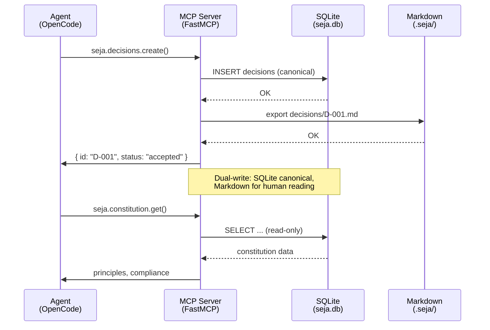
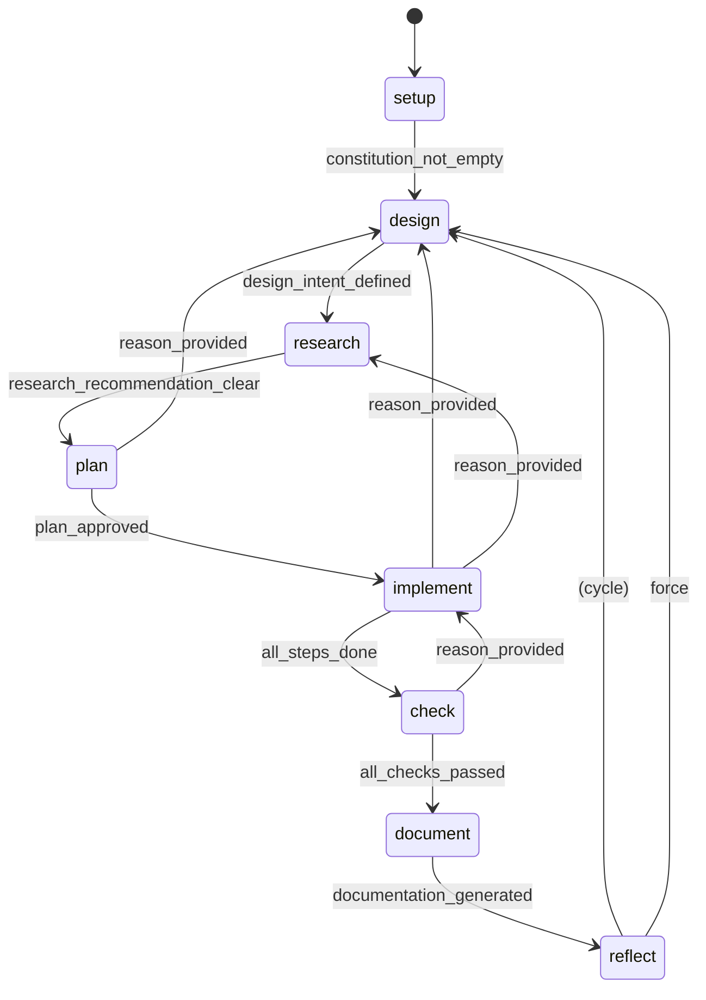
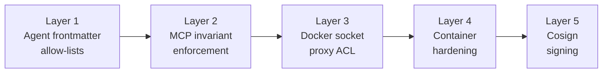
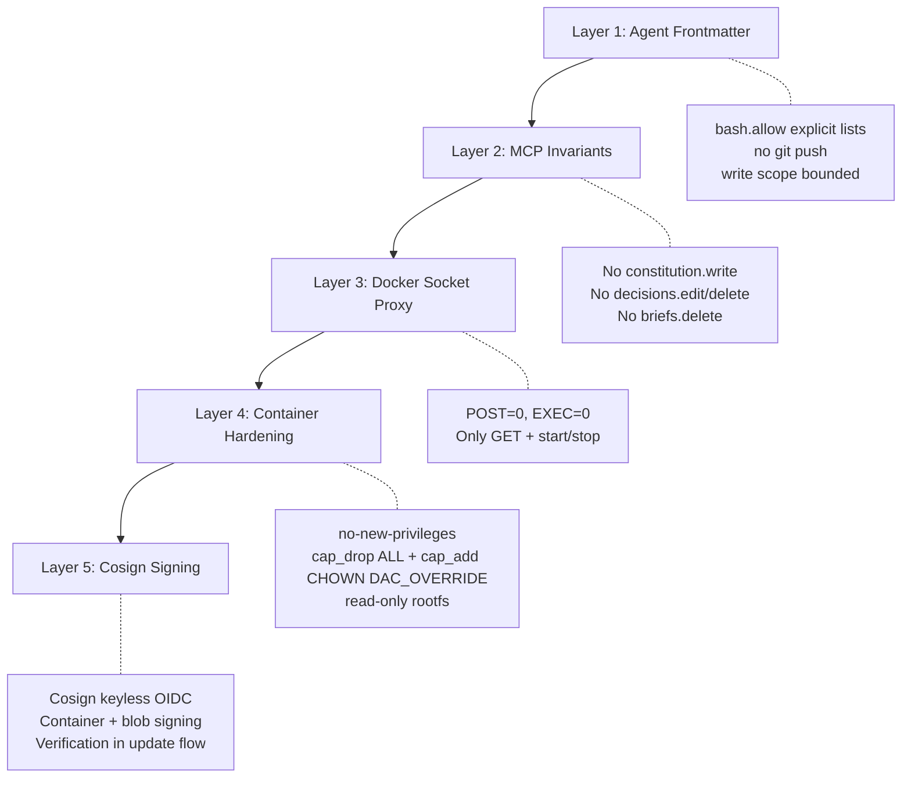
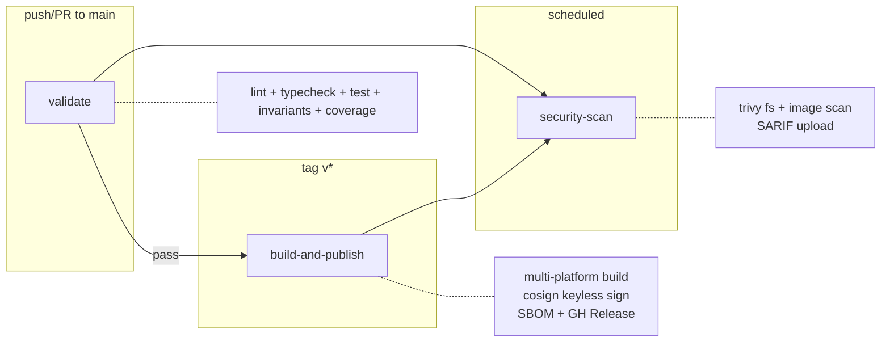

# SEJA v2.1.0

> **S**emiotic **E**ngineering **J**ourneys with **A**gents  
> Governance harness for structured agentic development over OpenCode + Docker

[](https://github.com/PUC-Behring-Institute-for-AI/seja/actions/workflows/publish.yml)
[](https://codecov.io/gh/PUC-Behring-Institute-for-AI/seja)
[](https://ghcr.io/puc-behring-institute-for-ai/seja)
[](LICENSE)

---

## Table of Contents

- [Overview](#overview)
- [Quick Start](#quick-start)
- [Architecture](#architecture)
- [Installation](#installation)
- [Usage](#usage)
- [Agent System](#agent-system)
- [Lifecycle FSM](#lifecycle-fsm)
- [MCP Server](#mcp-server)
- [Security](#security)
- [Development](#development)
- [Reference](#reference)
- [License](#license)

---

## Overview

SEJA is a **governance harness** that structures software development workflows by combining **agentic coding agents** (OpenCode) with a **semiotic engineering** framework. It provides a containerized runtime where AI agents collaborate under explicit lifecycle phases, design intent tracking, and architectural invariants — turning unstructured agent sessions into governed, auditable development processes.

### Why SEJA?

Agentic coding tools (OpenCode, Claude Code, Aider) are powerful but ungoverned: agents can skip design, bypass review, or make decisions without documentation. SEJA wraps the agent runtime with:

- An **FSM lifecycle** (8 states, 19 transitions) that prevents phase skipping
- A **decision registry** with supersession tracking (D-NNN IDs)
- **D16 checker** for multi-step plans (each step validates its predecessor)
- **Semiotic inspection** to measure gaps between intended design and coded reality
- **Dual-write persistence** (SQLite canonical + Markdown for human reading)
- **Litestream backup** with S3 replication for disaster recovery

### How It Works

```mermaid
flowchart LR
    subgraph Host
        A[seja CLI] -->|docker compose| B[Docker Runtime]
    end

    subgraph Containers
        C[seja<br/>MCP + OpenCode] -->|health| D[socket-proxy<br/>Docker API ACL]
        E[litestream<br/>SQLite replication]
        C -->|WAL| E
    end

    subgraph Storage
        F[(SQLite<br/>seja.db)]
        G[.seja/<br/>Markdown Tree]
    end

    C -->|dual-write| F
    C -->|export| G
    
    B --> C
    D -->|GET only| H[/var/run/docker.sock]
```

### Core Concepts

| Concept | Description |
|---------|-------------|
| **Semiotic Engineering** | Theory by Clarisse de Souza (2005) — every system is a metacommunication artifact. SEJA extends this to agent governance |
| **FSM Lifecycle** | 8 sequential states: setup → design → research → plan → implement → check → document → reflect |
| **D16 Plans** | Plans with checker steps — step N verifies step N-1 before allowing progress. Named after architectural invariant D16 |
| **Tier Model** | Agents assigned to REASON (slow/deep), CODE (balanced), or FAST (lightweight) tiers |
| **Semiotic Inspection** | Compares designer intent (as-intended) against system behavior (as-coded) using the Semiotic Inspection Method |

---

## Quick Start

```bash
# 1. Install the CLI
curl -fsSL -o /usr/local/bin/seja \
  "https://github.com/PUC-Behring-Institute-for-AI/seja/releases/latest/download/seja"
chmod +x /usr/local/bin/seja

# 2. Setup (~/.seja/ structure + image pull)
seja setup

# 3. Initialize a project
cd ~/projects/my-app
seja init

# 4. Start the container
seja start

# 5. Verify health
seja status
```

---

## Architecture

### Container Design (3 Services)

```mermaid
graph TB
    subgraph "Docker Compose — seja"
        S1[seja<br/>:8765 MCP<br/>:4096 OpenCode]
        S2[socket-proxy<br/>:2375]
        S3[litestream<br/>:—]
    end

    subgraph "Volumes"
        V1[seja-state<br/>/root/.seja-state]
        V2[socket-proxy<br/>/tmp/docker.sock]
        V3[litestream-data<br/>/data/replica]
    end

    S1 -->|seja.db + WAL| V1
    S1 -->|Docker API via proxy| S2
    S2 -->|/var/run/docker.sock:ro| D[/var/run/docker.sock]
    S3 -->|replicate| V1
    S3 -->|snapshots| V3
    
    style S1 fill:#4a90d9,color:#fff
    style S2 fill:#7c3aed,color:#fff
    style S3 fill:#059669,color:#fff
```

| Service | Image | Role | Ports |
|---------|-------|------|-------|
| **seja** | Custom build | MCP server + OpenCode runtime | 8765 (MCP), 4096 (OpenCode) |
| **socket-proxy** | `tecnativa/docker-socket-proxy` | ACL proxy for Docker socket | 2375 (internal) |
| **litestream** | `litestream/litestream` | SQLite WAL replication | — |

### Data Flow



### Module Map

15 MCP modules across 5 categories:

| Category | Modules | Tools | Purpose |
|----------|---------|-------|---------|
| **Core** | project, constitution | 8 | Workspace init, principles, compliance |
| **State** | decisions, design, telemetry | 17 | Decision registry, feature tracking, metrics |
| **Lifecycle** | lifecycle, pending, briefs | 12 | FSM transitions, blockers, session logging |
| **Workflow** | plans, research, perspectives | 12 | D16 plans, recommendations, archetypal views |
| **Analysis** | journeys, tests, experiments | 13 | Semiotic inspection, test runs, parallel forks |

Total: **15 modules**, **64 tools**, **18 SQLite tables**.

### FSM Lifecycle



See [Lifecycle FSM](#lifecycle-fsm) for complete transition table including all 19 transitions and guard conditions.

### Security Layers



---

## Installation

### Prerequisites

| Requirement | Version | Check |
|-------------|---------|-------|
| Docker | 24+ | `docker --version` |
| Docker Compose | v2.24+ | `docker compose version` |
| Git | 2.40+ | `git --version` |
| Bash | 4+ | `bash --version` |
| curl | 7+ | `curl --version` |

### Option A: One-liner (recommended)

```bash
curl -fsSL https://github.com/PUC-Behring-Institute-for-AI/seja/releases/latest/download/seja \
  -o /usr/local/bin/seja && chmod +x /usr/local/bin/seja
seja setup
```

### Option B: Manual download

```bash
# Download from GitHub Releases
VERSION="v2.1.0"
curl -fsSL "https://github.com/PUC-Behring-Institute-for-AI/seja/releases/download/${VERSION}/seja" \
  -o /usr/local/bin/seja
chmod +x /usr/local/bin/seja

# Download cosign public key
curl -fsSL "https://github.com/PUC-Behring-Institute-for-AI/seja/releases/download/${VERSION}/cosign.pub" \
  -o ~/.seja/cosign.pub

# Initialize
seja setup --image "ghcr.io/puc-behring-institute-for-ai/seja:${VERSION}"
```

### Option C: From source

```bash
git clone https://github.com/PUC-Behring-Institute-for-AI/seja.git
cd seja

# Install dependencies
python -m venv .venv && source .venv/bin/activate
pip install -e mcp/[dev]

# Build Docker image
make build

# The CLI is at scripts/seja — use it directly
alias seja=$(pwd)/scripts/seja
seja setup --image ghcr.io/puc-behring-institute-for-ai/seja:latest
```

### Verification

```bash
seja doctor
```

This checks: Docker daemon, compose version, MCP port availability, git config, disk space, cosign public key.

### Directory Structure

After `seja setup`, your `~/.seja/` contains:

```
~/.seja/
├── .env                      # Runtime configuration
├── docker-compose.yml        # Generated compose file
├── docker-compose.override.yml  # Workspace mounts
├── cosign.pub                # Public key for signature verification
├── workspaces.conf            # Registered workspace paths
├── backups/
│   └── litestream/            # Local litestream replicas
├── logs/                      # Container logs
└── tmp/                       # Temporary update files
```

---

## Usage

### CLI Reference — 25+ Subcommands

#### Core

| Command | Description |
|---------|-------------|
| `seja setup [--dry-run] [--no-pull] [--image IMG]` | Initialize `~/.seja/` directory structure and pull image |
| `seja init [path]` | Initialize `.seja/` workspace at path with templates |
| `seja status [--json]` | Show container status, MCP health, workspace info |
| `seja start` | Start SEJA services (`docker compose up -d`) |
| `seja stop` | Stop SEJA services (`docker compose down`) |
| `seja restart` | Restart SEJA services |
| `seja logs [service] [--tail N] [--follow]` | View container logs |
| `seja shell [service]` | Open interactive shell in a container |
| `seja exec <cmd>` | Execute command in the SEJA container |
| `seja update [--check]` | Update SEJA to latest version (cosign-verified) |
| `seja version` | Show SEJA version |
| `seja help [cmd]` | Show help for a specific command |

#### Workspace Management

| Command | Description |
|---------|-------------|
| `seja workspace add <path>` | Register a workspace mount point |
| `seja workspace remove <path>` | Remove a workspace mount |
| `seja workspace list` | List registered workspaces |
| `seja workspace sync <path>` | Force markdown-to-SQLite sync |

#### Configuration

| Command | Description |
|---------|-------------|
| `seja config get <key>` | Get a configuration value |
| `seja config set <key> <value>` | Set a configuration value |
| `seja config list` | List all configuration |
| `seja config edit` | Edit configuration in `$EDITOR` |

#### Maintenance

| Command | Description |
|---------|-------------|
| `seja doctor` | Run full diagnostics (Docker, MCP, cosign, git, disk, ports) |
| `seja backup` | Trigger manual Litestream snapshot |
| `seja restore <snapshot>` | Restore from a Litestream snapshot |
| `seja verify` | Run integrity check on SQLite database |

#### Experiments

| Command | Description |
|---------|-------------|
| `seja exp list` | List active experiments |
| `seja exp fork <name>` | Create a new experiment (git worktree + lock) |
| `seja exp merge <name>` | Merge experiment back to main branch |
| `seja exp status [name]` | Show experiment status |
| `seja exp discard <name>` | Discard experiment (remove worktree + branch) |

#### Special

| Command | Description |
|---------|-------------|
| `seja inspect` | Semiotic inspection report on current workspace |
| `seja check` | Run all checkers (constitution, design, plan D16, tests) |
| `seja completion [bash\|zsh]` | Generate shell completion scripts |

### Workspace Lifecycle

```bash
# 1. Initialize a project
cd ~/projects/my-web-app
seja init

# 2. Edit constitution and design intent
$EDITOR .seja/constitution.md
$EDITOR .seja/product-design-as-intended.md

# 3. The FSM will be in 'setup' state.
#    Call the MCP tool to transition:
#    seja.lifecycle.transition_phase("design")

# 4. Work through the lifecycle:
#    design → research → plan → implement → check → document → reflect
```

### Update Flow

```bash
# Check for updates without applying
seja update --check

# Apply update
seja update
# 1. Verifies cosign signature on latest image
# 2. Pulls the new image
# 3. Extracts new CLI script + docker-compose.yml from image
# 4. Compares SHA with current versions
# 5. Replaces atomically with backup
# 6. Restarts services with --force-recreate
```

### Config Reference

| Key | Default | Description |
|-----|---------|-------------|
| `SEJA_IMAGE` | `ghcr.io/puc-behring-institute-for-ai/seja:latest` | Docker image |
| `SEJA_MCP_PORT` | `8765` | MCP server port |
| `SEJA_OPENCODE_PORT` | `4096` | OpenCode port |
| `SEJA_TIER_REASON` | `anthropic/claude-opus-4-5` | Model for reasoning agents |
| `SEJA_TIER_CODE` | `anthropic/claude-sonnet-4-5` | Model for coding agents |
| `SEJA_TIER_FAST` | `anthropic/claude-haiku-4-5` | Model for fast agents |
| `SEJA_BACKUP_S3_BUCKET` | _(none)_ | S3 bucket for Litestream backups |
| `SEJA_BACKUP_S3_REGION` | `us-east-1` | S3 region |
| `LITESTREAM_REPLICA_URL` | `file:///data/replica` | Litestream replica URL |
| `SEJA_DB_PATH` | `/root/.seja-state/seja.db` | SQLite database path |

---

## Agent System

### Tier Model

| Tier | Model | Agents | Purpose |
|------|-------|--------|---------|
| **REASON** | `claude-opus-4-5` | strategy, architect, check, council, semiotic, oracle, research | Deep reasoning, architecture, governance |
| **CODE** | `claude-sonnet-4-5` | planner, implement | Plan generation, code implementation |
| **FAST** | `claude-haiku-4-5` | triage, tester, docs, brief, workspace, boost, chronicler | Quick tasks, test writing, documentation |

### Primary Agents (5)

| Agent | Role | Tab-automatic? | Shell access | Write access |
|-------|------|---------------|-------------|-------------|
| **seja-strategy** | Defines product vision, metacommunication strategy, high-level intent | Yes | Read-only | `.seja/constitution.md`, `.seja/product-design-as-intended.md` |
| **seja-architect** | Translates strategy into feature architecture, validates design decisions | Yes | Read-only | `.seja/designs/` |
| **seja-planner** | Produces D16-structured execution plans from architectural decisions | Yes | `git *`, `npm *` | `.seja/plans/` |
| **seja-implement** | Executes plan steps: codes features, writes tests, updates design docs | Yes | `git add/commit/status/diff/log/branch/merge/worktree`, `npm *`, `rm -f`, `mv` | All workspace files |
| **seja-check** | Runs checkers, validates D16 step completion, verifies invariants | Yes | Read-only | Read-only |

### Hidden Agents (11)

| Agent | Role | Trigger |
|-------|------|---------|
| **seja-triage** | Initial triage: classifies user request, routes to correct agent | First message analysis |
| **seja-tester** | Writes and updates test files following AAA pattern | `/seja-test` or plan step requires test |
| **seja-docs** | Maintains documentation files | `/seja-docs` |
| **seja-research** | Gathers external information, technical research | `/seja-research` |
| **seja-brief** | Creates session briefs and transition summaries | Phase transitions |
| **seja-council** | Multi-architype debate for complex decisions | `/seja-council` |
| **seja-semiotic** | Performs semiotic inspection | `/seja-semiotic` |
| **seja-workspace** | Manages workspace configuration | `/seja-workspace` |
| **seja-boost** | Handles urgent/fast operations | `/seja-boost` |
| **seja-oracle** | Root cause analysis and debugging | `/seja-debug` |
| **seja-chronicler** | Maintains project narrative and changelog | Phase completion |

### Bash Allow-Lists

Each agent template declares explicit `bash.allow` and `bash.deny` lists. Key constraints:

- **No `git push`** on any agent — pushes only via CLI or CI/CD
- **No `git *` wildcards** — only specific commands per role
- **Write scope bounded** to workspace files — no system file modification
- **REASON-tier agents** are read-only — observe, never modify

---

## Lifecycle FSM

### States and Transitions

| # | From | To | Guard | Type |
|---|------|----|-------|------|
| 1 | setup | design | constitution_not_empty | forward |
| 2 | design | research | design_intent_defined | forward |
| 3 | research | plan | research_recommendation_clear | forward |
| 4 | plan | implement | plan_approved | forward |
| 5 | implement | check | all_steps_done | forward |
| 6 | check | document | all_checks_passed | forward |
| 7 | document | reflect | documentation_generated | forward |
| 8 | reflect | design | _(none)_ | cycle |
| 9 | implement | design | reason_provided | reverse |
| 10 | implement | research | reason_provided | reverse |
| 11 | implement | plan | reason_provided | reverse |
| 12 | plan | design | reason_provided | reverse |
| 13 | plan | research | reason_provided | reverse |
| 14 | design | setup | reason_provided | reverse |
| 15 | research | design | reason_provided | reverse |
| 16 | research | setup | reason_provided | reverse |
| 17 | check | implement | reason_provided | reverse |
| 18 | check | plan | reason_provided | reverse |
| 19 | document | check | reason_provided | reverse |
| — | Any | Any | force=true | force |

### Guard Logic

Guards are methods on the FSM class that query the SQLite database through an injected context:

| Guard | Logic | Queries |
|-------|-------|---------|
| `constitution_not_empty` | Projects table has a constitution | `SELECT COUNT(*) FROM constitution_principles` |
| `design_intent_defined` | At least one feature exists | `SELECT COUNT(*) FROM features` |
| `research_recommendation_clear` | Research exists with recommendation | `SELECT COUNT(*) FROM research_reports WHERE recommendation IS NOT NULL` |
| `plan_approved` | Latest plan status = 'approved' | `SELECT status FROM plans ORDER BY created_at DESC LIMIT 1` |
| `all_steps_done` | Zero plan_steps with status != 'done' | `SELECT COUNT(*) FROM plan_steps JOIN plans ... WHERE status != 'done'` |
| `all_checks_passed` | All checker steps completed | `SELECT COUNT(*) FROM plan_steps WHERE checker = 1 AND checker_done_at IS NULL` |
| `documentation_generated` | Documentation for current phase exists | `SELECT COUNT(*) FROM briefs WHERE phase = current_phase` |
| `reason_provided` | `reason` parameter is non-empty | Context check: `bool(self.context.get("reason"))` |

### Force Transition

Any state can transition to any other state using `force=true`. This is a human override — requires an explicit `reason` parameter that is logged to `lifecycle_history`.

```python
# Normal transition
await mcp.call("seja.lifecycle.transition_phase",
    new_phase="implement",
    reason="")

# Reverse transition with reason
await mcp.call("seja.lifecycle.transition_phase",
    new_phase="design",
    reason="Architectural flaw discovered in implementation")

# Force transition
await mcp.call("seja.lifecycle.transition_phase",
    new_phase="check",
    force=true,
    reason="Emergency: production bug requires immediate validation")
```

---

## MCP Server

### Connection Details

| Parameter | Value |
|-----------|-------|
| Server URL | `http://localhost:8765` |
| Transport | `streamable-http` |
| Auth | None (localhost-only by default) |
| Tools registered | 64 |

### Module List

| Module | File | Tools | Key Operations |
|--------|------|-------|----------------|
| **project** | `modules/project.py` | 4 | init, get, detect, status |
| **constitution** | `modules/constitution.py` | 4 | get, get_principle, list, check_compliance |
| **decisions** | `modules/decisions.py` | 6 | create, get, list, search, export, digest |
| **design** | `modules/design.py` | 6 | metacomm, feature CRUD, diff int/as-coded |
| **lifecycle** | `modules/lifecycle.py` | 5 | phase, transition, history, diagram, validate |
| **pending** | `modules/pending.py` | 4 | list, add, resolve, blocking |
| **briefs** | `modules/briefs.py` | 3 | log_started, log_done, recent |
| **telemetry** | `modules/telemetry.py` | 4 | record, query, anomalies, rotate |
| **plans** | `modules/plans.py` | 7 | create, get, list, approve, step update, checker, last approved |
| **research** | `modules/research.py` | 3 | create, get, list |
| **perspectives** | `modules/perspectives.py` | 2 | for_plan, get_perspective |
| **journeys** | `modules/journeys.py` | 4 | create, get, list, semiotic_report |
| **tests** | `modules/tests.py` | 3 | record, results, summary |
| **experiments** | `modules/experiments.py` | 6 | fork, list, status, compare, merge, discard |
| **workspace** | `modules/workspace.py` | 3 | sync, validate, info |

### Key Invariants

These tools are architecturally forbidden (enforced by invariant tests):

| Forbidden Tool | Why |
|---------------|-----|
| `seja.constitution.write` | Constitution is read-only by agents; edited by human |
| `seja.decisions.edit` | Decisions are append-only; corrections create new decision with supersedes |
| `seja.decisions.delete` | Decisions are immutable; supersession is the only operation |
| `seja.briefs.delete` | Briefs are append-only audit log |

### API Contract

All MCP tools accept keyword arguments and return JSON with this envelope:

```json
{
  "success": true,
  "data": { ... },
  "_exported": true,
  "meta": {
    "workspace_path": "/path/to/project",
    "module": "decisions",
    "tool": "create_decision",
    "timestamp": "2026-06-20T15:30:00Z"
  }
}
```

---

## Security

### 5-Layer Defense



### Signature Verification

All SEJA releases are signed with cosign using GitHub OIDC (keyless):

```bash
# Verify container image
cosign verify ghcr.io/puc-behring-institute-for-ai/seja:latest \
  --certificate-identity "https://github.com/PUC-Behring-Institute-for-AI/seja/.github/workflows/publish.yml@refs/tags/v*" \
  --certificate-oidc-issuer "https://token.actions.githubusercontent.com"

# Verify CLI script
cosign verify-blob \
  --certificate-identity "https://github.com/PUC-Behring-Institute-for-AI/seja/.github/workflows/publish.yml@refs/tags/v*" \
  --certificate-oidc-issuer "https://token.actions.githubusercontent.com" \
  --bundle scripts/seja.bundle \
  scripts/seja
```

### Security Invariants (from ARCHITECTURE.md §22)

| # | Invariant | Enforcement |
|---|-----------|-------------|
| I1 | Container runs with `no-new-privileges` | Docker compose `security_opt` |
| I2 | Only CHOWN + DAC_OVERRIDE capabilities added | Docker compose `cap_add` |
| I3 | Docker socket access goes through proxy only | `socket-proxy` service |
| I4 | Socket proxy blocks POST except start/stop | `POST=0, ALLOW_START=1, ALLOW_STOP=1` |
| I5 | Agents never see `git push` in allow-lists | Frontmatter `bash.allow` |
| I6 | MCP never registers write/delete on constitution, edit/delete on decisions, delete on briefs | Invariant tests (AST-level check) |
| I7 | Cosign signature verified before update | `seja update` flow |
| I8 | Dual-write: SQLite canonical, Markdown derived | Export after every write |

---

## Development

### Local Setup

```bash
git clone https://github.com/PUC-Behring-Institute-for-AI/seja.git
cd seja

# Python environment
python -m venv .venv
source .venv/bin/activate
pip install -e mcp/[dev]

# Install dev extras
make install-dev
```

### Running Tests

```bash
# All tests
make test

# Individual suites
make test-unit       # 11 FSM tests
make test-integration # 10 schema integration tests
make test-invariants  # 20 invariant tests (critical - verify forbidden tools)
```

| Suite | File | Tests | What it covers |
|-------|------|-------|----------------|
| **Unit** | `tests/unit/test_fsm.py` | 11 | FSM initial state, forward transitions (blocked/allowed), reverse transitions (requires reason), force, guard conditions |
| **Integration** | `tests/integration/test_schema.py` | 10 | All 18 tables exist, FTS5, WAL mode, foreign keys, roundtrips (project, principle, decision FTS sync, lifecycle, brief), UNIQUE constraints |
| **Invariants** | `tests/invariants/test_invariants.py` | 20 | No forbidden tools registered (AST parsing), tool naming convention, FSM 8 states + 19 transitions, no `git push` in any `.tpl`, cosign.pub PEM format, `_skip_export` logic, module boundary checks |

### CI/CD Pipeline



```bash
# Build image locally
make build

# Run full pipeline
make release    # test → build → sign → push → sign-blob
```

### Makefile Targets (22)

| Target | Description |
|--------|-------------|
| `build` | Build Docker image (multi-platform) |
| `push` | Push image to GHCR |
| `sign` | Sign image with cosign (keyless) |
| `sign-blob` | Sign CLI script with cosign |
| `verify` | Verify cosign signature |
| `test` | Run all test suites |
| `test-unit` | Run unit tests only |
| `test-integration` | Run integration tests only |
| `test-invariants` | Run invariant tests only |
| `lint` | Run ruff linter |
| `typecheck` | Run mypy |
| `format` | Run ruff formatter |
| `clean` | Clean Python cache files |
| `install-dev` | Install dev dependencies |
| `install` | Install production dependencies |
| `image` | Build image (alias for build) |
| `validate` | Lint + typecheck + test |
| `release` | Full release pipeline |
| `changelog` | Generate changelog from git log |
| `version` | Show current version |
| `security-scan` | Run trivy or grype |
| `help` | Show all targets |

---

## Reference

| Resource | Description |
|----------|-------------|
| [ARCHITECTURE.md](docs/ARCHITECTURE.md) | Complete architectural specification (3748 lines, 23 sections) |
| [AGENTS.md.global](opencode/AGENTS.md.global) | Global SEJA governance framework for OpenCode (295 lines, 8 sections) |
| [Agent templates](opencode/agents/) | 16 agent `.md.tpl` files with envsubst variable injection |
| [Custom commands](opencode/commands/) | 13 `/seja-*` command definitions |
| [OpenCode config](opencode/opencode.json.tpl) | MCP server URL, agent model assignments, plugins, providers |
| [Project templates](project-template/.seja/) | `.seja/` scaffold: constitution, decisions, plans, designs, briefs |

### Bibliography

- de Souza, C. S. (2005). *The Semiotic Engineering of Human-Computer Interaction*. MIT Press.
- de Souza, C. S., & Leitão, C. F. (2009). *Semiotic Engineering Methods for Scientific Research in HCI*. Morgan & Claypool.
- Norman, D. A. (2013). *The Design of Everyday Things*. Basic Books. (Conceptual model alignment, metacommunication)

---

## License

MIT License. See [LICENSE](LICENSE) for details.
