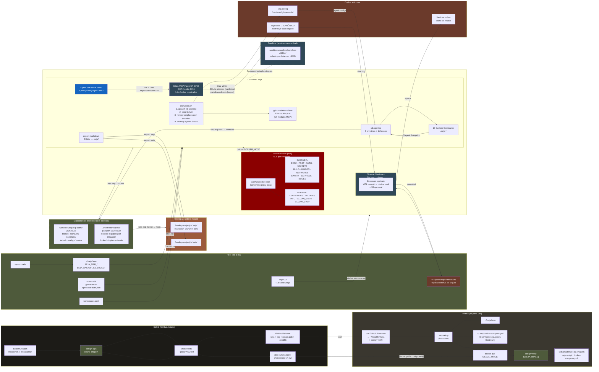

# SEJA — Arquitetura Completa
**Semiotic Engineering Journeys with Agents — Otimizado sobre OpenCode + Docker**
*Versão: 2.1.0-draft — Junho 2026*

---

## Índice

0. [Fundamentos da Semiotic Engineering](#0-fundamentos-da-semiotic-engineering)
1. [Visão Geral](#1-visão-geral)
   — [1.1 Princípios arquiteturais](#11-princípios-arquiteturais)
   — [1.2 Fundamentos teóricos dos princípios](#12-fundamentos-teóricos-dos-princípios)
   — [1.3 Stack](#13-stack)
   — [1.4 Modelo Conceitual do SEJA](#14-modelo-conceitual-do-seja)
   — [1.5 Filosofia da Governança](#15-filosofia-da-governança)
2. [Layout do Repositório](#2-layout-do-repositório)
3. [Instalação — Como o Usuário Recebe o SEJA](#3-instalação--como-o-usuário-recebe-o-seja)
4. [Runtime Layout](#4-runtime-layout)
5. [Container e Docker](#5-container-e-docker)
6. [CLI `seja`](#6-cli-seja)
7. [seja-models — Gerenciador de Tiers](#7-seja-models--gerenciador-de-tiers)
8. [SEJA-MCP Server](#8-seja-mcp-server)
9. [Workspace Layout `.seja/`](#9-workspace-layout-seja)
10. [Roster de Agentes](#10-roster-de-agentes)
11. [AGENTS.md — Duas Camadas](#11-agentsmd--duas-camadas)
12. [Custom Commands](#12-custom-commands)
13. [opencode.json Global](#13-opencodejson-global)
14. [CI/CD — Publicação de Imagem e Script](#14-cicd--publicação-de-imagem-e-script)
15. [Lifecycle Flow — FSM](#15-lifecycle-flow--fsm)
16. [Data Flow Diagram](#16-data-flow-diagram)
17. [Catálogo de Exit Criteria](#17-catálogo-de-exit-criteria)
18. [Protocolo de Supersession de Decisões](#18-protocolo-de-supersession-de-decisões)
19. [Modelo de Segurança](#19-modelo-de-segurança)
20. [Semiotic Inspection Method no SEJA](#20-semiotic-inspection-method-no-seja)
21. [Backup & Recovery](#21-backup--recovery)
22. [Resumo de Invariantes Arquiteturais](#22-resumo-de-invariantes-arquiteturais)
23. [Exploração Paralela com Git Worktrees](#23-exploração-paralela-com-git-worktrees)

---

## 0. Fundamentos da Semiotic Engineering

O SEJA é fundamentado na **Semiotic Engineering** (de Souza, 2005) — uma teoria da Interação Humano-Computador (IHC) que propõe que todo sistema computacional é, antes de tudo, um **artefato de metacomunicação**: o designer do sistema se comunica com o usuário através do próprio sistema.

Esta seção introduz os conceitos centrais da teoria e mostra como o SEJA os estende para o domínio da agent governance.

### 0.1 O triângulo semiótico original

Na formulação original de de Souza, a interação humano-computador é mediada por um **triângulo semiótico**:

```
┌─────────────┐
│  Designer   │ ← Quem concebe a intenção
└──────┬──────┘
       │
       │ mensagem de metacomunicação
       ▼
┌─────────────┐     ┌─────────────┐
│  Sistema    │────▶│  Usuário    │
│ (artefato)  │     │ (interpreta)│
└─────────────┘     └─────────────┘
```

O sistema **não é** uma ferramenta neutra. Ele carrega a voz do designer — suas escolhas, seus valores epistêmicos, sua visão de como o mundo deveria funcionar. Cada ícone, cada fluxo, cada mensagem de erro é um **signo** que o designer emitiu e que o usuário precisa interpretar.

De Souza define três categorias de signos:

| Categoria | O que é | Exemplo |
|---|---|---|
| **Metalinguísticos** | O sistema fala sobre si mesmo — explica como deve ser usado | Help, tooltips, onboarding, mensagens de erro |
| **Estáticos** | O sistema em repouso — janelas, menus, layouts | A estrutura de uma tela, a posição de um botão |
| **Dinâmicos** | O sistema em transformação — comportamentos, transições | Animações, feedback de loading, mudanças de estado |

A **comunicabilidade** é a propriedade do sistema de transmitir fielmente a intenção do designer ao usuário. Um sistema com alta comunicabilidade permite que o usuário compreenda não apenas **o que** o sistema faz, mas **por que** o designer o fez assim.

### 0.2 O problema da agência na metacomunicação

No desenvolvimento de software tradicional, o designer e o implementador são a mesma pessoa (ou equipe). O designer intenciona → o designer codifica → o usuário interpreta. A metacomunicação é direta.

No desenvolvimento **agent-mediated**, esta cadeia se rompe. O designer diz a um agente (LLM) o que fazer, e o agente implementa. O designer não escreve o código — ele **comunica sua intenção** a um intermediário. O agente, por sua vez, precisa interpretar esta intenção e materializá-la em código que, finalmente, comunicará a intenção ao usuário.

```
┌──────────────┐     ┌──────────────┐     ┌──────────────┐     ┌────────────┐
│  Designer    │────▶│  Agente      │────▶│  Código      │────▶│  Usuário   │
│ (intenção)   │     │ (interpreta) │     │ (materializa) │     │ (consome)  │
└──────────────┘     └──────────────┘     └──────────────┘     └────────────┘
       ↘                     ↙                    ↙
      Metacomunicação ←────────── Spec-drift ──────────→
```

Este é o **problema fundamental** que o SEJA resolve. Em um sistema agent-mediated, há **dois atos de metacomunicação**:

1. **Designer → Agente**: o designer comunica sua intenção através da constituição, do design intent, da metacomunicação I/você, e das decisões arquiteturais registradas
2. **Agente → Usuário (via código)**: o agente materializa esta intenção em código que, se bem-sucedido, comunica a intenção original ao usuário

O **spec-drift** é a falha de comunicabilidade nesta cadeia estendida — quando o que o agente codificou não corresponde ao que o designer intencionou. Não é apenas um bug: é uma **falha semiótica**. O código gerado pelo agente não comunica a intenção correta.

### 0.3 Como o SEJA operacionaliza a teoria

O SEJA aborda o problema da agência na metacomunicação com três mecanismos, cada um mapeando a um conceito da Semiotic Engineering:

| Conceito de SE | Problema que endereça | Componente SEJA | Enforcement |
|---|---|---|---|
| **Metacomunicação I/você** | Ambiguidade na intenção do designer | `product-design-as-intended.md` + template I/você | Padrão textual enforced por AGENTS.md global e revisão do `seja-design` |
| **Inspeção semiótica** | Detecção de drift entre intenção e implementação | `seja-semiotic-inspector` (SIM automatizado) + `diff_as_intended_vs_coded` | Ferramenta MCP que compara as-intended vs as-coded seção por seção |
| **Registro epistêmico** | Perda de contexto entre ciclos de desenvolvimento | D-NNN imutáveis + `lifecycle_history` + `reflections/` + AAR | Invariante via API (ausência de ferramentas de edição/deleção) |

A Seção 20 detalha como o SEJA adapta o **Semiotic Inspection Method** (de Souza & Leitão, 2009) para agent governance — o `seja-semiotic-inspector` executa uma versão automatizada do SIM sobre o código gerado por agentes.

### 0.4 Por que Semiotic Engineering e não outra teoria

Teorias alternativas de interação e design foram consideradas. A escolha pela Semiotic Engineering se justifica por três razões:

| Teoria | Por que não atende | Limitação para agent governance |
|---|---|---|
| **Activity Theory** (Engeström) | Foco em atividade mediada por artefatos em contexto social | Explica o que o usuário faz, não como o designer se comunica através do sistema. O agente não é um "artefato mediador" — é um intérprete |
| **Distributed Cognition** (Hutchins) | Foco em sistemas cognitivos distribuídos entre pessoas e artefatos | Trata o sistema como extensão da cognição humana, não como portador de mensagens do designer. Não oferece framework para avaliar fidelidade da comunicação |
| **Value Sensitive Design** (Friedman) | Foco em valores humanos incorporados no design | Framework normativo, não descritivo. Diz o que o sistema deveria comunicar, não como analisar se a comunicação é fiel |
| **Semiotic Engineering** (de Souza) | Foco na comunicação designer→sistema→usuário | Explica como a intenção do designer se materializa no artefato se for interpretada pelo agente. Fornece método de avaliação (SIM) |

A Semiotic Engineering é a única teoria que trata o sistema como **ato de fala do designer** — e é exatamente este ato de fala que o agente precisa interpretar fielmente.

---

**A Seção 1 mostra como estes fundamentos se materializam em 9 princípios arquiteturais concretos, cada um forçado por um mecanismo verificável.**

---

## 1. Visão Geral

SEJA é um **agent harness de governance** que opera sobre o OpenCode como ferramenta de execução. O OpenCode é o mecanismo; o SEJA é o motor conceitual que o governa. A arquitetura foi projetada para que **cada princípio seja forçado por um mecanismo concreto verificável**, não por texto de prompt ou convenção.

### 1.1 Princípios arquiteturais

| # | Princípio | Mecanismo de enforcement | Como verificar |
|---|---|---|---|
| 1 | **Harness como infraestrutura** — estado vive no SEJA-MCP, não no contexto do agente | MCP tools retornam apenas o que o agente pediu. Nenhum dump de arquivo. SQLite é o único repositório de estado | `tools/list` vs `tools/call` — agente não tem tool `read_file` |
| 2 | **SQLite como fonte canônica de verdade** — SQLite é a fonte; markdown é export para inspeção humana | Ordem de escrita: SQLite (atômico, WAL) → markdown (gerado). Indexer SÓ reconstrói SQLite de markdown em cold start. NUNCA o contrário | `reindex_workspace()` só executa se SQLite vazio. Teste: corromper markdown → SQLite não perde dados |
| 3 | **Invariantes via API** — imutabilidade enforced por ausência de tools, não por texto | Tools de escrita proibidas (`constitution.write`, `decisions.edit`, `briefs.delete`) NÃO são registradas no MCP. Agente não pode chamar o que não existe | `test_invariants.py` verifica `tools/list` contra whitelist. Nenhuma tool proibida na lista |
| 4 | **Agentes com responsabilidade única** — cada agente faz uma coisa bem, com permissões correspondentes | OpenCode frontmatter scopo: `bash:`, `write:`, `edit:`, `read:` permit/deny explícitos. `seja-implement` tem bash com allow-list | Verificar frontmatter de cada .md.tpl contra sua responsabilidade declarada |
| 5 | **Modelo certo para cada tarefa** — 3 tiers de modelo configuráveis | `seja-models` atualiza `.env`; `entrypoint.sh` roda `envsubst` com `SEJA_TIER_*` nos templates no startup | `docker exec seja env | grep SEJA_TIER` retorna os modelos ativos |
| 6 | **Script autossuficiente** — `seja` é o único artefato que o usuário instala | Script contém compose template como heredoc. Zero dependência de repo clonado | `seja setup` funciona sem git clone. Testar em máquina limpa |
| 7 | **Imagem como fonte de verdade do runtime** — `seja update` extrai o script e o compose template da imagem | `seja update` extrai `seja-script` + `docker-compose.yml` da imagem, compara SHA, verifica assinatura cosign, substitui atomicamente | `cosign verify ghcr.io/org/seja:latest` → identidade do maintainer |
| 8 | **Enforcement em camadas** — prompt, API, infra | Três camadas independentes: (1) frontmatter do OpenCode, (2) absence de tools no MCP, (3) docker-socket-proxy + seccomp + cap_drop. Cada camada bloqueia independentemente | Teste: desativar camada 1 → camadas 2 e 3 ainda bloqueiam |
| 9 | **Designer é o decididor** — o harness propõe, o humano decide | FSM permite `force=true` com reason obrigatório. Toda transição forçada é registrada. Prompt nunca auto-executa recomendação | `lifecycle_history` com `forced=true` quando humano override. Não há tool de auto-aprovação |

### 1.2 Fundamentos teóricos dos princípios

Cada princípio arquitetural do SEJA tem uma origem teórica que justifica sua existência — não é uma escolha arbitrária de engenharia, mas a materialização de um conceito consolidado.

**1. Harness como infraestrutura** — O princípio de que o estado do projeto não deve residir no contexto do agente é uma aplicação da **teoria de sistemas** de Simon (1969). Simon demonstrou que a complexidade de sistemas artificiais é gerenciada pela separação entre mecanismo de execução e camada de controle — o que ele chamou de "hierarchical near-decomposability". No SEJA, o agente executa; o harness (via SEJA-MCP) armazena e gerencia o estado. Um sistema onde o próprio agente carrega seu estado é epistemicamente frágil: se o contexto é perdido, o estado é perdido. Por isso o SQLite persiste entre sessões, entre agentes, entre containers.

**2. SQLite como fonte canônica** — A filosofia da informação de Floridi (2011) estabelece que uma informação deve ter uma **fonte única de verdade** para ser epistemicamente confiável. O dual-write original (markdown + SQLite como duas fontes) viola este princípio: se as duas divergem, não há como determinar qual está correta. O SEJA corrige isso tornando o SQLite a fonte única e markdown um **derivado** — eliminando o problema de divergência na raiz. O banco relacional, com sua integridade referencial e transações atômicas, é epistemicamente superior a arquivos de texto para armazenar estado governado.

**3. Invariantes via API** — Inspirado nos **sistemas capability-based** (Dennis & Van Horn, 1966), onde a posse de um capability (a capacidade de invocar uma operação) é simultaneamente a autorização para executá-la. No SEJA, se uma ferramenta MCP não existe, o agente não pode chamá-la — não porque "não deve", mas porque a operação não pertence ao seu espaço de ações possíveis. Isto contrasta com sistemas ACL-based (listas de permissão), onde é linguagem o agente não deve fazer X. A ausência é uma restrição categórica; a permissão negada é uma restrição condicional.

**4. Agentes com responsabilidade única** — Aplicação do princípio de **Single Responsibility** (Martin, 2003) ao design de agentes. Cada agente é um módulo cognitivo com um contrato explícito: um conjunto de ferramentas MCP que pode chamar, um conjunto de permissões de bash/arquivos que possui, e um workflow que descreve seu comportamento. A granularidade é determinada pelo **princípio da granularidade cognitiva**: o contexto de cada agente deve ser suficiente para sua tarefa sem causar overflow ou subutilização.

**5. Modelo certo para cada tarefa** — A **economia da atenção** de Simon (1971) introduziu o conceito de bounded rationality: agentes racionais têm recursos computacionais e cognitivos limitados. LLMs são agentes racionais com custos de raciocínio drasticamente diferentes: um modelo REASON custa ~10-50x mais que um modelo FAST. Atribuir o modelo correto a cada tarefa é uma otimização de eficiência alocativa: modelos REASON para tarefas que exigem inferência profunda, modelos CODE para geração de código, modelos FAST para tarefas determinísticas.

**6. Script autossuficiente** — O padrão de **Immutable Infrastructure** (Fowler, Morris) aplicado à distribuição de software. O artefato distribuído (o script `seja`) contém tudo o que precisa para funcionar — não depende de ambiente, de repo clonado, de dependências externas. Isto elimina uma classe inteira de falhas de configuração e drift de ambiente. A "imutabilidade" aqui não é do hardware, mas do contrato de distribuição: o que o usuário baixa é exatamente o que o maintainer publicou.

**7. Imagem como fonte de verdade do runtime** — A aplicação do princípio **Build Once, Run Anywhere** (Java) ao ciclo de vida do harness. A imagem Docker contém o runtime completo do SEJA — agentes, MCP server, entrypoint, ferramentas. O script `seja` extrai o template docker-compose da imagem, garantindo que o script do host e o runtime do container estejam sempre na mesma versão. Qualquer mudança no runtime exige uma nova imagem, que passa pelo pipeline de CI/CD com testes, lint e assinatura cosign.

**8. Enforcement em camadas** — A doutrina de **Defense in Depth** (NSA, 1982) aplicada a agent governance. Nenhuma camada única de proteção é suficiente. Três camadas independentes — frontmatter do OpenCode (prompt), ausência de tools no MCP (API), docker-socket-proxy + seccomp (infraestrutura) — garantem que, mesmo que uma seja contornada, as outras ainda bloqueiam. Cada camada é independente e verificável: frontmatters podem ser auditados, tools/list pode ser inspecionado, ACL do proxy pode ser testada.

**9. Designer é o decididor** — O harness como **augmentador de capacidade**, não substituto de julgamento (Engelbart, 1962). O FSM propõe transições, guards bloqueiam ações inválidas, mas o humano pode forçar qualquer transição com `force=true` e reason. Isto reflete a **teoria da ação comunicativa** (Habermas, 1981): a interação humano-agente é um ato comunicativo onde o harness apresenta argumentos (gates, warnings) e o humano decide com base no melhor entendimento disponível. O harness não toma decisões de design — apenas garante que as decisões sejam tomadas com visibilidade das consequências.

### 1.3 Stack

```
┌──────────────────────────────────────────────────────────────────────┐
│                        CONTAINER (single cluster)                     │
│                                                                      │
│  ┌──────────────────────────────────────────────────────────────┐   │
│  │  SEJA container (principal)                                   │   │
│  │                                                               │   │
│  │  opencode serve :4096     ←─── FOREGROUND                     │   │
│  │  seja-mcp :8765           ←─── BACKGROUND (FastMCP/Python)    │   │
│  │  python-statemachine     ←─── FSM declarativo do lifecycle    │   │
│  │  get /health :8765       ←─── Health endpoint (não-MCP)       │   │
│  │  [omni-tools :7654]       ←─── BACKGROUND (opcional)          │   │
│  │                                                               │   │
│  │  ┌─ Sandbox (opcional, host-gated) ──────────────────────┐    │   │
│  │  │  git worktree add .worktrees/sandbox/sandbox-<sha>     │   │   │
│  │  │  Isolado por branch. Gerenciado por `seja sandbox`     │    │   │
│  │  └───────────────────────────────────────────────────────┘    │   │
│  │  ┌─ Exploração (Seção 23) ───────────────────────────────┐    │   │
│  │  │  git worktree add .worktrees/exp/exp-<name>/            │   │   │
│  │  │  Branch nomeado, locked, lifecycle próprio             │    │   │
│  │  │  Gerenciado por `seja exp`                             │    │   │
│  │  └───────────────────────────────────────────────────────┘    │   │
│  └──────────────────────────────────────────────────────────────┘   │
│        ↕ socket                                                    │
│  ┌──────────────────────────────────────────────────────────────┐   │
│  │  docker-socket-proxy (Tecnativa) — sidecar                   │   │
│  │  ACL: CONTAINERS=1 VOLUMES=1 INFO=1 ALLOW_START=1           │   │
│  │       ALLOW_STOP=1 | EXEC=0 AUTH=0 SECRETS=0 POST=0         │   │
│  │  Bloqueia: docker run --privileged, docker exec, curl via    │   │
│  │  socket, swarm, images, networks                             │   │
│  └──────────────────────────────────────────────────────────────┘   │
│        ↕ volume mount                                              │
│  ┌──────────────────────────────────────────────────────────────┐   │
│  │  litestream — sidecar de backup contínuo do SQLite           │   │
│  │  Replica /root/.seja-state/seja.db → ~/.seja/backups/       │   │
│  │  Opcional: replicação para S3 (SEJA_BACKUP_S3_BUCKET)        │   │
│  └──────────────────────────────────────────────────────────────┘   │
│                                                                      │
│  Volume: seja-state → /root/.seja-state/ (SQLite index)             │
│  Volume: seja-config → /root/.config/opencode/ (OC config)          │
│  Bind: /workspace/ ← host workspaces (markdown export)              │
│  Sock: socket-proxy:/var/run/docker.sock (NUNCA o socket real)     │
└──────────────────────────────────────────────────────────────────────┘
        ↕ HTTP :4096        ↕ TUI attach           ↕ HTTP proxy :4443
┌───────────────────────────────────┐
│         HOST (~/.seja/)           │
│  seja CLI · seja-models · .env   │
│  .secrets/ (github-token, auth)  │
│  backups/litestream/ (WAL réplica)│
│  Proxy caddy/nginx (porta 4443)  │
└───────────────────────────────────┘
```

### 1.4 Modelo Conceitual do SEJA

O SEJA opera com uma ontologia de estado de três categorias, cada uma com seu regime epistêmico distinto.

#### 1.4.1 As três categorias de estado

| Categoria | O que contém | Onde vive | Regime epistêmico |
|---|---|---|---|
| **Estado de intenção** | O que o designer QUER: constituição, design intent, metacomunicação I/você, decisões (D-NNN) | `.seja/` no workspace (markdown commitável) + SQLite (fonte canônica) | Imutável por agentes (invariante via API). Mutável por humanos com rastreabilidade |
| **Estado de fato** | O que FOI CONSTRUÍDO: product-design-as-coded, status de features, journey maps descobertos (JM-E) | `.seja/` no workspace + SQLite | Mutável por agentes (seja-implement, seja-semiotic-inspector) com registro em telemetria |
| **Estado de processo** | O estado do DEVELOPMENT: fase atual (FSM), actions pendentes, briefs de invocação, telemetria, reflections | SQLite (canônico) + `_output/` (export) | Append-only. Briefs e telemetria são imutáveis após escritos. Pending pode ser resolvido, nunca deletado |

A separação destas três categorias é essencial para a governança porque cada uma tem **regras de mutação diferentes**, e confundi-las é a principal fonte de spec-drift. Um agente que trata estado de intenção como estado de fato (reescrevendo a constituição) está cometendo um erro de categoria epistêmica — não apenas uma violação de permissão.

#### 1.4.2 O ciclo semiótico do desenvolvimento

O lifecycle do SEJA (Seção 15) não é apenas um fluxo de trabalho — é um **ciclo semiótico** onde a intenção do designer é progressivamente interpretada, materializada, verificada e refletida:

```
┌──────────┐    ┌──────────┐    ┌──────────┐    ┌──────────┐    ┌──────────┐
│  Design  │───▶│ Research │───▶│  Plan    │───▶│Implement │───▶│  Check   │
│ intenção │    │investiga │    │contrato  │    │codifica  │    │verifica  │
│ (setup)  │    │hipóteses │    │executável│    │material  │    │comunica  │
└──────────┘    └──────────┘    └──────────┘    └──────────┘    └──────────┘
                                                                    │
                                    ┌──────────┐    ┌──────────┐    │
                                    │ Reflect  │◀───│ Document │◀───┘
                                    │aprendizado│   │comunica  │
                                    │ (drift)  │   │ resultados│
                                    └──────────┘    └──────────┘
```

Cada fase tem um **momento semiótico**: não é apenas "o que se faz", mas **que tipo de significado é produzido**. A transição de fase só deve ocorrer quando o significado da fase atual foi suficientemente estabelecido (Seção 17 — Exit Criteria).

#### 1.4.3 Metacomunicação como ato ilocucionário

A fórmula "Eu projetei [X] para você porque [rationale]" não é uma convenção de formatação — é um **ato de fala ilocucionário** (Austin, 1962; Searle, 1969). O designer não está apenas descrevendo uma feature; ele está **comprometendo-se publicamente** com uma intenção de design registrada em um artefato imutável.

Searle classifica atos ilocucionários em cinco categorias. A metacomunicação I/você do SEJA é um ato **assertivo-compromissivo**: o designer ASSERTA que a intenção de design é X, e se COMPROMETE a que o sistema resultante comunique X ao usuário. Quando um agente modifica o código sem preservar esta intenção, ele está quebrando o compromisso ilocucionário do designer. O `diff_as_intended_vs_coded` é o detector desta quebra.

#### 1.4.4 Spec-drift como falha de comunicabilidade

Spec-drift é tradicionalmente definido como "a diferença entre o que foi especificado e o que foi implementado." No SEJA, spec-drift é mais que isso: é uma **falha de comunicabilidade** na cadeia designer→agente→código→usuário. O código pode estar funcionalmente correto (passa nos testes, compila, executa) mas semioticamente incorreto (não comunica a intenção do designer).

O SEJA detecta spec-drift em três níveis:

| Nível | Detector | Resposta |
|---|---|---|
| **Superficial** — código não compila ou testes falham | `seja-test-runner`, compilador | Bloqueia transição implement→check |
| **Estrutural** — código funciona mas viola princípios da constituição | `seja-standards-checker`, guards do FSM | Advisory Warning + exige reason para continuar |
| **Semiótico** — código funciona e é compliant mas não comunica a intenção do designer | `seja-semiotic-inspector`, `diff_as_intended_vs_coded` | Reportado como spec-drift na fase reflect |

Os três níveis formam uma hierarquia: se o nível superficial falha, os outros nem são avaliados. Se o nível semiótico falha, o produto está funcionalmente correto mas comunicativamente falho.

### 1.5 Filosofia da Governança

O SEJA não é um framework de automação ou de produtividade. É um **framework de governança** — e a distinção é fundamental.

#### 1.5.1 O problema da agência

Agentes de LLM são poderosos mas epistemicamente frágeis. Um agente com acesso irrestrito a bash, Docker e filesystem pode executar tarefas complexas de forma autônoma — mas também pode:

- Produzir código que se desvia da intenção do designer (spec-drift)
- Modificar artefatos que deveriam permanecer estáveis (constituição, decisões passadas)
- Perder contexto entre sessões, repetindo erros já documentados
- Executar ações que comprometem o sistema (docker escape, exfiltração de credenciais)

O problema não é que os agentes sejam "maus" — é que eles operam em um espaço de ações possíveis que é grande demais para ser governado apenas por instruções textuais. O SEJA **reduz este espaço** estruturalmente, não normativamente.

#### 1.5.2 Governança estrutural vs. governança normativa

| Tipo | O que diz | Exemplo | Eficácia |
|---|---|---|---|
| **Normativa** | "O agente não deve escrever na constituição" | Prompt no AGENTS.md | Falha se o prompt for ignorado, esquecido, ou se o contexto for perdido |
| **Estrutural** | "O agente não tem tool para escrever na constituição" | `constitution.write()` NÃO EXISTE no MCP | Inviolável — a operação não está no espaço de ações possíveis |

O SEJA é deliberadamente **estrutural**. Todo enforcement que pode ser implementado como ausência de capability, como ACL de infraestrutura, ou como guard de FSM, o é. Onde enforcement estrutural não é possível (ex: qualidade da metacomunicação), o enforcement é delegado a **agentes especialistas com contexto mínimo** (revisores, checkers, inspectors).

A distinção não é acadêmica. Ela determina se o sistema falha silenciosamente ou se o sistema se recusa a falhar.

#### 1.5.3 Invariantes como axiomas

Os invariantes do SEJA (Seção 22) não são "regras" — são **axiomas** de um sistema formal de governança. Um sistema axiomático tem a propriedade de que proposições derivadas (teoremas) são verdadeiras se os axiomas forem verdadeiros e as regras de inferência forem válidas.

No SEJA, os axiomas são:
- **A constituição é imutável por agentes** (não há ferramenta de escrita)
- **Decisões são permanentes** (não há ferramentas de edição/deleção)
- **Briefs são append-only** (não há ferramentas de edição/deleção)
- **Implementação requer plano aprovado** (guarda do FSM)

Qualquer comportamento que um agente produza é um teorema neste sistema: se ele não viola os axiomas, o comportamento é válido por definição. Se um comportamento requer violar um axioma (ex: editar uma decisão), o sistema não pode produzi-lo — não porque "não deve", mas porque a operação não existe no sistema.

#### 1.5.4 Transparência radical

O SEJA opera com **transparência radical**: todo estado é queryable, toda transição é auditável, toda decisão é imutável. A governança não é restrição — é **visibilidade**.

| O que é visível | Como | Para quem |
|---|---|---|
| Estado atual (fase, decisões, pendências) | `seja status`, MCP tools | Designer e agentes |
| Histórico de transições | `lifecycle_history` | Designer (reflect) |
| Decisões passadas e sua evolução | `decisions` com supersession | Designer e agentes (pesquisa) |
| Telemetria de invocações | `telemetry.query()` | Designer (reflect, diagnose) |
| Log de briefs | `briefs.get_recent()` | Designer (o que foi feito) |

Quando o designer entende exatamente o que foi feito, por que, e qual era o estado do sistema em cada ponto, ele pode tomar decisões informadas. A governança não é sobre controle — é sobre **inteligibilidade**.

#### 1.5.5 A linha entre autonomia e automação

O espectro entre "fully autonomous" e "fully scripted" é contínuo. O SEJA ocupa o ponto **autonomia governada**:

| Ponto no espectro | Quem decide | Quem executa | Risco |
|---|---|---|---|
| **Scripted** | Humano (pré-determina) | Máquina (executa deterministicamente) | Rigidez, não se adapta |
| **Autonomia governada** (SEJA) | Humano decide _o que_ e _quando_; agente decide _como_ dentro de limites | Agente com FSM, guards, checkers | Adaptável sem perder controle |
| **Total autonomy** | Agente decide tudo | Agente executa tudo | Perda de alinhamento, spec-drift |

O FSM com `force=true` materializa esta filosofia: o agente propõe transições, o humano pode aceitar ou forçar com reason. O harness garante que transições forcadas sejam registradas, auditáveis, e excepcionais — não a norma.

### 1.6 Identificação visual das decisões no documento

Cada decisão arquitetural é referenciada pelo seu ID entre parênteses, ex: `(B4)`, `(C1)`, `(D13)`. A tabela de ligação entre decisões e princípios está na Seção 22 (Invariantes).

---

## 2. Layout do Repositório

> **Este repositório é para desenvolvedores do SEJA — não para usuários finais.**
> Usuários instalam o SEJA via `curl` (ver Seção 3). O repo nunca é clonado por quem usa o SEJA.
> O artefato distribuído é a imagem Docker + o script `seja` publicados pelo CI/CD.

```
seja/
├── AGENTS.md                          # Regras para contribuidores do repo SEJA
├── CHANGELOG.md                       # Histórico de versões
├── .env.example                       # Documentação das variáveis
├── .gitignore
├── Dockerfile                         # Imagem do container
├── entrypoint.sh                      # Bootstrap de serviços
├── docker-compose.yml                 # Template (3 serviços: seja, socket-proxy, litestream)
├── Makefile                           # build, push, test, lint, release
│
├── scripts/
│   └── seja                           # Artefato distribuído ao usuário final
│                                      # Contém: heredoc do docker-compose com 3 serviços,
│                                      # lógica cosign verify, sandbox worktree management
│
├── mcp/                               # SEJA-MCP Server (Python/FastMCP)
│   ├── pyproject.toml
│   ├── uv.lock
│   └── seja_mcp/
│       ├── __init__.py
│       ├── server.py                  # Entrypoint FastMCP, porta 8765; GET /health
│       ├── lifecycle_fsm.py           # python-statemachine — FSM declarativo do lifecycle
│       ├── db/
│       │   ├── __init__.py
│       │   ├── schema.py              # CREATE TABLE statements (inclui nova tabela test_runs)
│       │   ├── connection.py          # SQLite connection pool (WAL mode)
│       │   └── migrations/
│       │       ├── 001_initial.sql
│       │       └── 002_lifecycle.sql  # Migration para tabela test_runs
│       ├── models/
│       │   ├── __init__.py
│       │   └── schemas.py             # Pydantic models (DecisionRecord c/ supersession, etc.)
│       ├── sync/
│       │   ├── __init__.py
│       │   ├── markdown_export.py     # Gera markdown a partir do SQLite (NUNCA o inverso)
│       │   └── indexer.py             # Só reconstrói SQLite em cold start
│       └── modules/
│           ├── __init__.py
│           ├── project.py             # seja.project.*
│           ├── constitution.py        # seja.constitution.* (read-only p/ agentes)
│           ├── decisions.py           # seja.decisions.* (create + read + export, no edit/delete)
│           ├── design.py              # seja.design.* (as-intended + as-coded)
│           ├── lifecycle.py           # seja.lifecycle.* (FSM via python-statemachine)
│           ├── pending.py             # seja.pending.* (com phase_required)
│           ├── briefs.py              # seja.briefs.* (append-only)
│           ├── telemetry.py           # seja.telemetry.* (com rotation_policy_days)
│           ├── plans.py               # seja.plans.* (com campo checker)
│           ├── research.py            # seja.research.*
│           ├── perspectives.py        # seja.perspectives.*
│           ├── journeys.py            # seja.journeys.* (JM-TB + JM-E)
│           ├── experiments.py          # seja.experiments.* (NOVO — exploração paralela)
│           ├── perspectives.py        # seja.perspectives.*
│           └── tests.py               # seja.tests.* (test_runs table)
│
├── opencode/
│   ├── agents/                        # Templates de agentes (usa ${SEJA_TIER_*})
│   │   ├── seja-design.md.tpl
│   │   ├── seja-plan.md.tpl
│   │   ├── seja-implement.md.tpl      # bash allow-list, auto-commit, D16
│   │   │                               # + exploração paralela: SEJA_WORKTREE scoped
│   │   ├── seja-research.md.tpl
│   │   │                               # + get_experiment_candidates()
│   │   ├── seja-reflect.md.tpl        # Template AAR de 4 perguntas
│   │   │                               # + seção "Exploração Paralela" no AAR
│   │   ├── seja-code-reviewer.md.tpl
│   │   ├── seja-plan-reviewer.md.tpl
│   │   ├── seja-research-reviewer.md.tpl
│   │   ├── seja-council.md.tpl        # Nota experimental D14
│   │   │                               # + comparação de experimentos via council
│   │   ├── seja-standards-checker.md.tpl
│   │   ├── seja-test-runner.md.tpl
│   │   ├── seja-semiotic-inspector.md.tpl
│   │   │                               # + evaluate_experiment()
│   │   ├── seja-harness-health.md.tpl
│   │   ├── seja-doc-generator.md.tpl
│   │   ├── seja-comm-generator.md.tpl
│   │   └── seja-explain.md.tpl
│   ├── commands/                      # Custom commands (copiados para o container)
│   │   ├── seja-setup.md
│   │   ├── seja-research.md
│   │   ├── seja-explain.md
│   │   ├── seja-design.md
│   │   ├── seja-plan.md
│   │   ├── seja-implement.md
│   │   ├── seja-check.md              # Chama transition_phase("check")
│   │   ├── seja-document.md           # Chama transition_phase("document")
│   │   ├── seja-communicate.md
│   │   ├── seja-reflect.md
│   │   ├── seja-pending.md
│   │   ├── seja-exp.md                # NOVO — gerencia experimentos paralelos (faz parte do sistema de exploração, Seção 23)
│   │   ├── seja-sandbox.md            # Worktree descartável simples
│   │   └── seja-help.md
│   ├── AGENTS.md.global               # Template da camada global
│   └── opencode.json.tpl              # Template com proxy auth
│
├── project-template/                  # Usado por /seja-setup
│   ├── AGENTS.md.local.tpl            # Inclui campo checker no plano ativo
│   └── .seja/
│       ├── constitution.md.tpl
│       ├── conventions.md.tpl
│       ├── product-design-as-intended.md.tpl
│       └── product-design-as-coded.md.tpl
│
├── tests/
│   ├── test_mcp_modules.py
│   ├── test_dual_write.py
│   ├── test_invariants.py             # Tools que NÃO existem
│   ├── test_lifecycle.py              # FSM transitions + guards
│   ├── test_enforcement.py            # Camadas de enforcement independentes
│   ├── test_export.py                 # seja.decisions.export()
│   ├── test_experiments.py            # NOVO — ciclo completo de exploração (fork→merge→discard)
│   ├── test_worktree_invariant.py     # NOVO — worktree locked, sandbox não remove exp
│   └── test_multi_agent_exploration.py  # NOVO — agentes paralelos + council comparison
│
├── security/
│   ├── cosign.pub                     # Chave pública para verificação do script
│   └── seccomp-profile.json           # Perfil seccomp customizado
│
└── docs/
    └── ARCHITECTURE.md                # Este documento
```

---

## 3. Instalação — Como o Usuário Recebe o SEJA

O usuário **nunca clona o repositório**. O único pré-requisito é Docker rodando. O CI/CD publica a imagem no GHCR e o script como Release Asset. O script é assinado com cosign e verificado antes de cada atualização.

### Passo 1 — Instalar o script `seja`

```bash
curl -fsSL https://github.com/<org>/seja/releases/latest/download/seja \
  -o ~/.local/bin/seja && chmod +x ~/.local/bin/seja

# Verificar assinatura (cosign) — recomendado mas não obrigatório na primeira instalação
cosign verify-blob --key https://github.com/<org>/seja/releases/latest/download/cosign.pub \
  --signature ~/.local/bin/seja.sig ~/.local/bin/seja

seja --version
```

### Passo 2 — Inicializar o runtime

```bash
seja setup
```

`seja setup` é interativo. Fluxo completo:

```
1. detect_docker_rootless()
   → macOS: open -a Docker, espera 60s; fallback colima start
   → Linux: sudo systemctl start docker
   → Rootless: ajusta socket path para ${XDG_RUNTIME_DIR}/docker.sock
   → Falha: imprime instruções e exit

2. Criar ~/.seja/ com subdiretórios

3. Prompts interativos:
   ┌─────────────────────────────────────────────────────────────┐
   │ SEJA image [ghcr.io/<org>/seja:latest]:                     │
   │ GitHub token (opcional, para pull de imagem privada):       │
   │ OpenCode config repo (opcional):                            │
   │ Backend S3 para Litestream (opcional):                      │
   └─────────────────────────────────────────────────────────────┘

4. Gerar ~/.seja/.env com valores coletados
   → SEJA_BACKUP_S3_BUCKET incluído se configurado

5. Escrever ~/.seja/docker-compose.yml
   → Template com 3 serviços: seja, socket-proxy (C2), litestream (C3)
   → Template embutido no próprio script seja (heredoc)

6. (Se token configurado) docker login ghcr.io

7. docker pull ${SEJA_IMAGE}

8. cosign verify ${SEJA_IMAGE} (C5)
   → Falha: aborta com instruções. Usuário pode forçar com --no-verify

9. Extrair da imagem os artefatos de referência:
   → /usr/local/bin/seja-script → ~/.seja/backups/seja.<sha8>
   → /usr/local/share/seja/docker-compose.yml (validar compatibilidade)
   → Substituir ~/.seja/docker-compose.yml se SHA diferir e validação passar

10. Criar ~/.seja/workspace/ (root default de workspaces)

11. Exibir próximos passos:
    ✓ SEJA pronto em ~/.seja/

    Próximos passos:
      seja workspace add ~/projects/meu-projeto
      seja sandbox "experimentar lib X"   ← worktree descartável (W1)
      seja web
```

### Fluxo de `seja setup` em reinstalação

Se `~/.seja/` já existe:

```
~/.seja/ já existe. O que deseja fazer?
  [1] Atualizar configuração (preserva workspaces, volumes, .env)
  [2] Reinicializar completamente (DESTRÓI ~/.seja/ — volumes Docker são preservados)
  [3] Validar integridade (verifica assinatura cosign da imagem + snapshots Litestream)
  [4] Cancelar
```

Opção 1 permite reconfigurar variáveis sem perder estado.
Opção 2 remove `~/.seja/` mas **não remove os Docker volumes** (`seja-state`, `seja-config`)
— o estado dos projetos SEJA é preservado.
Opção 3 executa `cosign verify` + `litestream verify` + `sqlite3 .db PRAGMA integrity_check`.

### Posicionamento: o que vai onde

| Quem | O que faz | Como |
|---|---|---|
| **Dev do SEJA** | Desenvolve o harness | Clona `github.com/<org>/seja`, usa `make build/push/test` |
| **Usuário do SEJA** | Usa o harness em seus projetos | `curl ... seja`, `seja setup`, `seja workspace add` |
| **Projeto governado** | Recebe o harness | `.seja/` commitado no git, `AGENTS.md` local |

---

## 4. Runtime Layout

Após `seja setup`, o runtime persiste em `~/.seja/`. O repositório do SEJA nunca é necessário aqui.

```
~/.seja/
├── .env                               # Fonte de verdade das variáveis de runtime
├── docker-compose.yml                 # 3 serviços (seja, socket-proxy, litestream)
├── workspaces.conf                    # Mapeamentos de workspace ativos
├── docker-compose.override.yml        # Gerado dinamicamente — mounts de workspace
├── workspace/                         # Root default de workspaces (bind mount host)
├── backups/
│   ├── litestream/                    # Réplica contínua do SQLite (C3)
│   │   └── seja.db                   # Cópia WAL point-in-time
│   ├── seja.<sha8>                   # Backups do script seja (mantém 5 últimos)
│   └── seja.<sha8>
├── logs/
│   └── stash.log                     # Eventos de stash (somente sem worktrees)
└── .docker-config/                    # Fallback de credenciais GHCR
```

### Variáveis de `.env`

```bash
# Imagem
SEJA_IMAGE=ghcr.io/<org>/seja:latest
SEJA_CONTAINER_NAME=seja

# Portas host
SEJA_OPENCODE_HOST_PORT=4096
SEJA_MCP_PORT=8765                     # Interno, não exposto ao host
OMNITOOLS_HOST_PORT=7654
SEJA_PROXY_PORT=4443                   # Reverse proxy (caddy/nginx) p/ OpenAI Web (A3)

# Tiers de modelo (gerenciados pelo seja-models)
SEJA_TIER_REASON=anthropic/claude-opus-4-5
SEJA_TIER_CODE=anthropic/claude-sonnet-4-5
SEJA_TIER_FAST=anthropic/claude-haiku-4-5

# Features opcionais
OMNITOOLS_ENABLED=true

# Backup contínuo (C3)
SEJA_BACKUP_S3_BUCKET=                 # Opcional — vazio = backup local apenas
SEJA_BACKUP_S3_REGION=us-east-1        # Apenas se S3 configurado

# Sync de config (opcional)
OPENCODE_CONFIG_REPO=
OPENCODE_CONFIG_BRANCH=main

# Workspace default
SEJA_WORKSPACE_DIR=~/.seja/workspace

# Proxy auth (A3)
OPENCODE_ACCESS_TOKEN=                 # Gerado por seja auth web
```

---

## 5. Container e Docker

### 5.1 Serviços

O `docker-compose.yml` contém **3 serviços**: `seja` (principal), `socket-proxy` (sidecar de segurança), `litestream` (sidecar de backup). Apenas o `seja` é exposto ao host.

### 5.2 Ports e serviços

| Porta container | Exposição host | Serviço | Quem acessa |
|---|---|---|---|
| `4096` | `${SEJA_OPENCODE_HOST_PORT:-4096}` | OpenCode server (web UI + TUI attach) | Host (via proxy caddy/nginx com token) |
| `8765` | **NÃO exposta** | SEJA-MCP (FastMCP/Python) | Apenas OpenCode dentro do container |
| `4443` | `${SEJA_PROXY_PORT:-4443}` | Proxy caddy/nginx (auth layer) | Host (único acesso externo aprovado) |
| `7654` | `${OMNITOOLS_HOST_PORT:-7654}` | omni-tools (opcional) | Host (se habilitado) |
| `2375` | **NÃO exposta** | docker-socket-proxy (API restrita) | Apenas seja container |

### 5.3 Volumes Docker

| Volume | Path no container | Propósito |
|---|---|---|
| `seja-state` | `/root/.seja-state/` | SQLite index (`seja.db`) — PERSISTE entre sessões. **Única fonte de verdade** |
| `seja-config` | `/root/.config/opencode/` | Config e agentes do OpenCode (renderizados pelo entrypoint) |

### 5.4 `docker-compose.yml` (estrutura)

```yaml
version: "3.9"
services:
  # ── Principal ────────────────────────────────────────────────────────
  seja:
    image: ${SEJA_IMAGE}
    container_name: ${SEJA_CONTAINER_NAME:-seja}
    restart: unless-stopped
    stop_grace_period: 30s
    ports:
      - "${SEJA_OPENCODE_HOST_PORT:-4096}:4096"
      - "${SEJA_PROXY_PORT:-4443}:4443"
      - "${OMNITOOLS_HOST_PORT:-7654}:7654"
    volumes:
      - seja-state:/root/.seja-state
      - seja-config:/root/.config/opencode
      - socket-proxy:/tmp/docker.sock:ro    # Socket PROXY, não o real
      - litestream-data:/var/lib/litestream
      - ~/.secrets:/run/secrets:ro
      # Workspaces adicionados dinamicamente via docker-compose.override.yml
    environment:
      DOCKER_HOST: "unix:///tmp/docker.sock"  # Aponta para o proxy
    env_file:
      - ~/.seja/.env
    security_opt:                             # (C2) Hardening
      - no-new-privileges:true
    cap_drop:
      - ALL
    cap_add:
      - CHOWN                                    # Mínimo necessário para git
      - DAC_OVERRIDE                             # Mínimo para escrita de arquivos
    healthcheck:
      test: ["CMD", "curl", "-sf", "http://localhost:4096/global/health"]
      interval: 10s
      timeout: 5s
      retries: 12
      start_period: 30s
    depends_on:
      socket-proxy:
        condition: service_started
      litestream:
        condition: service_started

  # ── Sidecar: Docker Socket Proxy ──────────────────────────────────────
  # ACL por endpoint. Impede que qualquer agente faça docker run --privileged
  # ou acesse funcionalidades além do necessário.
  socket-proxy:
    image: tecnativa/docker-socket-proxy:latest
    container_name: seja-socket-proxy
    restart: unless-stopped
    volumes:
      - /var/run/docker.sock:/var/run/docker.sock:ro   # Socket REAL — só aqui
    environment:
      # ACL — só o que o SEJA precisa
      CONTAINERS: 1          # docker container ls/inspect
      ALLOW_START: 1         # docker start (restart do container)
      ALLOW_STOP: 1          # docker stop (shutdown)
      VOLUMES: 1             # docker volume ls/inspect
      INFO: 1                # docker info
      # BLOQUEADO — zero acesso
      EXEC: 0                # NUNCA — impede docker exec não-autorizado
      AUTH: 0
      SECRETS: 0
      POST: 0                # NUNCA — impede CREATE, que exigiria --privileged
      BUILD: 0
      COMMIT: 0
      CONFIGS: 0
      DISTRIBUTION: 0
      IMAGES: 0
      NETWORKS: 0
      NODES: 0
      PLUGINS: 0
      SERVICES: 0
      SESSION: 0
      SWARM: 0
      TASKS: 0

  # ── Sidecar: Backup Contínuo do SQLite ────────────────────────────────
  # Litestream replica o SQLite para o host a cada WAL commit.
  # Opcional: replicação para S3 via SEJA_BACKUP_S3_BUCKET.
  litestream:
    image: litestream/litestream:latest
    container_name: seja-litestream
    restart: unless-stopped
    volumes:
      - seja-state:/data/seja-state:ro        # Lê o SQLite
      - litestream-data:/data/replica          # Cache local
      - ~/.seja/backups/litestream:/backups    # Réplica no host filesystem
    environment:
      LITESTREAM_ACCESS_KEY_ID: "${SEJA_BACKUP_S3_KEY_ID:-}"
      LITESTREAM_SECRET_ACCESS_KEY: "${SEJA_BACKUP_S3_SECRET:-}"
    command:
      - "replicate"
      - "/data/seja-state/seja.db"
    # Sempre replica para filesystem local
    # Se SEJA_BACKUP_S3_BUCKET estiver setado, replica também para S3
    healthcheck:
      test: ["CMD", "litestream", "databases"]
      interval: 30s
      timeout: 5s
      retries: 3
      start_period: 5s

volumes:
  seja-state:
  seja-config:
  litestream-data:
  socket-proxy:
```

### 5.5 `entrypoint.sh` — Ordem de inicialização

```bash
#!/usr/bin/env bash
set -euo pipefail

# 0. Verificar MCP health endpoint (não-MCP)
health_listen() { while true; do echo -e "HTTP/1.1 200 OK\n\n{\"status\":\"healthy\"}" | nc -l -p 8766; done }

# 1. Git identity e auth (via entrypoint, NUNCA via agente)
configure_git_auth()  # Lê /run/secrets/github-token — agente NÃO pode ler (A2)

# 2. OpenCode OAuth seed
seed_opencode_auth()  # /run/secrets/opencode-auth.json

# 3. Bootstrap OpenCode config repo (opcional)
bootstrap_opencode_config()

# 4. Renderizar agentes com modelos reais (envsubst)
render_agent_templates()
# Limpa agentes órfãos antes de copiar novos (evita acumulação)
rm -f /root/.config/opencode/agents/*.md
for tpl in /opt/seja/agents/*.md.tpl; do
  envsubst '${SEJA_TIER_REASON} ${SEJA_TIER_CODE} ${SEJA_TIER_FAST}' \
    < "$tpl" > "/root/.config/opencode/agents/$(basename "$tpl" .tpl)"
done
# Também copia commands/*.md para /root/.config/opencode/commands/
# Também copia AGENTS.md.global para /root/.config/opencode/AGENTS.md
# Também renderiza opencode.json com SEJA_MCP_PORT e proxy settings

# 5. Iniciar SEJA-MCP em background + health endpoint
start_seja_mcp()
# python -m seja_mcp.server --host 0.0.0.0 --port ${SEJA_MCP_PORT:-8765} &
# Aguarda readiness: curl -sf http://localhost:8765/health (endpoint não-MCP)
# Se MCP falhar no startup → aborta (sem MCP, governance não existe)

# 5b. Health endpoint não-MCP em background
health_listen &  # Porta 8766, usado por docker healthcheck

# 6. (Opcional) omni-tools
[[ "${OMNITOOLS_ENABLED:-true}" == "true" ]] && start_omnitools()

# 7. Iniciar proxy caddy/nginx (A3) com auth
start_auth_proxy()

# 8. OpenCode server — FOREGROUND
exec opencode serve --hostname 0.0.0.0 --port 4096
```

### 5.6 Dockerfile (estrutura)

```dockerfile
FROM ubuntu:22.04

# Node.js (para OpenCode)
RUN curl -fsSL https://deb.nodesource.com/setup_22.x | bash - \
    && apt-get install -y nodejs curl git gettext-base

# Python + uv (para SEJA-MCP)
RUN curl -LsSf https://astral.sh/uv/install.sh | sh
ENV PATH="/root/.local/bin:$PATH"

# OpenCode
RUN npm install -g opencode@latest

# SEJA-MCP
COPY mcp/ /opt/seja-mcp/
RUN cd /opt/seja-mcp && uv sync --no-dev
# Pin mcp>=1.27,<2 para evitar breakage com v2 alpha

# Agentes e commands templates
COPY opencode/agents/ /opt/seja/agents/
COPY opencode/commands/ /opt/seja/commands/
COPY opencode/AGENTS.md.global /opt/seja/AGENTS.md.global
COPY opencode/opencode.json.tpl /opt/seja/opencode.json.tpl

# Project template (para /seja-setup dentro do OpenCode)
COPY project-template/ /opt/seja/project-template/

# (Opcional) omni-tools
COPY --from=iib0011/omni-tools /app/build /opt/omni-tools

# Perfil seccomp e chave pública cosign
COPY security/ /opt/seja/security/

# Artefatos distribuídos
COPY scripts/seja /usr/local/bin/seja-script
COPY docker-compose.yml /usr/local/share/seja/docker-compose.yml

# Entrypoint
COPY entrypoint.sh /usr/local/bin/entrypoint
RUN chmod +x /usr/local/bin/entrypoint /usr/local/bin/seja-script

ENTRYPOINT ["/usr/local/bin/entrypoint"]
```

> **Por que copiar `seja-script` e `docker-compose.yml` na imagem?**
> O `seja update` no host extrai ambos da imagem e verifica a assinatura cosign da imagem
> antes de substituir os arquivos locais. A imagem é a única fonte de verdade do runtime (C5).

### 5.7 Invariante de infraestrutura

| Invariante | Quem bloqueia | O que acontece se violado |
|---|---|---|
| Agente NUNCA acessa Docker socket real | socket-proxy ACL: `POST=0`, `EXEC=0` | Proxy retorna 403. Agente não tem `docker` no bash allow-list também |
| Container NUNCA escala privilégios | `security_opt: no-new-privileges:true` + `cap_drop: [ALL]` | syscall `setuid` bloqueada pelo kernel |
| Secrets NUNCA lidos por agentes | Frontmatter `read: deny: /run/secrets/**` (A2) | OpenCode bloqueia o acesso antes do bash executar |
| SQLite NUNCA perde mais que 1s de dados | Litestream replica a cada WAL commit | RPO < 1s. Restore point-in-time com `litestream restore` |

---

## 6. CLI `seja`

O `seja` é um bash script instalado pelo usuário via `curl` em `~/.local/bin/seja`.
É **autossuficiente**: não depende de repo clonado, não depende de arquivos externos.
Contém todos os subcomandos, o template do `docker-compose.yml` como heredoc (com 3 serviços),
e a lógica de auto-atualização com verificação de assinatura cosign.

### Surface completa de comandos

```
# ── Inicialização ─────────────────────────────────────────────────────────────
seja setup                         Inicializa ~/.seja/, puxa imagem, configura runtime
seja setup --image            Especifica imagem sem prompt
seja setup --no-pull               Cria ~/.seja/ sem puxar imagem

# ── Operação diária ───────────────────────────────────────────────────────────
seja                               Sobe container, aguarda health, attach TUI
seja web                           Sobe container, abre browser na sessão atual
seja open <projeto> [--web]        Abre projeto específico (TUI ou browser)
seja tui                           Alias de seja
seja status                        Container status, volumes, URLs local/LAN, health

# ── Workspaces ────────────────────────────────────────────────────────────────
seja workspace add <path>          Bind mount do path no container como /workspace/<basename>
seja workspace remove <nome>       Remove mapping
seja workspace list                Lista workspaces ativos com tipo e path

# ── Sandbox — Worktree descartável (W1 a W4) ──────────────────────────────────
seja sandbox <descrição>           Cria worktree git isolado para experimentação
                                   git worktree add .worktrees/sandbox-<sha> -b sandbox/<date>
seja sandbox list                  Lista worktrees sandbox ativos com idade
seja sandbox clean [--days 7]      Remove worktrees com mais de N dias (default: 7)
seja sandbox close <nome>          Remove worktree específico e faz stash das mudanças

# ── Exploração Paralela — Worktrees com lifecycle (Seção 23) ─────────────────
seja exp fork <name> [--from <branch>]     Cria experimento em worktree isolado com branch exp/<name>-<date>
seja exp list                              Lista experimentos com status (active/ready/merged/discarded)
seja exp status <name>                     Status detalhado de um experimento
seja exp lock <name>                       Marca experimento como pronto para review e comparação
seja exp compare [names...]                Compara experimentos com semiotic score + council ranking
seja exp merge <name>                      Merge do experimento escolhido no branch main
seja exp discard <name>                    Descarta experimento e remove worktree
seja exp close-all                         Cleanup de experimentos merged/discarded

# ── Projeto ───────────────────────────────────────────────────────────────────
seja init [path]                   Inicializa .seja/ no projeto e gera AGENTS.md local
                                   Usa project-template/ da imagem via docker exec

# ── Modelos ───────────────────────────────────────────────────────────────────
seja models                        Alias para seja-models (gerencia tiers de modelo)

# ── Configuração ──────────────────────────────────────────────────────────────
seja config show                   Exibe ~/.seja/.env com valores atuais
seja config set KEY=VALUE          Atualiza variável em ~/.seja/.env

# ── Auth ──────────────────────────────────────────────────────────────────────
seja auth gh                       gh auth login → persiste token em ~/.secrets/github-token
seja auth ghcr                     docker login ghcr.io usando token configurado
seja auth web                      Gera token para proxy caddy/nginx (A3)

# ── Lifecycle do runtime ──────────────────────────────────────────────────────
seja update                        Atualiza imagem + script + compose template
                                   COSIGN verify ANTES de extrair (C5)
seja rollback [sha8]               Rollback do script seja para versão anterior em backups/
                                   NÃO faz rollback da imagem — apenas do script host

# ── Dados ─────────────────────────────────────────────────────────────────────
seja backup                        Trigger manual de snapshot Litestream (C3)
seja restore [timestamp]           Restore point-in-time de backup Litestream
seja verify                        Executa verificações de integridade:
                                   cosign verify da imagem + Litestream verify + PRAGMA integrity_check

# ── Diagnóstico ───────────────────────────────────────────────────────────────
seja help [comando]                Ajuda geral ou específica sobre um subcomando
seja --version                     Exibe versão do script + versão da imagem em uso
```

### Comportamento de `seja` (sem subcomando)

```
1. require_docker_running() — falha com mensagem acionável se daemon parado
2. Auto-adicionar CWD ao workspaces.conf quando:
   - Diretório é um repo git
   - Ainda não está mapeado
   - Está sob ~/projects, ~/Documents, ~/dev, ~/src (heurística configurável)
3. ensure_ghcr_login() se SEJA_IMAGE for ghcr.io/*
4. docker compose --file ~/.seja/docker-compose.yml up -d
5. Aguardar /global/health (timeout 60s, retry 10s)
6. Cleanup de sessões OpenCode vazias para paths mapeados (preserva mais recente)
7. Idempotência: find-or-create sessão para CWD mapeado
8. docker exec -it seja opencode attach --session <session-id>
```

### `seja update` — Fluxo detalhado com cosign (C5)

```
1. require_docker_running()
2. ensure_ghcr_login() se imagem for ghcr.io/*
   ├── Verifica se já está logado (docker system info | grep ghcr)
   └── Se não: solicita login com token do ~/.secrets/

3. cosign verify ${SEJA_IMAGE}:latest   ← ANTES de pull
   ├── Obtém chave pública de /opt/seja/security/cosign.pub dentro da imagem ATUAL
   ├── Ou de URL: https://github.com/<org>/seja/releases/latest/download/cosign.pub
   ├── Se assinatura inválida → ABORTA com "assinatura inválida"
   ├── Se chave pública não encontrada → WARNING + pergunta se deseja continuar
   └── Se --no-verify → pula verificação

4. docker pull ${SEJA_IMAGE}:latest
   ├── Se pull falhar: aborta (nunca atualiza de imagem local stale)
   └── Exibe erro acionável ao usuário

5. Extrair /usr/local/bin/seja-script da imagem (docker create + docker cp)
6. Comparar SHA256 com ~/.local/bin/seja
   ├── Se diferente:
   │   a. Guardar backup em ~/.seja/backups/seja.<sha8>
   │   b. Manter apenas os 5 backups mais recentes
   │   c. Substituir ~/.local/bin/seja atomicamente (mv temp file)
   │   d. Preservar permissão +x
   └── Se igual: nenhuma ação

7. Extrair /usr/local/share/seja/docker-compose.yml da imagem
8. Validar template extraído (variáveis obrigatórias)
9. Se SHA diferente: substituir atomicamente

10. docker compose --file ~/.seja/docker-compose.yml down (grace_period: 30s)
11. docker compose --file ~/.seja/docker-compose.yml up -d --force-recreate
12. Aguardar /global/health + MCP health (timeout 120s)
13. Exibir resumo: versão anterior → nova, artefatos atualizados, assinatura verificada
```

### `seja sandbox` — Fluxo detalhado (W1 a W4)

```
seja sandbox "testar migração ORM → raw SQL"

1. require_git_project() — falha se não for repo git
2. Verificar que .worktrees/ está no .gitignore
   ├── Se não: adicionar automaticamente, perguntar se quer commit
   └── Se recusar: aborta com instrução
3. Gerar sha curto: $(date +%s | sha256sum | head -c 6)
4. git worktree add --detach .worktrees/sandbox-<sha>
   ├── Usa --detach (detached HEAD) para evitar branch pollution
   └── Se falhar: exibe erro e aborta
5. Mount worktree no container:
   ├── docker-compose.override.yml add volumes:
   │     - $(pwd)/.worktrees/sandbox-<sha>:/workspace/<basename>-sandbox
   └── docker compose up -d --no-recreate (só atualiza mounts)
6. Registrar em ~/.seja/workspaces.conf:
   ├── path, created_at, description
   └── pruning automático se > 30 dias (com warning)

seja sandbox clean --days 7

1. Listar worktrees em .worktrees/sandbox/ com idade > 7 dias
   → NÃO inclui .worktrees/exp/ (experimentos têm lifecycle próprio e lock — Seção 23)
2. Para cada:
   └── git worktree remove <path>
3. Remover registros de workspaces.conf
4. docker compose down + up (recria sem o volume antigo)

### `seja backup` — Fluxo (C3)

seja backup

1. litestream snapshot (se o container estiver rodando)
2. Se não: docker exec seja-litestream litestream snapshot /data/litestream/seja.db
3. Copiar snapshot para ~/.seja/backups/litestream/snapshot-<date>.db
4. Verificar com PRAGMA integrity_check
5. Exibir: "Backup concluído. Integridade OK. Último restore: litestream restore <path>"
```

---

## 7. seja-models — Gerenciador de Tiers

O `seja-models` gerencia a atribuição de modelos por tier e persiste em `~/.seja/.env`.

### Três tiers e sua lógica de otimização

| Tier | Variável | Otimiza para | Agentes que usam | Modelo default |
|---|---|---|---|---|
| **REASON** | `SEJA_TIER_REASON` | Raciocínio profundo, síntese, análise multi-perspectiva | seja-design, seja-plan, seja-research, seja-reflect, seja-code-reviewer, seja-plan-reviewer, seja-research-reviewer, seja-semiotic-inspector, seja-comm-generator, seja-council | `anthropic/claude-opus-4-5` |
| **CODE** | `SEJA_TIER_CODE` | Geração de código, implementação de steps | seja-implement | `anthropic/claude-sonnet-4-5` |
| **FAST** | `SEJA_TIER_FAST` | Velocidade, tarefas determinísticas, baixo custo | seja-standards-checker, seja-test-runner, seja-harness-health, seja-doc-generator, seja-explain | `anthropic/claude-haiku-4-5` |

O princípio "Modelo certo para cada tarefa" (princípio 5) é forçado por `envsubst`:
- `entrypoint.sh` renderiza os templates com `SEJA_TIER_*` do `.env`
- OpenCode lê o modelo do frontmatter YAML de cada agente
- Se o `.env` falta uma variável, `envsubst` deixa vazio → OpenCode usa default global

### Interface do seja-models

```bash
seja-models list                           # Lista tiers e modelos ativos
seja-models show                           # Exibe configuração completa
seja-models set reason=<model>             # Define tier REASON
seja-models set code=<model>               # Define tier CODE
seja-models set fast=<model>               # Define tier FAST
seja-models set all=<model>                # Define todos os tiers com mesmo modelo
seja-models reset                          # Restaura defaults da imagem
seja-models apply                          # Re-renderiza agentes e reinicia container
```

**Fluxo de `seja-models set` + `apply`:**
1. Atualiza `SEJA_TIER_*` em `~/.seja/.env`
2. `seja-models apply` → `docker restart seja`
3. `entrypoint.sh` re-executa `render_agent_templates()` com novos valores
4. Agentes em `/root/.config/opencode/agents/` são recriados com modelos corretos
5. OpenCode recarrega os agentes na próxima sessão

---

## 8. SEJA-MCP Server

### 8.0 Fundamento conceitual

O SEJA-MCP Server é a materialização do princípio **Harness como infraestrutura** (Princípio 1). Todo o estado do projeto — intenções, decisões, processo — vive no SQLite gerenciado pelo MCP, não no contexto do agente.

A arquitetura do servidor segue o padrão **domain.capability** inspirado em sistemas capability-based (Dennis & Van Horn, 1966): cada módulo expõe um conjunto de tools que correspondem a capacidades que o agente possui ou não. Um agente com acesso a `seja.constitution.get` pode ler a constituição simplesmente porque a tool existe. Um agente sem acesso a `seja.constitution.write` não pode escrever na constituição porque a operação não está registrada em lugar nenhum — o agente sequer sabe que esta operação é concebível.

Isto difere fundamentalmente de sistemas ACL-based, onde um agente "sabe" que a operação existe mas é "proibido" de chamá-la. No SEJA, a ausência da tool no registro MCP significa que a operação não pertence ao espaço de ações possíveis do agente — é uma impossibilidade lógica, não uma restrição normativa.

Os 15 módulos do servidor (14 originais + 1 novo: experiments) são divididos em três categorias:

| Categoria | Módulos | Regime |
|---|---|---|
| **Read-only** | constitution, perspectives | Tools de leitura apenas. Nenhuma tool de escrita existe |
| **Create + Read + Search** | decisions, research, plans, briefs, telemetry, journeys | Append-only ou create-only. Sem edit/delete. D-NNN com supersession (D13) para evolução sem perda histórica |
| **Read + Write (estado controlado)** | project, design, lifecycle, pending, tests | Escrita em campos específicos com validação de schema e invariantes (FSM guards, checkers) |

A subseção 8.1 mostra como este modelo de capabilities se materializa em código Python/FastMCP, com 14 módulos registrados e o protocolo de dual-write que implementa o SQLite como fonte canônica.

### 8.1 Arquitetura do servidor

```python
# seja_mcp/server.py
from fastmcp import FastMCP
from seja_mcp.db.connection import init_db
from seja_mcp.sync.markdown_export import export_workspace_markdown
from seja_mcp.modules import (
    project, constitution, decisions, design,
    lifecycle, pending, briefs, telemetry,
    plans, research, perspectives, journeys, tests,
    experiments  # NOVO — exploração paralela (Seção 23)
)

mcp = FastMCP("seja-state", version="2.0.0")

# Registro de todos os 15 módulos
for module in [project, constitution, decisions, design,
               lifecycle, pending, briefs, telemetry,
               plans, research, perspectives, journeys, tests,
               experiments]:  # NOVO — exploração paralela
    mcp.include(module.router)

# Health endpoint não-MCP (para Docker healthcheck)
@mcp.app.get("/health")
async def health():
    return {"status": "healthy", "version": "2.0.0", "lifecycle_fsm": lifecycle.fsm.current_state}

@mcp.on_startup
async def startup():
    await init_db()
    # SÓ reconstrói SQLite em cold start (B4)
    if await is_database_empty():
        for workspace in list_mounted_workspaces():
            await reindex_from_markdown(workspace)
    # Export markdown do SQLite (NUNCA o inverso)
    for workspace in list_mounted_workspaces():
        await export_workspace_markdown(workspace)

if __name__ == "__main__":
    mcp.run(transport="streamable-http", host="0.0.0.0", port=8765)
```

### 8.2 Dual-Write: ordem correta (B4)

Toda operação de escrita segue o protocolo **SQLite → markdown**:

```
agente chama tool → SEJA-MCP recebe →
  1. Valida schema via Pydantic
  2. Escreve no SQLite (commit imediato, WAL mode)
  3. Gera/atualiza markdown no /workspace/<proj>/.seja/<path> (export para humanos)
  4. Retorna resultado estruturado ao agente
```

Na inicialização (`on_startup`), o indexer faz o INVENTO do dual-write original:
- Se SQLite está vazio (cold start): lê markdown e popula SQLite
- Se SQLite não está vazio: **não toca no SQLite**. Gera markdown do SQLite.

Isso garante que divergências markdown→SQLite NUNCA ocorrem em runtime.
Se o humano editar markdown manualmente, as mudanças SÓ aparecem após cold start ou `seja.workspace.sync()`.
O SQLite é a fonte de verdade; markdown é export para inspeção humana e versionamento git.

### 8.3 Lifecycle FSM com python-statemachine (C1, C8, C9)

O lifecycle é implementado como um FSM declarativo usando `python-statemachine`:

```python
# seja_mcp/lifecycle_fsm.py
from statemachine import StateMachine, State

class SejaLifecycleFSM(StateMachine):
    "FSM declarativo do lifecycle SEJA — gerado por código, não desenhado"
    
    # 8 estados
    setup = State(initial=True)
    design = State()
    research = State()
    plan = State()
    implement = State()
    check = State()
    document = State()
    reflect = State()
    
    # Transições forward — com guards (exit criteria)
    setup_to_design = setup.to(design, cond="constitution_not_empty")
    design_to_research = design.to(research, cond="design_intent_defined")
    research_to_plan = research.to(plan, cond="research_recommendation_clear")
    plan_to_implement = plan.to(implement, cond="plan_approved")
    implement_to_check = implement.to(check, cond="all_steps_done")
    check_to_document = check.to(document, cond="all_checks_passed")
    document_to_reflect = document.to(reflect, cond="documentation_generated")
    reflect_to_design = reflect.to(design)  # Novo ciclo
    
    # Transições reversas (C8) — com reason obrigatório
    implement_to_design = implement.to(design, cond="reason_provided")
    implement_to_research = implement.to(research, cond="reason_provided")
    plan_to_design = plan.to(design, cond="reason_provided")
    
    # Força bruta — humano pode override com reason
    force_transition = any.to.any(cond="force_allowed")
```

**Como o FSM força a governança:**

| Condição (guard) | O que bloqueia | Quem decide | Se falha |
|---|---|---|---|
| `constitution_not_empty` | setup→design se constitution vazia (C9) | Humano edita constitution | `MachineError` + mensagem "Constituição vazia. Use /seja-setup" |
| `plan_approved` | plan→implement sem plano aprovado | seja-plan-reviewer + humano approva | `MachineError` + "Nenhum plano aprovado. Crie e aprove um plano em /seja-plan" |
| `all_steps_done` | implement→check se steps incompletos | seja-implement (precisa terminar) | `MachineError` + "Step 3/7 pendente" |
| `all_checks_passed` | check→document se check falhou | seja-code-reviewer | `MachineError` + "Check falhou: violação T1" |
| `reason_provided` | Transição reversa sem `reason=` | Humano precisa fornecer | `MachineError` + "Transição reversa requer reason" |

**Diagrama é gerado do código:**

```python
# Em lifecycle.py
def get_mermaid():
    return SejaLifecycleFSM._graph().to_mermaid()
```

O diagrama na Seção 15 é OUTPUT deste método, não desenho manual. FSM e diagrama NUNCA divergem.

### 8.4 SQLite Schema Completo (atualizado)

```sql
-- WAL mode ativado na conexão
PRAGMA journal_mode=WAL;
PRAGMA foreign_keys=ON;

-- Projetos
CREATE TABLE IF NOT EXISTS projects (
    id          TEXT PRIMARY KEY,
    workspace   TEXT NOT NULL UNIQUE,
    name        TEXT NOT NULL,
    description TEXT DEFAULT '',
    phase       TEXT DEFAULT 'setup',
    created_at  TIMESTAMP DEFAULT CURRENT_TIMESTAMP,
    updated_at  TIMESTAMP DEFAULT CURRENT_TIMESTAMP
);

-- Princípios da constituição
CREATE TABLE IF NOT EXISTS constitution_principles (
    id            TEXT NOT NULL,
    project_id    TEXT NOT NULL REFERENCES projects(id),
    type          TEXT NOT NULL,    -- 'technical' | 'quality'
    principle     TEXT NOT NULL,
    rationale     TEXT NOT NULL,
    markdown_path TEXT NOT NULL,
    PRIMARY KEY (id, project_id)
);

-- Decision records (D-NNN) — com supersession (D13)
CREATE TABLE IF NOT EXISTS decisions (
    id            TEXT NOT NULL,    -- D-001-a3f2 (híbrido B5)
    project_id    TEXT NOT NULL REFERENCES projects(id),
    title         TEXT NOT NULL,
    context       TEXT NOT NULL,
    decision      TEXT NOT NULL,
    rationale     TEXT NOT NULL,
    consequences  TEXT NOT NULL,
    alternatives  TEXT NOT NULL,
    source        TEXT DEFAULT 'manual',
    status        TEXT DEFAULT 'accepted',   -- 'accepted' | 'superseded' | 'deprecated' (D13)
    superseded_by TEXT DEFAULT NULL,          -- ref: D-007 (D13)
    created_at    TIMESTAMP DEFAULT CURRENT_TIMESTAMP,
    markdown_path TEXT NOT NULL,
    PRIMARY KEY (id, project_id)
);
CREATE INDEX idx_decisions_status ON decisions(project_id, status);

-- FTS para busca em decisions — FILTRA por status active
CREATE VIRTUAL TABLE IF NOT EXISTS decisions_fts USING fts5(
    id, title, context, decision, rationale, content=decisions
);
-- Nota: queries default usam WHERE status='accepted'
-- Queries com include_superseded=true incluem todos

-- Features (as-intended + as-coded)
CREATE TABLE IF NOT EXISTS features (
    id                TEXT NOT NULL,
    project_id        TEXT NOT NULL REFERENCES projects(id),
    name              TEXT NOT NULL,
    metacomm          TEXT,
    as_coded_status   TEXT DEFAULT 'not_implemented',
    as_coded_notes    TEXT DEFAULT '',
    priority          TEXT DEFAULT 'P2',
    markdown_path     TEXT NOT NULL,
    updated_at        TIMESTAMP DEFAULT CURRENT_TIMESTAMP,
    PRIMARY KEY (id, project_id)
);

-- Planos — com campo checker (D16)
CREATE TABLE IF NOT EXISTS plans (
    id            TEXT NOT NULL,
    project_id    TEXT NOT NULL REFERENCES projects(id),
    feature_id    TEXT,
    mode          TEXT DEFAULT 'standard',
    status        TEXT DEFAULT 'draft',
    created_at    TIMESTAMP DEFAULT CURRENT_TIMESTAMP,
    markdown_path TEXT NOT NULL,
    use_checker   INTEGER DEFAULT 1,         -- D16: 1 = checker obrigatório entre steps
    PRIMARY KEY (id, project_id)
);

-- Steps de planos — com checker obrigatório (D16)
CREATE TABLE IF NOT EXISTS plan_steps (
    id          TEXT NOT NULL,
    plan_id     TEXT NOT NULL REFERENCES plans(id),
    project_id  TEXT NOT NULL,
    step_number INTEGER NOT NULL,
    title       TEXT NOT NULL,
    files       TEXT,               -- JSON array
    references  TEXT,               -- JSON array
    depends_on  TEXT,               -- JSON array de step ids
    verify      TEXT,
    tests       TEXT,
    docs        TEXT,
    status      TEXT DEFAULT 'pending',
    checker     INTEGER DEFAULT 1,  -- D16: 1 = checker obrigatório antes do próximo step
    checker_done_at TIMESTAMP,
    done_at     TIMESTAMP,
    PRIMARY KEY (id, plan_id)
);

-- Pending ledger — com phase_required (C9)
CREATE TABLE IF NOT EXISTS pending_actions (
    id           TEXT PRIMARY KEY,
    project_id   TEXT NOT NULL REFERENCES projects(id),
    type         TEXT NOT NULL,
    description  TEXT NOT NULL,
    source       TEXT NOT NULL,
    phase_required TEXT DEFAULT NULL,  -- C9: bloqueia transição se não resolvido
    created_at   TIMESTAMP DEFAULT CURRENT_TIMESTAMP,
    resolved_at  TIMESTAMP,
    status       TEXT DEFAULT 'open'
);

-- Briefs log (append-only — sem UPDATE, sem DELETE)
CREATE TABLE IF NOT EXISTS briefs (
    id          INTEGER PRIMARY KEY AUTOINCREMENT,
    project_id  TEXT NOT NULL REFERENCES projects(id),
    skill       TEXT NOT NULL,
    description TEXT,
    agent_id    TEXT DEFAULT '',
    started_at  TIMESTAMP DEFAULT CURRENT_TIMESTAMP,
    done_at     TIMESTAMP,
    duration_s  INTEGER
);

-- Telemetria (append-only) — com rotação
CREATE TABLE IF NOT EXISTS telemetry (
    id                   INTEGER PRIMARY KEY AUTOINCREMENT,
    project_id           TEXT NOT NULL REFERENCES projects(id),
    skill                TEXT NOT NULL,
    agent_id             TEXT DEFAULT '',
    started_at           TIMESTAMP DEFAULT CURRENT_TIMESTAMP,
    duration_s           INTEGER,
    outcome              TEXT,
    files_changed        INTEGER DEFAULT 0,
    git_sha              TEXT DEFAULT '',
    decision_points      INTEGER DEFAULT 0,
    research_decisions   TEXT,
    advisory_decisions   TEXT,
    plan_id              TEXT DEFAULT '',
    phase                TEXT DEFAULT '',
    rationale_presented  INTEGER DEFAULT 1,
    stuck_retries        INTEGER DEFAULT 0,
    raw_json             TEXT,
    rotation_policy_days INTEGER DEFAULT 90    -- registros mais antigos são candidatos a pruning
);
CREATE INDEX idx_telemetry_started ON telemetry(project_id, started_at);

-- Research reports
CREATE TABLE IF NOT EXISTS research_reports (
    id            TEXT NOT NULL,
    project_id    TEXT NOT NULL REFERENCES projects(id),
    question      TEXT NOT NULL,
    report_body   TEXT NOT NULL,
    recommendation TEXT NOT NULL,
    branch        TEXT NOT NULL,
    created_at    TIMESTAMP DEFAULT CURRENT_TIMESTAMP,
    markdown_path TEXT NOT NULL,
    PRIMARY KEY (id, project_id)
);

-- Lifecycle history — inclui forced e reverse transitions
CREATE TABLE IF NOT EXISTS lifecycle_history (
    id            INTEGER PRIMARY KEY AUTOINCREMENT,
    project_id    TEXT NOT NULL REFERENCES projects(id),
    from_phase    TEXT NOT NULL,
    to_phase      TEXT NOT NULL,
    transition_type TEXT DEFAULT 'forward',  -- 'forward' | 'reverse' | 'forced' | 'sandbox'
    plan_id       TEXT DEFAULT '',
    reason        TEXT DEFAULT '',
    forced        INTEGER DEFAULT 0,
    transitioned_at TIMESTAMP DEFAULT CURRENT_TIMESTAMP
);

-- Journey maps
CREATE TABLE IF NOT EXISTS journey_maps (
    id            TEXT NOT NULL,
    project_id    TEXT NOT NULL REFERENCES projects(id),
    type          TEXT NOT NULL,    -- 'designed' (JM-TB) | 'discovered' (JM-E)
    title         TEXT NOT NULL,
    steps         TEXT,             -- JSON
    markdown_path TEXT NOT NULL,
    PRIMARY KEY (id, project_id)
);

-- Test runs (D12)
CREATE TABLE IF NOT EXISTS test_runs (
    id          TEXT PRIMARY KEY,   -- test-<uuid[:8]>
    project_id  TEXT NOT NULL REFERENCES projects(id),
    plan_id     TEXT NOT NULL,
    step_id     TEXT,
    test_name   TEXT NOT NULL,
    outcome     TEXT NOT NULL,      -- 'passed' | 'failed' | 'skipped' | 'error'
    duration_ms INTEGER,
    output      TEXT,               -- stdout + stderr truncado
    created_at  TIMESTAMP DEFAULT CURRENT_TIMESTAMP
);
CREATE INDEX idx_test_runs_plan ON test_runs(project_id, plan_id);
```

### 8.5 Módulos — Detalhamento completo

#### `seja.project.*`

```python
@router.tool
def init_project(workspace_path: str, project_name: str, description: str = "") -> dict:
    """
    Inicializa estrutura .seja/ em um projeto.
    Cria: constitution.md, conventions.md, as-intended.md, as-coded.md,
    decisions/, plans/, research/, journeys/, _output/.
    Registra projeto no SQLite com ID = hash(workspace_path).
    Retorna: { project_id, workspace_path, files_created: [...] }
    """

@router.tool
def get_project(workspace_path: str) -> dict:
    """
    Retorna metadados do projeto: nome, fase atual, contagens.
    """

@router.tool
def detect_project() -> dict:
    """
    Auto-detecta o projeto ativo pelo CWD da sessão OpenCode.
    """

@router.tool
def get_project_status(workspace_path: str) -> dict:
    """
    Health report: fase, pending count, drift indicators,
    telemetry summary dos últimos 7 dias.
    """
```

#### `seja.constitution.*` — Hard invariant: READ-ONLY para agentes

```
# ═══════════════════════════════════════════════════════════
# TOOLS QUE NÃO EXISTEM — HARD INVARIANTS
# seja.constitution.write()   → ToolNotFoundError
# seja.constitution.edit()    → ToolNotFoundError
# seja.constitution.delete()  → ToolNotFoundError
# ═══════════════════════════════════════════════════════════
```

```python
@router.tool
def get_constitution(workspace_path: str) -> dict:
    """Retorna todos os princípios (~200 tokens — não carrega o arquivo inteiro)."""

@router.tool
def get_principle(workspace_path: str, principle_id: str) -> dict:
    """Retorna um princípio específico com rationale completo."""

@router.tool
def list_principles(workspace_path: str) -> list[dict]:
    """Lista apenas id, type e principle (sem rationale) — economia de contexto."""

@router.tool
def check_compliance(workspace_path: str, artifact_description: str) -> dict:
    """Verifica se artefato viola algum princípio. Usado pelo seja-standards-checker."""
```

#### `seja.decisions.*` — Hard invariant: IMMUTABLE, com supersession (D13)

```
# ═══════════════════════════════════════════════════════════
# TOOLS QUE NÃO EXISTEM — HARD INVARIANTS
# seja.decisions.edit()    → ToolNotFoundError
# seja.decisions.delete()  → ToolNotFoundError
# ═══════════════════════════════════════════════════════════
```

```python
@router.tool
def get_decision(workspace_path: str, decision_id: str, include_superseded: bool = False) -> dict:
    """
    Retorna D-NNN completo. Por default, NÃO inclui decisões superseded/deprecated.
    include_superseded=true retorna qualquer decisão independente de status.
    """

@router.tool
def list_decisions(workspace_path: str, include_superseded: bool = False) -> list[dict]:
    """
    Lista D-NNN ativos (status='accepted'). include_superseded=true inclui todos.
    Campos: id, title, status, superseded_by, created_at.
    """

@router.tool
def search_decisions(workspace_path: str, topic: str, include_superseded: bool = False) -> list[dict]:
    """
    Busca textual. Default: filtra status='accepted'.
    include_superseded=true busca em todas.
    """

@router.tool
def create_decision(
    workspace_path: str,
    context: str, decision: str, rationale: str,
    consequences: str, alternatives: str,
    source: str = "manual",
    supersedes: str = None  -- D13: ID da decisão que esta substitui (ex: "D-003")
) -> dict:
    """
    Cria novo D-NNN.
    1. Gera ID híbrido: D-NNN-xxxx (counter atômico SQLite + short UUID)
    2. Se supersedes: atualiza decisão anterior para status='superseded', superseded_by=<novo ID>
    3. Insere no SQLite
    4. Gera markdown do SQLite
    Retorna: { decision_id: "D-006-a3f2", superseded: "D-003" (ou null), decision_id_next: "D-007" }
    """

@router.tool
def export(format: str = "markdown", include_superseded: bool = False) -> str:
    """
    (D11) Substitui index.jsonl. Gera export on-demand do SQLite.
    Formatos: 'markdown' (árvore de arquivos), 'json' (array json), 'yaml' (lista yaml).
    include_superseded=false por default.
    """

@router.tool
def get_decision_digest(workspace_path: str) -> dict:
    """
    Retorna o decision-digest indexado com metadados — machine-readable.
    """
```

#### `seja.design.*`

```python
@router.tool
def get_global_metacomm(workspace_path: str) -> str:
    """Visão global de metacomunicação (~100-300 tokens)."""

@router.tool
def get_feature(workspace_path: str, feature_id: str) -> dict:
    """Metadados e intenção de metacomunicação de uma feature específica."""

@router.tool
def list_features(workspace_path: str) -> list[dict]:
    """Lista features com id, name, as_coded_status, priority."""

@router.tool
def get_conventions(workspace_path: str) -> dict:
    """Convenções do projeto: stack, diretórios, padrões."""

@router.tool
def update_feature_as_coded(workspace_path: str, feature_id: str, status: str, notes: str = "") -> dict:
    """Atualiza status as-coded. Só agentes com permissão de escrita chamam isto."""

@router.tool
def diff_as_intended_vs_coded(workspace_path: str) -> dict:
    """Compara as-intended vs as-coded. Retorna divergências."""
```

#### `seja.lifecycle.*` — FSM declarativo (C1, C8, C9)

```python
@router.tool
def get_current_phase(workspace_path: str) -> dict:
    """
    Retorna fase atual e transições PERMITIDAS (extraídas do FSM).
    Response: { phase: "implement", allowed_transitions: ["check", "design", "research"],
                pending_count: 3, fsm_state: { from: "plan", to: "implement_forward" } }
    """

@router.tool
def transition_phase(workspace_path: str, new_phase: str, reason: str = "", force: bool = False) -> dict:
    """
    Transição de fase via FSM.
    - forward: cond guards do FSM validam (ex: plan_approved)
    - reverse: reason obrigatório (C8)
    - forced: ignora guards, registra em lifecycle_history (C9)
    Retorna: { previous_phase, new_phase, transition_type, warnings: [] }
    Se guard falha: MachineError com mensagem clara + alternativas.
    """

@router.tool
def validate_action(workspace_path: str, action_type: str) -> dict:
    """
    (OBSOLETO — mantido para compatibilidade)
    Substituído internamente pelo FSM. Chama guards do FSM.
    Retorna: { allowed: bool, level: "hard_block" | "advisory_warn" | "ok", message }
    """

@router.tool
def get_lifecycle_history(workspace_path: str, include_forced: bool = False) -> list[dict]:
    """Histórico de transições. include_forced=false por default."""

@router.tool
def get_fsm_diagram(workspace_path: str) -> str:
    """Retorna o diagrama mermaid gerado pelo FSM."""
```

#### `seja.pending.*` — Com phase_required (C9)

```python
@router.tool
def list_pending(workspace_path: str, status: str = "open", phase: str = None) -> list[dict]:
    """Lista ações pendentes. Filtrável por status e phase_required."""

@router.tool
def add_pending(workspace_path: str, pending_type: str, description: str, source: str, phase_required: str = "") -> dict:
    """Adiciona ação pendente. phase_required opcional — se setado, bloqueia transição."""

@router.tool
def resolve_pending(workspace_path: str, pending_id: str) -> dict:
    """Marca como resolved. NUNCA deleta."""

@router.tool
def list_pending_blocking_transition(workspace_path: str, target_phase: str) -> list[dict]:
    """Lista pending actions que BLOQUEIAM a transição para target_phase (C9)."""
```

#### `seja.briefs.*` — Hard invariant: APPEND-ONLY

```
# ═══════════════════════════════════════════════════════════
# TOOLS QUE NÃO EXISTEM — HARD INVARIANTS
# seja.briefs.edit()    → ToolNotFoundError
# seja.briefs.delete()  → ToolNotFoundError
# ═══════════════════════════════════════════════════════════
```

```python
@router.tool
def log_started(workspace_path: str, skill: str, description: str, agent_id: str = "") -> dict:
    """Registra STARTED em _output/briefs.md + SQLite."""

@router.tool
def log_done(workspace_path: str, brief_id: int, duration_seconds: int = None) -> dict:
    """Registra DONE. Atualiza SQLite com done_at e duration."""

@router.tool
def get_recent_briefs(workspace_path: str, n: int = 10) -> list[dict]:
    """Últimos N entries do briefs log."""
```

#### `seja.telemetry.*` — Com rotação

```python
@router.tool
def record_invocation(workspace_path: str, skill: str, agent_id: str,
                      duration_seconds: int, outcome: str, files_changed: int = 0,
                      git_sha: str = "", decision_points: int = 0,
                      research_decisions: dict = None, plan_id: str = "",
                      phase_at_invocation: str = "", stuck_retries: int = 0) -> dict:
    """Registra 19-field JSON no SQLite."""

@router.tool
def query_telemetry(workspace_path: str, days: int = 30, skill_filter: str = None) -> dict:
    """Agrega estatísticas dos últimos N dias."""

@router.tool
def get_anomalies(workspace_path: str) -> list[dict]:
    """Detecta anomalias: skills over-budget, stuck loops, baixo rationale_compliance."""

@router.tool
def rotate_telemetry(workspace_path: str, retention_days: int = 90) -> dict:
    """Remove registros mais antigos que retention_days. Chamado pelo entrypoint semanalmente."""
```

#### `seja.plans.*` — Com D16 (delegação compliance)

```python
@router.tool
def create_plan(workspace_path: str, feature_id: str, mode: str = "standard",
                steps: list[dict] = None, use_checker: bool = True) -> dict:
    """
    Cria plano numerado (plan-XXXXXX).
    use_checker (D16): se True, checker é obrigatório entre steps.
    Cada step pode ter checker: bool (default: True) — herda do plano.
    Retorna: { plan_id, markdown_path, step_count, use_checker }
    """

@router.tool
def get_plan(workspace_path: str, plan_id: str) -> dict:
    """Retorna plano completo com steps e status de cada um, incluindo checker_done_at."""

@router.tool
def list_plans(workspace_path: str, status: str = None) -> list[dict]:
    """Lista planos filtrável por status."""

@router.tool
def approve_plan(workspace_path: str, plan_id: str) -> dict:
    """Muda status de 'draft' para 'approved'. Guard do FSM 'plan_approved' usa isto."""

@router.tool
def update_step_status(workspace_path: str, plan_id: str, step_id: str, status: str) -> dict:
    """
    Atualiza status de um step.
    Se status='done' e use_checker=True e step.checker=True:
      → Verifica se o step ANTERIOR tem checker_done_at preenchido
      → Se não: retorna isError: true "Checker do step N não concluído"
    Se status='done' e D16 ativo: registra checkpoint para auto-commit (W5)
    """

@router.tool
def mark_step_checker_done(workspace_path: str, plan_id: str, step_id: str) -> dict:
    """
    (D16) Marca que o checker do step foi concluído.
    Chamado pelo @seja-standards-checker ou @seja-code-reviewer após avaliar o step.
    Sem isso, update_step_status do próximo step BLOQUEIA.
    """

@router.tool
def get_last_approved_plan(workspace_path: str) -> dict:
    """Retorna o plano aprovado mais recente."""
```

#### `seja.research.*`

```python
@router.tool
def create_research(workspace_path: str, question: str, report_body: str,
                    recommendation: str, branch: str) -> dict:
    """Cria relatório de research (research-XXXXXX)."""

@router.tool
def get_research(workspace_path: str, research_id: str) -> dict:
    """Retorna relatório completo."""

@router.tool
def list_research(workspace_path: str) -> list[dict]:
    """Lista research reports: id, question (truncada), recommendation, branch, created_at."""
```

#### `seja.perspectives.*`

```python
@router.tool
def get_for_plan(workspace_path: str, plan_prefix: str, depth: str = "essential") -> list[dict]:
    """
    Retorna perspectivas relevantes para o tipo de plano.
    FEATURE-B → [SEC, DB, API, ARCH, TEST, PERF]
    FEATURE-F → [UX, A11Y, VIS, RESP, I18N, TEST, MICRO]
    FEATURE-X → [SEC, DB, API, ARCH, UX, A11Y, I18N, TEST]
    16 perspectivas disponíveis: SEC, PERF, DB, API, ARCH, DX, I18N, TEST,
    OPS, COMPAT, DI, UX, A11Y, VIS, RESP, MICRO (D15)
    """

@router.tool
def get_perspective(perspective_id: str, depth: str = "essential") -> dict:
    """
    Retorna perspectiva específica com questions filtradas por depth.
    """
```

#### `seja.journeys.*` — NOVO (D10)

```python
@router.tool
def create_journey(workspace_path: str, journey_type: str, title: str, steps: list[dict]) -> dict:
    """
    Cria journey map.
    journey_type: 'designed' (JM-TB) | 'discovered' (JM-E)
    designed: criado por seja-design — representa a jornada PLANEJADA
    discovered: criado por seja-semiotic-inspector — representa a jornada DESCOBERTA na inspeção
    steps: [{ step_name: "Login", actor: "user", artifact: "login-screen", communicability: "ok" }]
    Retorna: { journey_id: "JM-TB-001", markdown_path }
    """

@router.tool
def get_journey(workspace_path: str, journey_id: str) -> dict:
    """Retorna journey map completo com steps."""

@router.tool
def list_journeys(workspace_path: str, journey_type: str = None) -> list[dict]:
    """Lista journey maps. Filtrável por type: 'designed' | 'discovered'."""

@router.tool
def get_semiotic_report(workspace_path: str) -> dict:
    """
    (D10) Retorna relatório semiótico consolidado:
    - Mapa de communicability gaps (discovered vs designed)
    - Signos metalinguísticos ausentes
    - Recomendações de comunicabilidade
    """
```

#### `seja.tests.*` — NOVO (D12)

```python
@router.tool
def record_test_run(workspace_path: str, plan_id: str, step_id: str,
                    test_name: str, outcome: str, duration_ms: int = 0,
                    output: str = "") -> dict:
    """
    Registra execução de teste no SQLite.
    Chamado pelo seja-test-runner ou por agentes com permissão.
    Retorna: { test_id: "test-a3f2b1c8" }
    """

@router.tool
def get_test_results(workspace_path: str, plan_id: str = None, step_id: str = None) -> list[dict]:
    """Retorna resultados de teste filtrável por plan_id e/ou step_id."""

@router.tool
def get_test_summary(workspace_path: str, plan_id: str) -> dict:
    """
    Sumário de testes para um plano:
    { total, passed, failed, skipped, pass_rate, slowest_tests }
    """
```

---

## 9. Workspace Layout `.seja/`

Criado em `<projeto-root>/.seja/` pelo `/seja-setup` ou `seja init`.
Markdown é EXPORT do SQLite (B4). Commitável ao git para referência humana.
SQLite no volume Docker é a fonte de verdade.

```
<projeto-root>/
├── AGENTS.md                              ← camada local (commitável)
└── .seja/
    ├── constitution.md                    ← princípios imutáveis do projeto
    ├── conventions.md                     ← stack, diretórios, padrões
    ├── product-design-as-intended.md      ← o que o designer QUER (humano mantém)
    ├── product-design-as-coded.md         ← o que foi CONSTRUÍDO (agente mantém)
    ├── decisions/
    │   ├── D-001-a3f2.md                  ← formato DRR com frontmatter MADR (alinhado)
    │   │                                     Context/Decision/Rationale/Consequences/Alternatives
    │   │                                     Frontmatter: id, status, superseded_by, created_at
    │   ├── D-002-b77e.md                  ← ID híbrido (B5): counter + short UUID
    │   └── index/                         ← (D11) NÃO é index.jsonl
    │       └── (gerado via seja.decisions.export())
    ├── journeys/
    │   ├── JM-TB-001.md                   ← Designed journey — criado por seja-design
    │   │                                     Formato: title, type, steps[] c/ communicability
    │   └── JM-E-001.md                    ← Discovered journey — criado por seja-semiotic-inspector
    │                                         Formato: mesmo schema, source="semiotic-inspection"
    ├── plans/
    │   ├── plan-000001.md                 ← steps com checkboxes [ ] / [x]
    │   │                                     Cada step: checker: [x] se concluído (D16)
    │   └── roadmap-000001.md
    ├── research/
    │   └── research-000001.md
    ├── .worktrees/                        ← (W1) Worktrees (gitignored)
    │   ├── sandbox/                       ← Sandboxes descartáveis — detached HEAD, sem lifecycle
    │   │   ├── sandbox-a3f2b1/
    │   │   └── sandbox-c877d3/
    │   └── exp/                           ← Experimentos — branch nomeado exp/<name>, locked, com lifecycle (Seção 23)
    │       ├── exp-auth0-20260620/
    │       │   └── .seja/                 ← Export markdown local do experimento
    │       └── exp-passport-20260620/
    └── _output/
        ├── briefs.md                      ← APPEND-ONLY
        ├── telemetry/                     ← Export do SQLite
        │   └── telemetry-202606.jsonl     ← Rotacionado mensalmente
        ├── pending.md                     ← Export do pending ledger
        ├── reflections/
        │   └── reflection-20260601.md     ← Template AAR (4 seções)
        └── communications/
            ├── comm-EVL-20260601.md
            └── comm-CLT-20260601.md
```

### Formato dos arquivos principais

**`decisions/D-001-a3f2.md` (alinhado com MADR frontmatter):**
```markdown
---
id: D-001-a3f2
status: accepted
superseded_by: null
source: manual
created: 2026-06-01T14:32:00Z
---

# D-001 — [Título da Decisão]

## Context
[O que motivou esta decisão]

## Decision
[O que foi escolhido]

## Rationale
[Por que esta opção — o argumento central]

## Consequences
**Gains:** [o que se ganha]
**Losses:** [o que se perde]

## Alternatives Considered
- **[Alternativa A]:** [por que rejeitada]
- **[Alternativa B]:** [por que rejeitada]
```

**`_output/briefs.md`:**
```
STARTED | 2026-06-01 14:30:00 UTC | seja-implement | plan-000001 step 1: Create Task type
DONE    | 2026-06-01 14:32:15 UTC | seja-implement | duration: 135s
STARTED | 2026-06-01 14:32:20 UTC | seja-code-reviewer | diff review plan-000001 step 1
DONE    | 2026-06-01 14:33:45 UTC | seja-code-reviewer | duration: 85s
```

**`journeys/JM-TB-001.md`:**
```markdown
---
id: JM-TB-001
type: designed
source: seja-design
created: 2026-06-01T14:30:00Z
---

# JM-TB-001 — Cadastro de Novo Usuário

**Jornada planejada (Top-down Behavior):**
1. Usuário acessa /cadastro
2. Preenche formulário (nome, email, senha)
3. Recebe email de confirmação
4. Confirma email
5. Acessa sistema

## Steps
| Step | Ator | Artefato | Comunicabilidade |
|---|---|---|---|
| 1 | Usuário | tela-cadastro | Eu quero que você se cadastre facilmente |
| 2 | Usuário | formulario | Eu projeto para você preencher apenas o essencial |
| 3 | Sistema | email-confirmacao | Eu te aviso que recebi seus dados |
| 4 | Usuário | link-confirmacao | Eu confirmo que você é quem diz ser |
| 5 | Sistema | dashboard | Eu te recebo no sistema |
```

---

## 10. Roster de Agentes

### 10.0 Fundamento conceitual

Dezesseis agentes. A pergunta inevitável é: por que 16 e não 5 ou 30? A resposta está no **princípio da granularidade cognitiva**: cada agente deve ter contexto suficiente para sua tarefa sem causar overflow ou subutilização da janela de contexto.

A decomposição em 16 agentes segue um produto cartesiano de duas dimensões:

| Dimensão | Valores | Descrição |
|---|---|---|
| **Fase do lifecycle** | 5 fases com agentes primários (design, research, plan, implement, reflect) | Cada fase tem um agente que conhece profundamente seu domínio semântico |
| **Especialidade transversal** | 11 papéis transversais (reviewers, inspectors, generators, explainers) | Cada especialidade é invocada sob demanda — nunca fica "em espera" consumindo contexto |

A distinção entre **agente primário** (autônomo, inicia workflows) e **subagente oculto** (convocado, contexto isolado) reflete a assimetria entre o que requer iniciativa própria e o que requer avaliação independente. Subagentes recebem apenas o contexto necessário para sua avaliação — um diff, um plan_id, um workspace_path — e retornam sua análise sem modificar o estado do sistema.

Esta arquitetura segue a recomendação de Anthropic (2024) de que "LLMs generally perform better when each consideration is handled by a separate LLM call, allowing focused attention on each specific aspect." Cada subagente é uma "LLM call" isolada — não um agente residente com contexto acumulado.

A subseção que segue lista os 5 agentes primários (Tab-cyclable) e os 11 subagentes ocultos (convocados por @), com suas permissões, workflows e responsabilidades.

### Primários expostos (Tab-cyclable, @mention disponível)

| Agente | Modelo | Permissão escrita | Bash | Responsabilidade principal |
|---|---|---|---|---|
| **seja-design** | REASON | `.seja/**`, `AGENTS.md` | Allow: git | Design intent, constituição, metacomunicação, JM-TB |
| **seja-research** | REASON | DENY | Read-only grep/find | Pesquisa e recomendação (branch design ou plan). + `seja.research.get_experiment_candidates()` — produz structured list de candidatos a exploração paralela |
| **seja-plan** | REASON | DENY | Read-only grep/find | Criação de planos executáveis com perspectivas |
| **seja-implement** | CODE | FULL | Allow-list (A1) | Execução de planos aprovados, auto-commit (W5), D16 |
| **seja-reflect** | REASON | DENY | DENY | Template AAR, retrospectiva, spec-drift |

---

**`seja-design.md.tpl`**

```yaml
---
description: >
  Configura design intent, constituição, metacomunicação, convenções e dualidade de design
  para o projeto ativo. Cria journey maps planejados (JM-TB).
mode: primary
model: ${SEJA_TIER_REASON}
temperature: 0.6
maxSteps: 80
color: "#4E5A3B"
permission:
  bash:
    allow:
      - "git add .seja/*"
      - "git add AGENTS.md"
      - "git commit *"
      - "git status"
    deny: "*"
  write:
    allow:
      - ".seja/**"
      - "AGENTS.md"
    deny: "*"
  edit:
    allow:
      - ".seja/**"
      - "AGENTS.md"
    deny: "*"
  read:
    deny: "/run/secrets/**"         # (A2)
---

Você é o seja-design — o agente que captura e registra a voz do designer no projeto.

## Sua responsabilidade
- Constituição (princípios imutáveis) — somente humanos editam via seja.constitution.*
- Convenções de stack e diretórios (seja.design.get_conventions)
- Visão global de metacomunicação e intenções por feature (seja.design.*)
- Registrar decisões de design como D-NNN (seja.decisions.create)
- Atualizar dualidade de design quando intent muda (seja.design.update_feature_as_coded)
- **Criar journey maps planejados (JM-TB)** via seja.journeys.create_journey("designed", ...) (D10)
- **Anotar partes da intenção como candidatos a exploração paralela** (Seção 23): `seja.design.mark_exploration_candidate(feature_id, "OAuth", candidates=["passport.js", "Auth0"])` — estas anotações alimentam `seja.research.get_experiment_candidates()`

## Padrão de metacomunicação
Toda intenção de feature usa o padrão I/você:
"Eu projetei [X] para você porque [rationale]"

## Ao iniciar
[workflow idêntico ao original + criação de JM-TB + anotação de candidatos a exploração]

## Exploração Paralela (Seção 23)
Você NÃO opera em worktrees de experimento. SEJA_WORKTREE não é setado. Sua intenção de design é a referência que o seja-semiotic-inspector usará para medir spec-drift de cada experimento — portanto, seja precisa e inequívoca.
```

---

**`seja-implement.md.tpl`** — COM bash allow-list (A1), auto-commit (W5), D16

```yaml
---
description: >
  Executa um plano aprovado step a step. O ÚNICO agente com acesso completo a escrita.
  Commita após cada step (W5). Checker obrigatório entre steps (D16). NUNCA implementa
  sem plan_id de um plano com status approved.
mode: primary
model: ${SEJA_TIER_CODE}
temperature: 0.2
maxSteps: 200
color: "#1565C0"
permission:
  read:
    allow: "*"
    deny: "/run/secrets/**"         # (A2) — NUNCA lê secrets
  write:
    allow: "*"
  edit:
    allow: "*"
  bash:
    allow:                          # (A1) — allow-list explícita
      - "git *"
      - "npm *"
      - "npx *"
      - "pytest *"
      - "cargo *"
      - "go *"
      - "python *"
      - "node *"
      - "make *"
      - "ls *"
      - "cat *"
      - "grep *"
      - "find *"
      - "mkdir *"
      - "cp *"
      - "mv *"
      - "rm *"
    deny:                           # (A1) — bloqueado na camada de frontmatter
      - "docker *"
      - "curl *"
      - "wget *"
      - "nc *"
      - "ssh *"
      - "env *"
      - "export *"
      - "docker-socket-proxy"       # redundante: socket-proxy também bloqueia
---

Você é o seja-implement — o único agente que escreve código de produção.

## Sua responsabilidade
Executar planos aprovados step a step, verificando cada step antes de avançar,
atualizando o estado as-coded e registrando telemetria completa.

## Workflow obrigatório (tronco principal — SEJA_WORKTREE vazio)
1. seja.project.detect() → projeto ativo
2. seja.lifecycle.validate_action("implement") → HARD BLOCK se sem plano aprovado
3. seja.plans.get(plan_id) → carregar plano
4. seja.constitution.get() → ler princípios ANTES de escrever
5. seja.briefs.log_started("seja-implement", plan_id)
6. Para cada step do plano:
    a. seja.plans.update_step_status(plan_id, step_id, "in_progress")
    b. Implementar o step (write, edit, bash)
    c. **Auto-commit (W5):** `git add -A && git commit -m "step N: [title]"`
       → Se falhar (arquivos não modificados): continua mesmo assim
       → Cada commit é um checkpoint atômico. `git reset HEAD~1` reverte 1 step
    d. Executar verify criteria do step
    e. @seja-standards-checker → verificar compliance com constituição
       → Se checker=1 (D16): também chama mark_step_checker_done()
    f. Se verify falha → PARAR e reportar ao designer
    g. seja.plans.update_step_status(plan_id, step_id, "done")
       → Se D16 ativo e step anterior não tem checker → BLOQUEIA com isError
7. @seja-code-reviewer → review do diff completo
8. seja.design.update_feature_as_coded(feature_id, "implemented")
9. seja.pending.add("verify-as-coded", ...)
10. seja.pending.add("test-implementation", ...)
11. seja.telemetry.record_invocation(...)
12. seja.briefs.log_done()
13. seja.lifecycle.transition_phase("implement", plan_id)

## Workflow de Exploração Paralela (SEJA_WORKTREE setado — Seção 23)

**Detecção de contexto**: `seja.project.detect()` retorna `{project_id, experiment_id}`.
`SEJA_WORKTREE` define o worktree onde este agente opera. CWD é `$SEJA_WORKTREE_PATH`.

1. seja.project.detect() → projeto + experimento ativo
2. Validar worktree locked: `git worktree list | grep locked`
3. seja.lifecycle.validate_action("implement", experiment_id)
4. seja.plans.get(plan_id, experiment_id) → plano do experimento
5. seja.constitution.get() → constituição do PROJETO PAI (tronco) — mesma para todos experimentos
6. Para cada step do plano (idêntico ao tronco, mas em CWD do worktree):
    a-f. [mesmo fluxo, operando no worktree]
    c. **Auto-commit (W5):** commits no branch `exp/<name>-<date>` do worktree
7. @seja-code-reviewer(experiment_id) → review do diff no worktree
8. seja.design.update_feature_as_coded(feature_id, "implemented", experiment_id)
9. seja.pending.add("verify-as-coded", experiment_id=experiment_id)
10. [mesmo restante, com experiment_id em briefs, telemetria, lifecycle]

## Invariantes de implementação
- Commitar após CADA step (W5) — não acumular mudanças
- NUNCA pular steps mesmo que pareçam triviais
- NUNCA violar princípios da constituição (T1-Tn, Q1-Qn)
- NUNCA modificar arquivos fora do escopo do plano
- NUNCA ler /run/secrets/ (A2)
- NUNCA executar docker, curl, wget, nc, ssh (A1)
- NUNCA fazer push de branch de experimento para remote (invariante 27)
- NUNCA operar fora do worktree designado por SEJA_WORKTREE_PATH (invariante 25)
- NUNCA mergear antes da comparação explícita do usuário (invariante 26)
- SEMPRE apresentar rationale com cada recomendação
```

---

**`seja-reflect.md.tpl`** — COM template AAR (C4)

```yaml
---
description: >
  Fecha o ciclo de lifecycle. Usa template AAR (After Action Review): O que funcionou?
  O que surpreendeu? O que fazer diferente? O que institucionalizar?
mode: primary
model: ${SEJA_TIER_REASON}
temperature: 0.4
maxSteps: 40
color: "#6B7A4E"
permission:
  write: deny
  edit: deny
  bash: deny
  read:
    deny: "/run/secrets/**"
---

Você é o seja-reflect — o agente que fecha o loop do lifecycle e cria memória institucional.

## Template AAR (After Action Review)
Ao apresentar o sumário ao designer, use estas 4 perguntas ESTRUTURADAS:

1. **O que funcionou bem neste ciclo?**
   (Preservar padrões positivos identificados)

2. **O que foi surpreendente ou não saiu como esperado?**
   (Identificar gaps entre intenção e execução)

3. **O que deveríamos fazer diferente no próximo ciclo?**
   (Ações concretas de melhoria)

4. **O que devemos institucionalizar?**
   (Conhecimento que deve virar constituição, convenção, ou decisão)

## Exploração Paralela (usar quando `seja.experiments.get_exploration_history()` não vazio — Seção 23)
Inclua no sumário AAR a seção adicional:

```
## Exploração de abordagens
- Quantos experimentos foram criados: [N]
- Qual foi escolhido: [name]
- Por que os outros foram descartados: [rationale]
- O que aprendemos sobre [abordagem A] vs [abordagem B]:
- Este padrão deve ser institucionalizado? (vira convenção ou constituição)
```

`seja.experiments.get_exploration_history(project_id)` retorna o histórico completo.

## Workflow
[idêntico ao original + usa as 4 perguntas do AAR + seção de exploração se houver experimentos]
```

---

### Subagentes hidden — Evaluators

| Agente | Modelo | Permissão | Responsabilidade |
|---|---|---|---|
| **seja-code-reviewer** | REASON | DENY | Review de diff contra perspectivas (D16). Aceita `experiment_id` — revisa diff do experimento independentemente |
| **seja-plan-reviewer** | REASON | DENY | Review de plano antes de aprovação |
| **seja-research-reviewer** | REASON | DENY | Avaliação de relatório de pesquisa |
| **seja-council** | REASON | DENY | **Experimental (D14)** — debate 5-7 arquétipos. + `seja.council.compare_experiments(experiment_ids)` (Seção 23) — compara implementações concorrentes e produz ranking |
| **seja-standards-checker** | FAST | DENY | Compliance com constituição (D16) |
| **seja-test-runner** | FAST | Bash: npm/pytest/cargo/go test | Execução de testes |
| **seja-semiotic-inspector** | REASON | DENY | Avaliação de comunicabilidade + JM-E (D10). + `seja.semiotic.evaluate_experiment(experiment_id)` (Seção 23) — avalia spec-drift de cada experimento |
| **seja-harness-health** | FAST | DENY | Integridade do harness |

### Subagentes hidden — Generators

| Agente | Modelo | Permissão escrita | Responsabilidade |
|---|---|---|---|
| **seja-doc-generator** | FAST | `.seja/_output/**`, `README.md`, `CHANGELOG.md`, `docs/**` | Documentação técnica |
| **seja-comm-generator** | REASON | `.seja/_output/communications/**` | Material p/ stakeholders |
| **seja-explain** | FAST | DENY | Seis modos: behavior, code, data-model, architecture, spec-drift |

**Total: 5 primários + 8 evaluators + 3 generators = 16 agentes.**

### Nota sobre o seja-council (D14)

O `seja-council` (5-7 arquétipos debatendo) é **experimental**. Seu custo de contexto e latência devem ser reavaliados após 3 meses de uso em produção. Os arquétipos do conselho foram mantidos conforme design original, mas a eficácia precisa ser validada empiricamente. Se o custo marginal exceder o benefício, o conselho pode ser substituído por chains de agentes mais simples (ex: duas perspectivas por rodada, em vez de 5-7 simultâneas).

---

## 11. AGENTS.md — Duas Camadas

### 11.0 Fundamento conceitual

O AGENTS.md do SEJA tem duas camadas porque o contrato de governança opera em duas escalas. A analogia é com sistemas federados: o governo federal define o que nenhum estado pode violar (direitos constitucionais); cada estado define o que seu contexto específico exige (leis locais).

A **camada global** (`~/.config/opencode/AGENTS.md`) é o contrato do harness — define os invariantes que NENHUM projeto pode violar: constituição imutável, decisões permanentes, FSM como fonte do lifecycle, checker obrigatório entre steps. É gerada pelo entrypoint.sh a partir do template na imagem, o que significa que o usuário NUNCA a edita — a imagem é a fonte de verdade.

A **camada local** (`<projeto>/AGENTS.md`) é o contrato do projeto — define a constituição específica, o stack, o plano ativo, as pendências. É gerada por `/seja-setup` e commitada ao git do projeto, o que significa que é versionada com o código.

Esta separação é epistemológica: invariantes universais pertencem ao harness; fatos contingentes pertencem ao projeto. Um harness que tentasse definir a constituição de cada projeto estaria violando o Princípio 9 (Designer é o decididor). Um projeto que tentasse redefinir os invariantes do harness estaria violando o Princípio 3 (Invariantes via API). As duas camadas são mutualmente vinculantes: o harness não pode ser editado pelo projeto; o projeto não pode ser determinado pelo harness.

As subseções 11.1 e 11.2 mostram o conteúdo de cada camada e como o entrypoint.sh as gera.

### 11.1 Camada Global — `~/.config/opencode/AGENTS.md`

Gerado pelo `entrypoint.sh` a partir de `/opt/seja/AGENTS.md.global`:

```markdown
# SEJA Harness — Regras Globais

## Identidade do Harness
Você é um agente harnessado operando dentro do SEJA (Semiotic Engineering Journeys
with Agents). O harness enforça design intent, governance e memória institucional.
Você não é um agente genérico — você é um agente governado.

## SEJA-MCP — Acesso ao Estado do Projeto
O estado de todos os projetos é gerenciado via SEJA-MCP em http://localhost:8765/mcp.
Sempre use as tools MCP para acessar estado do projeto. Nunca leia .seja/ diretamente
via bash — o SQLite é a fonte de verdade; markdown é export.

## Fases do Lifecycle (FSM Declarativo)
O lifecycle é um FSM declarativo implementado em python-statemachine.
Transições inválidas retornam erro (MachineError), não warning.

Fases: setup → design → research → plan → implement → check → document → reflect → design (ciclo)

Transições reversas permitidas (C8):
- implement → design (requer reason)
- implement → research (requer reason)
- plan → design (requer reason)

Diagrama completo do FSM: use `seja.lifecycle.get_fsm_diagram()` ou Seção 15 do ARCHITECTURE.md

## Invariantes Absolutos (nunca violáveis)
1. seja.constitution.write() NÃO EXISTE — constituição é imutável para agentes
2. seja.decisions.delete() / .edit() NÃO EXISTEM — D-NNN são permanentes
3. seja.briefs.edit() / .delete() NÃO EXISTEM — briefs são append-only
4. NUNCA implementar sem plan_id de um plano com status="approved"
5. SEMPRE registrar invocação em seja.briefs.log_started() e log_done()
6. SEMPRE apresentar rationale com cada recomendação
7. SEMPRE mostrar alternativas — "recomendado quando" / "não recomendado quando"
8. Checker entre steps é OBRIGATÓRIO (D16) — step N+1 não inicia sem checker do step N
   Steps com checker=false no plano são isentos
9. Auto-commit após cada step (W5) — NUNCA acumular mudanças sem checkpoint
10. NUNCA ler /run/secrets/ (A2) — violação é bloqueada pelo frontmatter

## Protocolo de Delegação para Subagentes
Sempre que o workflow especificar delegação, use o subagente hidden correto:
- Revisão de código → @seja-code-reviewer (D16: obrigatório antes do próximo step)
- Revisão de plano → @seja-plan-reviewer
- Trade-offs de research → @seja-research-reviewer
- Debate de design → @seja-council (experimental — reavaliar em 3 meses)
- Compliance com constituição → @seja-standards-checker (D16: obrigatório)
- Execução de testes → @seja-test-runner
- Spec-drift e explain → @seja-explain
- Comunicabilidade → @seja-semiotic-inspector (também cria JM-E)
- Health do harness → @seja-harness-health

## Resolução de Conflitos entre Perspectivas
1. Segurança vence por default — overrides performance e conveniência
   (docker-socket-proxy + cap_drop são a camada de enforcement; o agente
    não tem acesso ao socket real)
2. Acessibilidade é inegociável — nunca trade contra visual design ou perf
3. Documentar o trade-off — quando adiar uma perspectiva, registrar o rationale
4. Perguntar quando incerto

## O Designer é o Decididor
O harness propõe. O designer decide.
NUNCA auto-aceitar recomendações. SEMPRE aguardar confirmação explícita.
Transições forçadas (force=true) são permitidas mas registradas em lifecycle_history.
```

### 11.2 Camada Local — `<projeto>/AGENTS.md`

Gerado por `/seja-setup` ou `seja init`, commitável ao git do projeto:

```markdown
# [NOME_DO_PROJETO] — Regras do Projeto

## Projeto
- **Nome:** [NOME_DO_PROJETO]
- **Stack:** [STACK]
- **Workspace:** /workspace/[NOME_DO_PROJETO]

## Fase Atual do Lifecycle
[FASE]

## Constituição do Projeto

| ID | Tipo | Princípio |
|---|---|---|
| T1 | Técnico | [Princípio técnico 1] |
| T2 | Técnico | [Princípio técnico 2] |
| Q1 | Qualidade | [Princípio de qualidade 1] |
| Q2 | Qualidade | [Princípio de qualidade 2] |

Ver constituição completa com rationale: `.seja/constitution.md`

## Design Intent
- Metacomunicação global: `.seja/product-design-as-intended.md`
- Estado as-coded: `.seja/product-design-as-coded.md`
- Decisões (D-NNN): `.seja/decisions/`
- Journey maps: `.seja/journeys/`

## Plano Ativo
[PLAN_ID] — Status: [draft|approved|in_progress] — Checker: [on|off] (D16)

## Exit Criteria para a Fase Atual
Ver catálogo completo: Seção 17 do ARCHITECTURE.md
- [   ] Gate 1: [descrição] — **HARD** — o sistema bloqueia
- [   ] Gate 2: [descrição] — advisory — o harness recomenda

## Pending Actions
[N] ações pendentes — [N] bloqueiam transição para a próxima fase
seja.pending.list_pending() ou /seja-pending

## Sandbox Ativos
[Lista de worktrees sandbox, se houver]

## Referências Rápidas
- Convenções: `.seja/conventions.md`
- Research: `.seja/research/`
- Telemetria e briefs: `.seja/_output/`
```

---

## 12. Custom Commands

Commands globais instalados em `/root/.config/opencode/commands/` pelo `entrypoint.sh`.

---

**`seja-setup.md`** — Bootstrap de projeto
```markdown
---
description: Inicializa estrutura SEJA em um projeto. Cria .seja/, constitution.md,
             conventions.md, design intent, AGENTS.md local e primeiro journey map.
---
@seja-design [workflow completo]
```

---

**`seja-check.md`** — Verificação de qualidade + transição de fase (C7)
```markdown
---
description: Verificação de qualidade. Modos: review, health, telemetry, semiotic.
             Ao concluir com sucesso, chama transition_phase("check").
---

Verificar qualidade do projeto no modo: $ARGUMENTS

Modos disponíveis:
- review      → @seja-code-reviewer (diff do HEAD)
- health      → @seja-harness-health
- telemetry   → seja.telemetry.get_anomalies()
- semiotic    → @seja-semiotic-inspector (cria JM-E se detectar gaps)

Se nenhum modo for especificado, executar "review" como default.

Após conclusão com sucesso (PASS):
- seja.lifecycle.transition_phase("check")
- "Check concluído. Fase atual: check. Execute /seja-document para avançar."
```

---

**`seja-document.md`** — Documentação técnica + transição de fase (C7)
```markdown
---
description: Gera documentação técnica. Tipos: readme, changelog, api-reference, drr.
             Ao concluir, chama transition_phase("document").
---
@seja-doc-generator $ARGUMENTS

Após conclusão:
- seja.lifecycle.transition_phase("document")
- "Documentação gerada. Fase atual: document. Execute /seja-reflect para fechar o ciclo."
```

---

**`seja-sandbox.md`** — Worktree descartável para experimentação (W1)
```markdown
---
description: Cria worktree git isolado para experimentação segura. Pesquisa ou
             implementação exploratória sem contaminar o workspace principal.
             O worktree é descartável — pode ser removido com `seja sandbox clean`.
---
Criar sandbox para: $ARGUMENTS

1. seja.project.detect()
2. git worktree add .worktrees/sandbox-<sha> --detach
3. Montar worktree no container (docker-compose.override.yml)
4. Executar experimentação ou pesquisa no worktree isolado
5. Ao final: relatar descobertas e recomendar:
   a. "Manter" → merge para main
   b. "Descartar" → `seja sandbox close <nome>`
```

---

**`seja-exp.md`** — Worktree de exploração paralela com lifecycle (Seção 23)
```markdown
---
description: >
  Gerencia experimentos paralelos. Fork cria worktree git com branch nomeado
  exp/<name>-<date> e lock automático. Compare avalia múltiplos experimentos
  via seja-council + seja-semiotic-inspector. Merge integra ao main.
  Subcomandos: fork, list, status, lock, compare, merge, discard, close-all.
---
Gerenciar experimentos paralelos: $ARGUMENTS

1. seja.experiments.commando($ARGUMENTS)
```

---

## 13. opencode.json Global

Template renderizado pelo `entrypoint.sh` a partir de `/opt/seja/opencode.json.tpl`:

```json
{
  "$schema": "https://opencode.ai/config.json",
  "mcp": {
    "seja": {
      "type": "remote",
      "url": "http://localhost:8765/mcp",
      "enabled": true
    }
  },
  "instructions": [],
  "model": "${SEJA_TIER_REASON}"
}
```

O AGENTS.md global é referenciado automaticamente pelo OpenCode via `~/.config/opencode/AGENTS.md`.

O proxy caddy/nginx (A3) expõe a porta `4443` com autenticação via token. O OpenCode web UI nunca é acessado diretamente na porta `4096` — todo tráfego externo passa pelo proxy, que exige `OPENCODE_ACCESS_TOKEN` do `.env`.

---

## 14. CI/CD — Publicação de Imagem e Script

O GitHub Actions é a única forma de gerar releases oficiais do SEJA.
`seja publish` existe para forks pessoais, não para releases públicos.

### `.github/workflows/publish.yml`

**Triggers:** push para qualquer branch + tag semver.

**Stages:**

```
1. LINT
   - shellcheck v0.11.0 em scripts/seja e entrypoint.sh
   - hadolint v2.14.0 no Dockerfile
   - bash -n scripts/seja
   - python -m pytest tests/

2. BUILD (multi-arch)
   - docker buildx build --platform linux/amd64,linux/arm64
   - Otimização: --platform=$BUILDPLATFORM para npm install + uv sync
     (evita emulação de arch durante instalação de dependências)
   - Cache via GHCR (`ghcr.io/${{ github.repository_owner }}/seja:buildcache`)

3. COSIGN SIGN (C5)
   - cosign sign --key <cosign-key> ghcr.io/<org>/seja:<tag>
   - A chave pública é publicada como cosign.pub no GitHub Release
   - A assinatura é verificada pelo `seja update` antes de extrair artefatos

4. SMOKE TESTS (antes do publish)
   - opencode --version dentro do container
   - curl -sf http://localhost:8765/health (MCP health endpoint não-MCP)
   - python -c "import seja_mcp; print(seja_mcp.__version__)"
   - Regression: docker-socket-proxy ACL funcional
     (curl -sf --unix-socket /tmp/docker.sock http://localhost/containers/json → 200)
     (curl -sf --unix-socket /tmp/docker.sock http://localhost/images/json → 403)
   - Regression: scripts/seja não contém opencode attach fora de docker exec
   - Regression: /opt/seja/agents/ contém todos os 16 .md.tpl esperados
   - Regression: /opt/seja/project-template/ contém todos os templates

5. PUBLISH
   Tags publicadas:
   - `ghcr.io/<org>/seja:<branch-name>`
   - `ghcr.io/<org>/seja:<short-sha>`
   - `ghcr.io/<org>/seja:latest`  (somente em push para main)
   - `ghcr.io/<org>/seja:v<semver>`  (em push de tag semver)

6. RELEASE ASSET (somente em tag semver ou push para main)
   - Extrair scripts/seja do artefato de build
   - Assinar com cosign (scripts/seja.sig)
   - Publicar chave pública (cosign.pub)
   - GitHub Release com:
     · seja (o script executável)
     · seja.sig (assinatura cosign)
     · cosign.pub (chave pública)
     · seja.sha256 (checksum para verificação)
     · CHANGELOG.md como release notes

7. VERIFY (pós-publish)
   - Pull da imagem publicada (linux/amd64)
   - cosign verify ghcr.io/<org>/seja:latest
   - Executar smoke tests contra imagem remota
   - Verificar que seja-script extraído === scripts/seja do repo
   - Verificar que docker-socket-proxy smoke test passa
```

### Invariantes do CI/CD

| Invariante | Mecanismo |
|---|---|
| Nunca publicar imagem sem assinatura cosign | COSIGN SIGN é stage obrigatório antes de PUBLISH |
| Nunca publicar imagem com ACL de proxy quebrada | Smoke test verifica endpoints autorizados (200) e proibidos (403) |
| Script seja sempre sincronizado com imagem | SHA comparison no stage VERIFY |
| Nenhuma credencial no código | Apenas `GITHUB_TOKEN` auto-injetado; chave cosign em secret |
| Build reproduzível | Cache via GHCR buildcache, multi-arch via buildx |
| Rollback disponível | Toda tag semver persiste no GHCR; script tem 5 backups |

---

## 15. Lifecycle Flow — FSM

### 15.0 Fundamento conceitual

O lifecycle de 8 fases não é arbitrário. Cada fase corresponde a um **momento epistêmico** distinto no processo de desenvolvimento de software orientado a intenção:

| Fase | Momento epistêmico | Pergunta fundamental |
|---|---|---|
| **Setup** | Identidade — o projeto existe e tem princípios | "Quem somos e o que não negociamos?" |
| **Design** | Intenção — o designer comunica o que quer | "Qual é a intenção de metacomunicação?" |
| **Research** | Investigação — hipóteses são testadas antes do compromisso | "O que precisamos saber antes de decidir?" |
| **Plan** | Compromisso — o contrato entre designer e executor é firmado | "Como verificar que a intenção foi materializada?" |
| **Implement** | Materialização — a intenção vira código | "O código comunica o que foi intencionado?" |
| **Check** | Verificação — o código é avaliado contra critérios objetivos | "O código está correto, seguro e compliant?" |
| **Document** | Comunicação — o que foi aprendido e construído é registrado | "O que precisa ser comunicado e para quem?" |
| **Reflect** | Aprendizado — o ciclo é analisado, o conhecimento é institucionalizado | "O que aprendemos e o que faremos diferente?" |

A **linearidade** do fluxo principal (setup → reflect) não é uma limitação — é uma propriedade desejável. Desenvolvimento não é caótico; é estruturado. O que muda entre ciclos não é o grafo de transições, mas o **conteúdo semântico** de cada fase: a cada ciclo, a intenção de design evolui, as decisões se acumulam, e o conhecimento se institucionaliza.

As **transições reversas** (C8) — implement → design, implement → research, plan → design — são a admissão de que o ciclo semiótico pode retroceder sem ser quebrado. Um `reason` obrigatório garante que o retrocesso não é gratuito. O FSM com `force=true` é a materialização do Princípio 9: o designer pode forçar qualquer transição, desde que registre o porquê.

O diagrama abaixo é gerado por `SejaLifecycleFSM._graph().to_mermaid()` e portanto **nunca diverge do código**. Sua estrutura de 8 estados, arestas forward e reverse, e ramo de sandbox reflete exatamente o FSM declarativo na Seção 8.3.

```mermaid
flowchart TD
    subgraph FSM["FSM — python-statemachine\nGerado por SejaLifecycleFSM.to_mermaid()\nNUNCA desenhado à mão"]
        
        subgraph SETUP_PHASE["Fase 1: Setup"]
            S["setup"]
        end
        
        subgraph DESIGN_PHASE["Fase 2: Design"]
            D["design"]
        end
        
        subgraph RESEARCH_PHASE["Fase 3: Research"]
            R["research"]
        end
        
        subgraph PLAN_PHASE["Fase 4: Plan"]
            P["plan"]
        end
        
        subgraph IMPLEMENT_PHASE["Fase 5: Implement"]
            I["implement"]
        end
        
        subgraph CHECK_PHASE["Fase 6: Check"]
            C["check"]
        end
        
        subgraph DOCUMENT_PHASE["Fase 7: Document"]
            DOC["document"]
        end
        
        subgraph REFLECT_PHASE["Fase 8: Reflect"]
            REF["reflect"]
        end
        
        subgraph SANDBOX["Sandbox (opcional)"]
            SBX["sandbox\nworktree descartável"]
        end
        
        subgraph ENTRY["Entrada de Iteração"]
            RE["/seja-research\nbranch design ou plan"]
            EX["/seja-explain\nspec-drift analysis"]
        end
    end

    %% Forward transitions com guards
    S -->|"guard: constitution_not_empty"| D
    D -->|"guard: design_intent_defined"| R
    R -->|"guard: research_recommendation_clear"| P
    P -->|"guard: plan_approved"| I
    
    RE -->|"branch=design"| D
    RE -->|"branch=plan"| P
    EX -->|"design intent mudou"| D
    EX -->|"intent estável"| P
    
    I -->|"guard: all_steps_done\nauto-commit step a step (W5)"| C
    C -->|"guard: all_checks_passed\n/seja-check chama transition (C7)"| DOC
    DOC -->|"guard: documentation_generated\n/seja-document chama transition (C7)"| REF
    REF -->|"novo ciclo"| D
    
    %% Reverse transitions (C8)
    I -.-|"reverse\nreason obrigatório"| D
    I -.-|"reverse\nreason obrigatório"| R
    P -.-|"reverse\nreason obrigatório"| D
    
    %% Sandbox (W1)
    I -.->|"experimentação"| SBX
    SBX -.->|"merge ou descarte"| I
    SBX -.->|"protótipo"| RE
    
    %% Check/FAIL loop
    C -->|"FAIL → fix"| I
    
    %% Estilo
    style FSM fill:#1C1B17,color:#fff
    style S fill:#3A372F,color:#fff
    style D fill:#4E5A3B,color:#fff
    style R fill:#2F4858,color:#fff
    style P fill:#9C5A3C,color:#fff
    style I fill:#1565C0,color:#fff
    style C fill:#6B3A2B,color:#fff
    style DOC fill:#3A372F,color:#fff
    style REF fill:#6B7A4E,color:#fff
    style SBX fill:#2F4858,color:#fff,stroke-dasharray: 5 5
    style RE fill:#9C5A3C,color:#fff
    style EX fill:#9C5A3C,color:#fff
```



### Tabela de Transições

| De | Para | Tipo | Guard | Hard block? |
|---|---|---|---|---|
| setup | design | forward | constitution_not_empty | **SIM** |
| design | research | forward | design_intent_defined | **SIM** |
| research | plan | forward | research_recommendation_clear | Advisory |
| plan | implement | forward | plan_approved | **SIM** |
| implement | check | forward | all_steps_done | **SIM** |
| implement | check | forward | no_active_experiments (Seção 23.5) — sem experiments 'active' sem merge | **SIM** |
| implement | check | forward | experiments_compared (Seção 23.5) — se experiments 'ready', pelo menos 1 comparação | Advisory |
| implement | design | reverse | reason_provided | **SIM** (exige reason) |
| implement | research | reverse | reason_provided | **SIM** (exige reason) |
| plan | design | reverse | reason_provided | **SIM** (exige reason) |
| check | document | forward | all_checks_passed | **SIM** |
| document | reflect | forward | documentation_generated | Advisory |
| reflect | design | forward | (nenhum) | — |
| qualquer | qualquer | forced | force_allowed | **SIM** (registra em lifecycle_history) |

### Mini-FSM de Experimentos (Exploração Paralela)

Cada experimento (Seção 23) tem seu próprio mini-FSM independente do tronco principal:

```
fork ──▶ active ──▶ ready ──▶ merged
                       │
                       └──▶ discarded
```

Não é um `python-statemachine` separado — é implementado via campo `status` na tabela `projects` com validações nas tools MCP:

```python
# Validações em experiments.py
def validate_action(experiment_id, action):
    exp = db.query_one("SELECT id, status FROM projects WHERE id=?", experiment_id)
    if action == "implement" and exp.status != "active":
        raise MachineError("Experiment not active. Status atual: " + exp.status)
    if action == "merge" and exp.status != "ready":
        raise MachineError("Experiment not ready. Use `seja exp lock` first.")
    if action == "discard" and exp.status == "merged":
        raise MachineError("Already merged. Use git revert if needed.")
```

### Engine Room (roda em toda invocação)

```
Toda skill → pre-skill: log_started + constitution check + validate_action (via FSM)
Toda skill → post-skill: log_done + telemetry.record + pending update + auto-commit (se implement)
```

---

## 16. Data Flow Diagram



---

## 17. Catálogo de Exit Criteria

Cada fase tem critérios de saída (exit criteria) que determinam se uma transição é permitida.
Os critérios são implementados como **guards do FSM** (python-statemachine) — não como texto de prompt.

### Convenção de tipos

| Tipo | Comportamento | Mecanismo |
|---|---|---|
| **HARD** | `MachineError` se não satisfeito. Agente NÃO consegue transicionar | Guard cond retorna `False`. FSM bloqueia. `force=true` com reason contorna (registrado) |
| **ADVISORY** | Aviso registrado. Agente pode prosseguir, mas rationale é registrado | Guard retorna `True` sempre. Verificação separada registra warning em lifecycle_history |

### Tabela de Exit Criteria

| Fase de origem | Fase de destino | Critério | Tipo | Guard no FSM | Quem verifica |
|---|---|---|---|---|---|
| **setup** | design | `constitution.md` não está vazio (≥1 princípio técnico + ≥1 qualidade) | HARD | `constitution_not_empty` | `seja.constitution.get()` retorna ≥2 principles |
| **setup** | design | Projeto registrado no SQLite | HARD | `project_registered` | `seja.project.get()` retorna metadados |
| **design** | research | `product-design-as-intended.md` definido com ≥1 feature | HARD | `design_intent_defined` | Features table tem ≥1 registro |
| **design** | research | Pelo menos 1 journey map planejado (JM-TB) | ADVISORY | (warning apenas) | `seja.journeys.list_journeys("designed")` |
| **research** | plan | Research report com recommendation clara (branch design ou plan) | HARD | `research_recommendation_clear` | `branch` está preenchido |
| **research** | plan | Nenhuma anomalia de telemetria no research | ADVISORY | (warning apenas) | `seja.telemetry.get_anomalies()` vazio |
| **plan** | implement | Plano com status "approved" | HARD | `plan_approved` | `seja.plans.get(plan_id).status === "approved"` |
| **plan** | implement | Plano tem ≥1 step com verify definido | ADVISORY | (warning apenas) | Steps com verify vazio contados |
| **implement** | check | Todos os steps do plano com status "done" | HARD | `all_steps_done` | `plan_steps` sem status != "done" |
| **implement** | check | Auto-commit executado após cada step (W5) | HARD | `auto_commits_present` | `git log plan..HEAD` tem 1 commit por step |
| **implement** | check | Nenhum experimento ativo sem merge (Seção 23) | HARD | `no_active_experiments` | `SELECT count(*) FROM projects WHERE parent_id=? AND status='active'` = 0 |
| **implement** | check | Se experiments 'ready', pelo menos 1 comparação registrada (Seção 23) | ADVISORY | `experiments_compared` | experiments 'ready' devem ter comparação no experiments.recommendation |
| **implement** | check | Nenhum pending do tipo "verify-as-coded" em aberto | ADVISORY | (warning apenas) | Pendings com type="verify-as-coded" count |
| **check** | document | Nenhuma violação BLOCKING de constituição | HARD | `all_checks_passed` | `seja-standards-checker` retorna 0 blocking |
| **check** | document | Todas as perspectivas essenciais avaliadas | HARD | `all_perspectives_covered` | Cada step tem perspectiva coverage |
| **check** | document | Todos os testes obrigatórios passaram (se Q1 exige) | HARD | `required_tests_passed` | Test runs do plan_id sem "failed" |
| **check** | document | Journey map descoberto (JM-E) gerado | ADVISORY | (warning apenas) | `seja.journeys.list_journeys("discovered")` |
| **document** | reflect | README.md atualizado | ADVISORY | `documentation_generated` | `diff README.md` mostra mudanças |
| **document** | reflect | CHANGELOG.md atualizado | ADVISORY | (warning apenas) | Changelog tem entrada da data |
| **document** | reflect | pelo menos 1 comunicação gerada (se projeto tem stakeholders) | ADVISORY | (warning apenas) | `_output/communications/` não vazio |
| **reflect** | design | (nenhum — sempre permitido) | — | — | — |
| **qualquer** | (reverse) | `reason` preenchido | HARD | `reason_provided` | `reason !== ""` |
| **qualquer** | (forced) | `force=true` + `reason` preenchido | HARD | `force_allowed` | Registrado em lifecycle_history |

---

## 18. Protocolo de Supersession de Decisões

### 18.0 Epistemologia das Decisões

Uma decisão arquitetural não é uma nota, uma preferência, ou uma hipótese. É uma **escolha entre alternativas mutualmente exclusivas com consequências irreversíveis**. É um compromisso público com um caminho de design.

O SEJA trata decisões como **eventos históricos** porque elas O SÃO. Editar D-003 não é "corrigir um erro" — é reescrever o passado, apagar a trilha de causalidade que levou ao estado atual do sistema. Quando um novo agente (ou um novo desenvolvedor) encontra o projeto, ele precisa entender não apenas **o que** foi decidido, mas **por que** foi decidido assim e **o que mudou** quando a decisão foi revista.

O valor epistêmico de uma decisão não está em sua correção (decisões podem estar erradas), mas em seu **poder explanatório**: D-003 contém o contexto, as alternativas consideradas, e a justificativa para a escolha feita. Mesmo que D-003 tenha sido superado por D-007, D-003 ainda é valioso porque explica **por que o sistema chegou a precisar de D-007**.

O mecanismo de supersession preserva esta cadeia causal. D-003 → D-007 → D-012 conta a história da evolução do pensamento arquitetural sem apagar seus estágios intermediários. O `search_decisions()` com filtro implícito `status='accepted'` garante que o agente não recebe informação stale no fluxo normal, mas pode intencionalmente incluir superseded decisions (`include_superseded=true`) quando precisa entender a história.

### Problema

Decisões arquiteturais (D-NNN) são imutáveis por design — não podem ser editadas ou deletadas.
No entanto, decisões podem se tornar obsoletas quando:
- Uma decisão posterior substitui a anterior (ex: D-003 substituído por D-007)
- Uma decisão é deprecada por mudança de contexto
- Uma decisão é rejeitada após implementação

Sem um mecanismo de supersession, `search_decisions()` retorna decisões obsoletas junto com vigentes,
poluindo o contexto dos agentes com informação stale.

### Solução (D13)

```sql
-- Schema já implementado:
ALTER TABLE decisions ADD COLUMN status TEXT DEFAULT 'accepted';
ALTER TABLE decisions ADD COLUMN superseded_by TEXT DEFAULT NULL;
```

### Estados de uma decisão

| Status | Significado | Quem pode setar |
|---|---|---|
| `accepted` | Decisão vigente. Retornada em queries default | Apenas `create_decision()` (status inicial) |
| `superseded` | Substituída por outra decisão. `superseded_by` aponta para o ID da nova | Apenas `create_decision()` quando parâmetro `supersedes` é passado |
| `deprecated` | Não é mais aplicável. Sem substituta direta | Humano via `seja.decisions.deprecate()` (tool que só existe para humanos) |

### Regras de visibilidade

| Query mode | Comportamento |
|---|---|
| `default` (sem parâmetros) | WHERE `status='accepted'` — agentes só veem decisões vigentes |
| `include_superseded=true` | Todas as decisões, independente de status |
| `status='all'` | Todas as decisões |
| `status='superseded'` | Apenas decisões substituídas |

### Exemplo

```
1. Agente cria D-003: "Usar PostgreSQL" → status="accepted"
2. Pesquisa posterior recomenda mudança → Agente cria D-007: "Usar MySQL"
   create_decision(..., supersedes="D-003")
   → D-003 atualizado: status="superseded", superseded_by="D-007"
   → D-007 status="accepted"
3. Agente pesquisa search_decisions("database"):
   → Retorna APENAS D-007 (D-003 está superseded)
4. Humano quer auditoria: search_decisions("database", include_superseded=true):
   → Retorna D-003 (superseded by D-007) + D-007 (accepted)
```

### Invariante

Uma decisão `superseded` **nunca** volta a ser `accepted`. Se a decisão substituta for também substituída,
a cadeia se estende: D-003 → D-007 → D-012. `superseded_by` sempre aponta para a substituta IMEDIATA.
Para obter a cadeia completa, use `seja.decisions.get_chain(D-003)` (que segue `superseded_by` recursivamente).

---

## 19. Modelo de Segurança

O SEJA opera em **5 camadas independentes de enforcement**. Cada camada bloqueia independentemente das outras.
Se uma camada falhar (ex: bug no frontmatter), a próxima ainda bloqueia.

### Camada 1 — Frontmatter do OpenCode (agente)

| O que bloqueia | Mecanismo | Se falha |
|---|---|---|
| `seja-implement` executar curl/wget/docker | Bash allow-list no frontmatter | Docker socket proxy ainda bloqueia (camada 3) |
| Agente ler secrets | `read: deny: /run/secrets/**` | Secrets estão em volume :ro + entrypoint é o único que monta |
| Agente escrever fora do escopo | `write:` / `edit:` allow/deny por path | MCP server também não expõe tools de escrita arbitrária |

**Teste:** `test_invariants.py` verifica que cada .md.tpl tem as permissões corretas.

### Camada 2 — Invariantes via API (MCP)

| O que bloqueia | Mecanismo | Se falha |
|---|---|---|
| Constituição editada | `seja.constitution.write()` NÃO EXISTE | Agente chama `tools/call` → `ToolNotFoundError` |
| Decisão editada/deletada | `seja.decisions.edit()` / `.delete()` NÃO EXISTEM | `ToolNotFoundError` |
| Brief editado/deletado | `seja.briefs.edit()` / `.delete()` NÃO EXISTEM | `ToolNotFoundError` |
| Step N+1 sem checker do step N | `update_step_status` verifica D16 antes de prosseguir | `isError: true` |

**Teste:** `test_invariants.py` automatiza: `tools/list` não contém nomes proibidos.
`test_enforcement.py` tenta chamar cada tool proibida e espera `ToolNotFoundError`.

### Camada 3 — Docker Socket Proxy (infraestrutura)

| O que bloqueia | Mecanismo | Se falha |
|---|---|---|
| `docker run --privileged` | ACL `POST=0` no proxy — impede criação de containers | `seja-implement` não tem `docker` no bash allow-list (camada 1) |
| `docker exec` não-autorizado | ACL `EXEC=0` | Container não pode iniciar novos processos arbitrários |
| Acesso a images, networks, swarm | ACL `IMAGES=0`, `NETWORKS=0`, `SWARM=0` | Agente não pode escalar ataque lateralmente |
| Exfiltração via socket | Container NUNCA monta `/var/run/docker.sock` real | Monta socket do proxy (path controlado) |

**Teste:** `curl --unix-socket /tmp/docker.sock http://localhost/images/json` → 403.
`curl --unix-socket /tmp/docker.sock http://localhost/containers/json` → 200 (lista vazia ou permitida).

### Camada 4 — Container Hardening (kernel)

| O que bloqueia | Mecanismo | Se falha |
|---|---|---|
| Escalação de privilégio | `security_opt: no-new-privileges:true` | `setuid` syscall bloqueada pelo kernel |
| Syscalls perigosas | `cap_drop: [ALL]` + `cap_add: [CHOWN, DAC_OVERRIDE]` | Container não pode `mount`, `pivot_root`, `open_by_handle_at` |
| Limitado a permissões mínimas | Apenas 2 capabilities concedidas | Qualquer operação que exija `CAP_NET_ADMIN`, `CAP_SYS_ADMIN`, etc. falha |

**Teste:** Dentro do container, `capsh --print` mostra apenas `cap_chown, cap_dac_override`.
`mount -t tmpfs none /tmp` → Operation not permitted.

### Camada 5 — Supply Chain (imagem + script)

| O que bloqueia | Mecanismo | Se falha |
|---|---|---|
| Imagem não oficial | `seja update` executa `cosign verify` ANTES de extrair | Atualização aborta. Usuário pode forçar com `--no-verify` |
| Script adulterado | Release asset assinado com cosign + checksum SHA256 | Script corrompido não passa na verificação |
| Rollback malicioso | Backups mantêm apenas 5 últimas versões, com SHA verificável | Versão antiga verificada com `bash -n` antes de aplicar |

**Teste:** `cosign verify ghcr.io/org/seja:latest` retorna identidade do maintainer.
`seja update` com imagem sem assinatura → aborta.

### Matriz de Ameaças e Mitigações

| Ameaça | Camada 1 | Camada 2 | Camada 3 | Camada 4 | Camada 5 |
|---|---|---|---|---|---|
| Agente executa curl para exfiltrar dados | **BLOQUEIA** (bash allow-list) | — | **BLOQUEIA** (POST=0 + EXEC=0) | — | — |
| Agente edita constitution.md via bash | **BLOQUEIA** (write allow-list) | **BLOQUEIA** (tool não existe) | — | — | — |
| Agente escapa do container via Docker socket | **BLOQUEIA** (docker não no allow-list) | — | **BLOQUEIA** (POST=0, EXEC=0) | — | — |
| Agente escala para root no host | **BLOQUEIA** | — | — | **BLOQUEIA** (no-new-privileges + cap_drop) | — |
| Usuário instala imagem falsa | — | — | — | — | **BLOQUEIA** (cosign verify) |
| Agente lê github-token | **BLOQUEIA** (read: deny) | — | — | — | — |
| Agente cria auto-approva plano | — | **BLOQUEIA** (approve_plan é tool de humano) | — | — | — |
| Atualização quebra runtime | — | — | — | — | **BLOQUEIA** (cosign + SHA + fallback heredoc) |

---

## 20. Semiotic Inspection Method no SEJA

O `seja-semiotic-inspector` não é apenas mais um subagente — é a materialização do **Semiotic Inspection Method (SIM)** (de Souza & Leitão, 2009) no contexto de agent governance. Ele executa uma versão automatizada do SIM sobre o código gerado por agentes, avaliando a comunicabilidade do sistema resultante.

### 20.1 O SIM original

O SIM é um método qualitativo de avaliação de comunicabilidade em HCI. O avaliador percorre o sistema de forma sistemática, inspecionando cada signo e classificando-o em uma das três categorias:

1. **Signos metalinguísticos**: o sistema fala sobre si mesmo. No código: docstrings, comentários, README, mensagens de erro, logs, help text
2. **Signos estáticos**: o sistema em repouso. No código: APIs, tipos, assinaturas de função, interfaces, schema do banco, definições de classe
3. **Signos dinâmicos**: o sistema em transformação. No código: comportamentos, fluxos de runtime, transições de estado, propagação de eventos, tratamento de erros

O avaliador pergunta para cada signo: **"O que o designer está me dizendo através deste signo?"** E, em seguida: **"A comunicação é clara, ambígua, ou contraditória?"**

### 20.2 Adaptação para código agent-mediated

No SEJA, o "sistema" é o código gerado pelo agente, e o "usuário" é outro desenvolvedor (ou outro agente) que precisa entender e manter este código. O `seja-semiotic-inspector` automatiza a inspeção dos três tipos de signo:

| Tipo de signo | O que o inspector avalia | Como detecta falha de comunicabilidade |
|---|---|---|
| **Metalinguístico** | README, docstrings, documentação de API, comentários, mensagens de erro | Docstrings ausentes ou contraditórias com o comportamento real. Comentários que explicam "o que" mas não "por que" |
| **Estático** | Estrutura de tipos, assinaturas de função, schema do banco, organização de módulos | Nomes enganosos, parâmetros não documentados, acoplamento inesperado, violações de convenção |
| **Dinâmico** | Fluxo de runtime, transições de estado, propagação de erros, logs | Comportamento que surpreende o leitor, transições de estado sem registro, erros silenciosos |

### 20.3 Journey maps como artefato semiótico

O SEJA introduz dois tipos de journey maps que capturam o resultado da inspeção semiótica:

| Tipo | Criado por | O que captura |
|---|---|---|
| **JM-TB** (Top-down, Designed) | `seja-design` | A jornada que o designer **INTENCIONOU** que o usuário percorresse. A metacomunicação pretendida |
| **JM-E** (Bottom-up, Emergent) | `seja-semiotic-inspector` | A jornada que a implementação **REALMENTE COMUNICA**. A metacomunicação materializada |

O spec-drift semiótico é a diferença entre JM-TB e JM-E. Um diff estrutural (linha por linha entre os dois documentos) revela:
- Onde a implementação **adicionou** signos que o designer não previu (ambiguidade)
- Onde a implementação **perdeu** signos que o designer previu (falha de comunicabilidade)
- Onde a implementação **contradiz** a intenção do designer (violação semiótica)

### 20.4 A avaliação de comunicabilidade

O `seja-semiotic-inspector` produz uma **matriz de comunicabilidade** como output:

```
Feature: [feature_name]
Intenção (JM-TB): "Eu projetei X para você porque Y"

Inspeção de Signos:
  [META] README.md:          COMUNICA → descreve o propósito de X
  [META] src/x.ts (docstring): AMBÍGUO → docstring diz "processa X", mas o código faz X+Z
  [EST] API types:            COMUNICA → interface IX nomeada e tipada claramente  
  [EST] schema.sql:           SILÊNCIO → tabela X não documenta relação com Y
  [DIN] runtime flow:         COMUNICA → fluxo principal de X é rastreável
  [DIN] error handling:       FALHA → erro em X produz mensagem genérica "algo deu errado"

JM-E criado: journeys/JM-E-20260601.md
Spec-drift: PARCIAL — intenção comunicada mas com falha em tratamento de erro

Recomendação: Revisar src/x.ts para clarificar docstring e melhorar mensagem de erro.
              Acessível via /seja-design para ajuste de metacomunicação.
```

### 20.5 Integração com o lifecycle

O `seja-semiotic-inspector` é invocado:

1. **Durante a fase Check** — como parte da verificação de comunicabilidade (modo `semiotic` de `/seja-check`)
2. **Durante a fase Reflect** — como parte da detecção de spec-drift para o ciclo todo
3. **Sob demanda** — via `/seja-explain spec-drift` para análise focada em uma feature específica

O JM-E gerado é persistido em `.seja/journeys/JM-E-*.md` e indexado no SQLite como artifact daquele ciclo. O reflect pode comparar JM-TB e JM-E de múltiplos ciclos para detectar drift acumulado.

---

## 21. Backup & Recovery

### Estratégia

O SEJA usa **Litestream** (C3) para replicação contínua do SQLite em tempo real.
Litestream monitora o WAL (Write-Ahead Log) do SQLite e replica cada alteração
para o filesystem local e, opcionalmente, para S3.

### Arquitetura

```
┌─────────────────────────────────────────────────────────┐
│ Container: litestream                                    │
│                                                         │
│  litestream replicate /data/seja-state/seja.db           │
│       ↓                    ↓                             │
│  /backups/ (host bind)   S3 (opcional)                  │
│  RPO < 1s               RPO < 1s                        │
└─────────────────────────────────────────────────────────┘
```

### Recovery Point Objective (RPO)

- **Local filesystem:** < 1 segundo. Litestream replica a cada WAL commit do SQLite.
- **S3 (opcional):** < 1 segundo para dados replicados; latência de upload depende da rede.

### Recovery Time Objective (RTO)

- **Restore local:** < 10 segundos.
  `litestream restore ~/.seja/backups/litestream/seja.db`
- **Restore de S3:** < 30 segundos + download time.
  `litestream restore -o /tmp/seja.db s3://bucket/path/seja.db`

### Comandos

```bash
# Trigger manual de snapshot (seja backup)
seja backup
# → litestream databases → snapshot → PRAGMA integrity_check

# Restore point-in-time (seja restore)
seja restore 2026-06-15T14:30:00Z
# → litestream restore -o /tmp/seja-restored.db \
#     ~/.seja/backups/litestream/seja.db
# → docker cp /tmp/seja-restored.db seja:/root/.seja-state/seja.db
# → docker restart seja

# Verificar integridade (seja verify)
seja verify
# → litestream verify + PRAGMA integrity_check + cosign verify
```

### Política de Retenção

| Camada | Retenção | Local |
|---|---|---|
| WAL ao vivo (Litestream) | Contínuo | ~/.seja/backups/litestream/ |
| Snapshots manuais (seja backup) | Indefinido (usuário gerencia) | ~/.seja/backups/litestream/snapshot-*.db |
| S3 (opcional) | Configurável via bucket policy | S3 bucket |

### Disaster Recovery

| Cenário | Procedimento | RTO esperado |
|---|---|---|
| Container corrompido | `docker compose down` + `docker compose up -d` | 30s |
| SQLite corrompido | `seja restore` + restart | < 60s |
| Volume Docker perdido | `litestream restore` + `docker compose up -d` | < 2min |
| Host inteiro perdido | Instalar SEJA novo + `litestream restore s3://...` | < 10min (depende de network) |
| Script seja corrompido | `seja rollback <sha8>` (backup local) | < 10s |

---

## 22. Resumo de Invariantes Arquiteturais

| # | Invariante | Mecanismo de enforcement | Decisão relacionada |
|---|---|---|---|
| 1 | Constituição imutável para agentes | `seja.constitution.write()` NÃO EXISTE como MCP tool | Princípio 3 |
| 2 | D-NNN permanentes (sem edit/delete) | `seja.decisions.edit()` / `.delete()` NÃO EXISTEM | Princípio 3 |
| 3 | D-NNN com supersession para evitar poluição de contexto | `search_decisions()` filtra `status='accepted'` por default | D13 |
| 4 | Briefs append-only | `seja.briefs.edit()` / `.delete()` NÃO EXISTEM | Princípio 3 |
| 5 | Implement requer plano aprovado | FSM guard `plan_approved` bloqueia transition_phase | C1, C9 |
| 6 | Lifecycle é FSM declarativo (não prompt) | `python-statemachine` com guards. Transição inválida → `MachineError` | C1 |
| 7 | Transições reversas exigem reason | FSM guard `reason_provided`. Registrado em lifecycle_history | C8 |
| 8 | Checker obrigatório entre steps | `update_step_status` verifica `checker_done_at` do step anterior. Steps com `checker=false` isentos | D16 |
| 9 | Auto-commit após cada step | `seja-implement` executa `git commit` após cada step. Checkpoint atômico | W5 |
| 10 | SQLite é canônico; markdown é export | Ordem de escrita: SQLite primeiro (atômico), markdown gerado depois. Indexer SÓ reconstrói SQLite em cold start | B4 |
| 11 | IDs D-NNN sem colisão | Counter atômico SQLite + short UUID. UNIQUE constraint | B5 |
| 12 | Schema versionado | Schema declarativo completo. Recreate + reimport em nova versão | B6 |
| 13 | Container não escala privilégios | `security_opt: no-new-privileges:true` + `cap_drop: [ALL]` | C2 |
| 14 | Agente não acessa Docker socket real | `docker-socket-proxy` sidecar com ACL. `POST=0`, `EXEC=0`. Container monta socket do proxy, não o real | C1, C2 |
| 15 | Secrets não lidos por agentes | Frontmatter `read: deny: /run/secrets/**`. Entrypoint é o único que monta | A2 |
| 16 | Web UI protegida por proxy auth | Caddy/nginx com token na porta 4443. Porta 4096 não exposta ao host | A3 |
| 17 | Backup contínuo com RPO < 1s | Litestream replica WAL em tempo real. `seja restore` point-in-time | C3 |
| 18 | Imagem verificada antes do update | `cosign verify` da imagem ANTES de extrair script. Sem assinatura → aborta | C5 |
| 19 | Nenhum agente é onipotente | Permissões por frontmatter + 5 camadas de enforcement independentes | Princípios 8, 9 |
| 20 | Contexto mínimo carregado | Tools MCP retornam só o necessário por query, não dumps de arquivo. Decisões superseded são filtradas por default | D13, Princípio 2 |
| 21 | Usuário nunca vê o repo | Distribuição via curl + GHCR + cosign. Zero dependência de git clone | Princípio 6 |
| 22 | Pesquisa experimental sem contaminar workspace | `seja sandbox` cria worktree git isolado. Descartável. Não afeta main | W1 |
| 23 | Worktree de experimento sempre locked | `seja exp fork` executa `git worktree lock`. Operações críticas verificam lock | E1-E8 |
| 24 | Namespace segregado: sandbox ≠ experimento | `.worktrees/sandbox/*` (detached) vs `.worktrees/exp/*` (branch nomeado + locked). `seja sandbox clean` NÃO remove exp | Namespace Segregation |
| 25 | Agente opera exclusivamente no CWD | `SEJA_WORKTREE` setado → CWD change. `seja.project.detect()` valida contexto. MCP tools filtram por experiment_id | Context Scoping |
| 26 | Comparação obrigatória antes de merge | `seja exp compare` deve ser executado antes do merge. Council + semiotic-inspector avaliam cada experimento | C7, D14 |
| 27 | Agente NUNCA faz push de branch de experimento | bash allow-list A1 não inclui `git push`. Frontmatter bloqueia push remoto | A1 |
| 28 | Transição implement → check bloqueada se experimentos ativos sem merge | FSM guard `no_active_experiments` + `active_experiments_mergeable`. Hard block | C1 |

---

## 23. Exploração Paralela com Git Worktrees

### 23.0 Fundamento conceitual

O SEJA é um sistema de **design agent-mediated**: o designer comunica sua intenção a agentes que a materializam em código. O desafio fundamental é que, para uma dada intenção, existem **múltiplas abordagens de implementação** — e o designer pode não saber de antemão qual delas melhor comunicará sua intenção ao usuário final.

A exploração paralela resolve este problema permitindo que **múltiplos agentes implementem abordagens concorrentes simultaneamente**, cada um em seu próprio git worktree isolado. O designer então **compara os resultados** — usando avaliação semiótica (spec-drift) e debate multi-perspectiva (council) — e **escolhe a abordagem que melhor comunica sua intenção original**.

**Analogia com o Scientific Method:**
- **Hipótese**: abordagem A (ex: "usar middleware Passport.js") vs abordagem B (ex: "usar SDK Auth0")
- **Experimento**: cada hipótese vira um git worktree onde um agente implementa a abordagem
- **Análise**: o seja-semiotic-inspector mede spec-drift (gap entre intenção e implementação) e o seja-council debate trade-offs
- **Conclusão**: o designer escolhe a abordagem com menor spec-drift + melhor avaliação técnica

### 23.1 Modelo conceitual

```
Designer define intenção (seja-design)
         │
         ├── Worktree A: agente implementa abordagem A → código A
         ├── Worktree B: agente implementa abordagem B → código B
         ├── Worktree C: agente implementa abordagem C → código C
         │
         └── Usuário compara (council + semiotic) → escolhe a melhor
                           │
                    merge no main → reflect
```

### 23.2 Terminologia

| Termo | Definição |
|---|---|
| **Experimento** (exp) | Unidade de exploração: um worktree git com branch nomeado, lifecycle próprio e avaliação independente |
| **Fork** | Ato de criar um experimento: `git worktree add -b exp/<name>-<date>` + `git worktree lock` + registro SQLite |
| **Lock** | `git worktree lock` — previne pruning acidental. Obrigatório para todo experimento ativo |
| **Status** | active → ready → merged \| discarded. Mini-FSM próprio |
| **Comparação** | Avaliação multi-perspectiva: seja-semiotic-inspector (spec-drift) + seja-council (ranking) |
| **Merge** | Integração do branch do experimento ao main. Só permitido após comparação |
| **Discard** | Remoção do experimento sem merge. Branch deletado, worktree removido, decisão registrada |

### 23.3 Layout de diretórios

```
<projeto>/
├── .worktrees/                        ← (W1) Gitignored
│   ├── sandbox/                       ← Sandboxes descartáveis (detached HEAD)
│   │   └── sandbox-a3f2b1/
│   └── exp/                           ← Experimentos (branch nomeado, locked)
│       ├── exp-auth0-20260620/        ← branch: exp/auth0-20260620
│       │   └── .seja/                 ← Export markdown local do experimento
│       │       ├── decisions/
│       │       ├── plans/
│       │       └── journeys/
│       └── exp-passport-20260620/     ← branch: exp/passport-20260620
├── .seja/                             ← Tronco principal
└── (código do projeto)
```

### 23.4 Schema SQLite

#### projects — colunas novas

```sql
-- projects (existente + 3 colunas novas)
CREATE TABLE IF NOT EXISTS projects (
    id              TEXT PRIMARY KEY,
    name            TEXT NOT NULL,
    workspace       TEXT NOT NULL UNIQUE,
    parent_id       TEXT REFERENCES projects(id),  -- NOVO: NULL = tronco, não-NULL = experimento filho
    worktree_type   TEXT DEFAULT 'main',            -- NOVO: 'main' | 'exp' | 'sandbox'
    branch          TEXT,                            -- NOVO: 'exp/auth0-20260620' | NULL
    status          TEXT DEFAULT 'active',           -- NOVO: 'active' | 'ready' | 'merged' | 'discarded'
    created_at      TIMESTAMP DEFAULT CURRENT_TIMESTAMP
);

CREATE INDEX IF NOT EXISTS idx_projects_parent ON projects(parent_id);
```

#### experiments — tabela nova

```sql
CREATE TABLE IF NOT EXISTS experiments (
    id              TEXT PRIMARY KEY,              -- exp-<sha>
    project_id      TEXT NOT NULL REFERENCES projects(id),  -- projeto pai (tronco)
    exp_project_id  TEXT NOT NULL REFERENCES projects(id),  -- projeto filho (experimento)
    name            TEXT NOT NULL,                  -- "auth0" | "passport"
    recommendation  TEXT,                           -- resultado do seja-council
    semiotic_score  REAL,                           -- resultado do seja-semiotic-inspector (0-1)
    semiotic_report TEXT,                           -- relatório detalhado
    compared_at     TIMESTAMP,                      -- quando a comparação foi executada
    merged_at       TIMESTAMP,
    discarded_at    TIMESTAMP,
    created_at      TIMESTAMP DEFAULT CURRENT_TIMESTAMP
);

CREATE INDEX IF NOT EXISTS idx_experiments_project ON experiments(project_id);
CREATE INDEX IF NOT EXISTS idx_experiments_status ON experiments(exp_project_id, status);
```

#### Tabelas existentes — coluna experiment_id opcional

```sql
ALTER TABLE plans ADD COLUMN experiment_id TEXT REFERENCES projects(id);
ALTER TABLE plan_steps ADD COLUMN experiment_id TEXT REFERENCES projects(id);
ALTER TABLE lifecycle_history ADD COLUMN experiment_id TEXT REFERENCES projects(id);
ALTER TABLE briefs ADD COLUMN experiment_id TEXT REFERENCES projects(id);
```

`experiment_id` referencia `projects.id` (do experimento-filho), não `experiments.id`, para reusar toda a infraestrutura existente de plans, steps, lifecycle, briefs (já keyed por `project_id`).

#### Exemplo de dados

```sql
-- Tronco principal
INSERT INTO projects (id, name, workspace, parent_id, worktree_type, branch, status)
VALUES ('proj-main', 'my-app', '/workspace/my-app', NULL, 'main', 'main', 'active');

-- Experimentos (projetos filhos)
INSERT INTO projects (id, name, workspace, parent_id, worktree_type, branch, status)
VALUES ('proj-auth0', 'my-app:auth0', '.worktrees/exp/exp-auth0-20260620/', 'proj-main', 'exp', 'exp/auth0-20260620', 'active');

INSERT INTO experiments (id, project_id, exp_project_id, name)
VALUES ('exp-auth0', 'proj-main', 'proj-auth0', 'auth0');

-- Plano do experimento (usa project_id = proj-auth0)
INSERT INTO plans (id, project_id, experiment_id, title, status)
VALUES ('plan-auth0-01', 'proj-auth0', 'proj-auth0', 'Implement passport.js OAuth', 'draft');
```

### 23.5 FSM — Lifecycle de experimento

#### Mini-FSM por experimento

Cada experimento tem seu próprio mini-FSM (não um `python-statemachine` separado, mas validações via campo `status`):

```
fork ──▶ active ──▶ ready ──▶ merged
                       │
                       └──▶ discarded
```

```python
def validate_action(experiment_id, action):
    exp = db.query_one("SELECT status FROM projects WHERE id=?", experiment_id)
    if action == "implement" and exp.status != "active":
        raise MachineError("Experiment not active. Status atual: " + exp.status)
    if action == "merge" and exp.status != "ready":
        raise MachineError("Experiment not ready. Use `seja exp lock` first.")
    if action == "discard" and exp.status == "merged":
        raise MachineError("Already merged. Use git revert if needed.")
```

#### Guards no FSM do tronco

A transição `implement → check` no FSM principal é expandida com 3 novos guards:

| Guard | Condição | Hard? | Mecanismo |
|---|---|---|---|
| `no_active_experiments` | `SELECT count(*) FROM projects WHERE parent_id=? AND status='active'` = 0 | HARD | Bloqueia transição se há experiments 'active' não avaliados |
| `experiments_compared` | Se experiments 'ready', pelo menos 1 deve ter `experiments.compared_at` preenchido | Advisory | Warning apenas. Usuário pode forçar com `force=true` |
| `active_experiments_mergeable` | Se experiments 'ready', pelo menos 1 merged (outros podem ser discarded) | HARD | Bloqueia se user não mergeou nenhum. `force=true` contorna |

### 23.6 Worktree lifecycle — fluxo detalhado

#### Fork (`seja exp fork <name> [--from <branch>]`)

```
E1. Validar que não existe experimento com mesmo nome e status 'active'
E2. Gerar timestamp: $(date +%Y%m%d)
E3. Definir branch: exp/<name>-<timestamp>
E4. Definir path: .worktrees/exp/<name>-<timestamp>/
E5. Validar que path não existe
E6. git worktree add -b "exp/<name>-<timestamp>" ".worktrees/exp/<name>-<timestamp>/"
      → Se --from especificado: partir da branch indicada. Padrão: HEAD de main
E7. git worktree lock ".worktrees/exp/<name>-<timestamp>/"
E8. Verificar lock: git worktree list | grep locked
E9. Inserir em projects: (id=proj-<sha>, parent_id=proj-main, worktree_type='exp', status='active')
E10. Inserir em experiments: (id=exp-<sha>, name=<name>)
E11. Copiar .seja/constitution.md e .seja/conventions.md para worktree
E12. Montar worktree no container (entrypoint dinâmico — Seção 23.8)
E13. Output: "Experiment <name> criado em .worktrees/exp/<name>-<timestamp>/ (branch: exp/<name>-<timestamp>)"
```

#### Lock (`seja exp lock <name>`)

```
L1. Validar experimento existe e status='active'
L2. Status → 'ready' (pronto para review e comparação)
L3. Se todos steps implementados: opcional. Se ainda implementando: avisa que comparação parcial.
L4. Output: "Experiment <name> pronto para review. Execute seja exp compare."
```

#### Compare (`seja exp compare [names...]`)

```
C1. Listar experimentos em status 'ready' (ou nomes especificados)
C2. Para cada experimento:
      a. Gerar diff: git diff main..exp/<name>-<timestamp> --stat
      b. Chamar @seja-semiotic-inspector(experiment_id)
         → Retorna semiotic_score (0-1) e relatório de spec-drift
C3. Se múltiplos experimentos (≥2):
      a. Chamar @seja-council(experiment_ids)
      b. Council debate trade-offs com 5-7 arquétipos
      c. Produz ranking com rationale por arquétipo
C4. Montar tabela comparativa e registrar comparação:

| Experimento | Diff (files) | Semiotic Score | Council Rank | Recomendação |
|---|---|---|---|---|
| auth0       | +12/-3       | 0.87           | #1           | Menor spec-drift |
| passport    | +8/-2        | 0.72           | #2           | Mais familiar |
| nextauth    | +15/-5       | 0.65           | #3           | Overflow de abstração |

C5. Registrar em experiments: compared_at=NOW, recommendation, semiotic_score
C6. Output: tabela + recomendações para o usuário decidir
```

#### Merge (`seja exp merge <name>`)

```
M1. Validar experimento existe e status != 'discarded'
M2. Validar que experiments.compared_at não é NULL (comparação executada)
M3. git checkout main (repositório principal)
M4. git merge --no-ff "exp/<name>-<timestamp>"
      → Se conflito: reportar com instruções de resolução manual. Não auto-resolver.
M5. Se merge limpo: auto-commit com mensagem "exp: merge <name> (<experiment_id>)"
M6. Atualizar experiments: merged_at=NOW, status='merged'
M7. Atualizar projects (experimento): status='merged'
M8. git worktree unlock ".worktrees/exp/<name>-<timestamp>/"
M9. git worktree remove ".worktrees/exp/<name>-<timestamp>/"
M10. git branch -d "exp/<name>-<timestamp>"
M11. Output: "Experiment <name> merged to main. Worktree removido."
```

#### Discard (`seja exp discard <name>`)

```
D1. Validar experimento existe
D2. Se status='merged': erro "Já foi merged. Use git revert se necessário."
D3. Opcional: git tag "discarded/<name>-<timestamp>" para preservar referência
D4. Atualizar experiments: discarded_at=NOW, status='discarded'
D5. Atualizar projects (experimento): status='discarded'
D6. git worktree unlock ".worktrees/exp/<name>-<timestamp>/"
D7. git worktree remove ".worktrees/exp/<name>-<timestamp>/"
D8. git branch -D "exp/<name>-<timestamp>"
D9. Output: "Experiment <name> discarded. Decisão registrada em experiments."
```

#### Close-all (`seja exp close-all`)

```
1. Listar experimentos merged e discarded
2. Para cada: verificar se worktree ainda existe (pode ter sido removido manualmente)
   Se existe: git worktree remove. Se não: apenas limpar registro SQLite
3. Output: "N worktrees limpos"
```

### 23.7 Agentes — Papeis na exploração paralela

| Agente | Tipo | Papel na exploração | Worktree access | MCP scoping |
|---|---|---|---|---|
| **seja-design** | Primário | Define intenção, anota candidatos a exploração | Nenhum | project_id=NULL |
| **seja-research** | Primário | Produz lista de abordagens candidatas | Read-only grep/find | project_id=NULL |
| **seja-plan** | Primário | Cria planos por experimento | Nenhum | experiment_id=<param> |
| **seja-implement** | Primário | Executa planos no worktree designado | FULL (CWD-bound) | experiment_id=<assigned> |
| **seja-reflect** | Primário | AAR com seção de exploração | Nenhum | project_id=<merged_exp> |
| **seja-code-reviewer** | Subagente | Revisa diff de UM experimento | Nenhum (recebe diff via MCP) | experiment_id=<param> |
| **seja-council** | Subagente (D14) | Compara múltiplos experimentos, produz ranking | Nenhum | experiment_ids=[...] |
| **seja-semiotic-inspector** | Subagente | Avalia spec-drift de UM experimento | Nenhum (recebe código via MCP) | experiment_id=<param> |
| **seja-doc-generator** | Subagente | Gera docs do experimento merged | Nenhum | experiment_id=<merged> |

#### Environment variables injetadas

Quando um agente é spawnado para um experimento, o entrypoint injeta:

```yaml
environment:
  SEJA_WORKTREE: "auth0"           # Nome do experimento (vazio = tronco)
  SEJA_WORKTREE_PATH: ".worktrees/exp/auth0-20260620"  # Path relativo
  SEJA_WORKTREE_FULL_PATH: "/workspace/exp-auth0"      # Path absoluto no container
  SEJA_EXPERIMENT_ID: "proj-auth0"  # project_id do experimento
```

#### Permissões por agente

| Agente | Bash no tronco | Bash no worktree | Write no tronco | Write no worktree |
|---|---|---|---|---|
| seja-design | git add .seja, git commit | N/A | .seja/** , AGENTS.md | N/A |
| seja-research | grep/find (read-only) | grep/find (read-only) | DENY | DENY |
| seja-plan | grep/find (read-only) | N/A | DENY | DENY |
| seja-implement | git *, npm *, etc. (A1) | git *, npm *, etc. (CWD-bound) | FULL | FULL (seu worktree) |
| seja-reflect | DENY | N/A | DENY | N/A |

**Princípio**: A frontmatter de permissão é a MESMA para tronco e experimento. A diferença é o CWD — quando `SEJA_WORKTREE` é setado, o diretório de trabalho do agente é `$SEJA_WORKTREE_PATH`. `git *` opera no worktree, não no tronco.

### 23.8 Entrypoint — detecção e mount de worktrees

O entrypoint.sh detecta experimentos ativos e monta dinamicamente:

```bash
# entrypoint.sh — startup e hot-reload

# 1. Detectar experimentos ativos no host
function detect_experiments() {
    find /host-project/.worktrees/exp -maxdepth 1 -type d -name "exp-*" 2>/dev/null
}

# 2. Montar cada experimento em /workspace/
function mount_experiments() {
    for EXP_PATH in $(detect_experiments); do
        EXP_NAME=$(basename "$EXP_PATH")
        EXP_MOUNT="/workspace/$EXP_NAME"
        if [ ! -d "$EXP_MOUNT" ]; then
            mkdir -p "$EXP_MOUNT"
            mount --bind "$EXP_PATH" "$EXP_MOUNT" 2>/dev/null || true
        fi
    done
}

# 3. Remover mounts de experimentos que não existem mais
function unmount_stale_experiments() {
    for MOUNT in /workspace/exp-*; do
        [ -d "$MOUNT" ] || continue
        EXP_NAME=$(basename "$MOUNT")
        if [ ! -d "/host-project/.worktrees/exp/$EXP_NAME" ]; then
            umount "$MOUNT" 2>/dev/null && rmdir "$MOUNT" 2>/dev/null || true
        fi
    done
}
```

### 23.9 MCP — Tools

#### experiments.py (novo módulo)

| Tool | Descrição | Parâmetros | Retorno |
|---|---|---|---|
| `seja.experiments.fork` | Cria experimento | `name`, `from_branch=None` | `{experiment_id, project_id, worktree_path, branch, status}` |
| `seja.experiments.list` | Lista experimentos | `project_id=None`, `status=None` | `[{id, name, status, semiotic_score, created_at}]` |
| `seja.experiments.get` | Detalhes de um experimento | `experiment_id` | Full record |
| `seja.experiments.lock` | Marca como pronto | `experiment_id` | `{status: "ready"}` |
| `seja.experiments.get_diff` | Diff contra main | `experiment_id` | `{files_changed, insertions, deletions, diff_text}` |
| `seja.experiments.compare` | Inicia pipeline de comparação | `experiment_ids` | `{comparison_id, experiments, summary}` |
| `seja.experiments.merge` | Merge para main | `experiment_id` | `{status: "merged", merge_commit_sha}` |
| `seja.experiments.discard` | Descarta experimento | `experiment_id` | `{status: "discarded"}` |
| `seja.experiments.get_exploration_history` | Histórico do projeto | `project_id` | Lista completa |

#### Scoping automático

```python
def _get_experiment_context():
    exp_id = os.environ.get("SEJA_EXPERIMENT_ID")
    if not exp_id:
        return None  # operação no tronco
    exp = db.query_one("SELECT id, status FROM projects WHERE id=?", exp_id)
    return exp.id if exp else None
```

### 23.10 Segurança — cross-worktree isolation

| Risco | Mitigação | Mecanismo |
|---|---|---|
| Agente A escreve no worktree do Agente B | CWD-bound scoping. Cada agente só vê seu worktree via `SEJA_WORKTREE_PATH` | Environment variable + bash allow-list CWD-constrained |
| Agente faz merge sem permissão | `seja.experiments.merge()` valida status 'ready' e `compared_at` | Guard no MCP |
| Agente descarta experimento acidentalmente | `discard()` requer experiment_id explícito. `close-all` pede confirmação | Confirmação explícita |
| Dois agentes implementam no mesmo worktree | Git impede checkout do mesmo branch em 2 worktrees | Branch exclusivity (git worktree nativo) |
| Humano faz checkout de outro branch no worktree | Detectado por `git branch --show-current` em `validate_action()`. Warning não-bloqueante | Princípio 9 — designer é o decididor |
| Lock perdido (git worktree unlock manual) | `verify_lock()` antes de operações críticas. Re-lock automático se detectado | Verificação pré-operação |
| Merge conflict | Reportar conflito com instruções de resolução manual. Nunca auto-resolver | Princípio 9 |
| Container sem suporte a mount --bind | Experimentos funcionam sem mount — agente opera diretamente em .worktrees/exp/* | Fallback transparente |

### 23.11 CLI — `seja exp`

```
seja exp fork <name> [--from <branch>]     # Cria experimento (E1-E13)
seja exp list                              # Lista com status (active/ready/merged/discarded)
seja exp status <name>                     # Status detalhado: branch, worktree, semiotic_score
seja exp lock <name>                       # Marca como ready para review (L1-L4)
seja exp compare [names...]                # Compara experimentos (C1-C6)
seja exp merge <name>                      # Merge no main (M1-M11)
seja exp discard <name>                    # Descarta experimento (D1-D9)
seja exp close-all                         # Cleanup de merged/discarded
```

### 23.12 Custom Command — `/seja-exp`

```
---
description: >
  Gerencia experimentos paralelos. Fork cria worktree git com branch nomeado
  exp/<name>-<date> e lock automático. Compare avalia múltiplos experimentos
  via seja-council + seja-semiotic-inspector. Merge integra ao main.
  Subcomandos: fork, list, status, lock, compare, merge, discard, close-all.
---
Gerenciar experimentos paralelos: $ARGUMENTS

1. seja.experiments.commando($ARGUMENTS)
```

### 23.13 Entrypoint — variáveis de agente

Quando `SEJA_WORKTREE` é setado, o entrypoint gera o frontmatter do agente com:

```yaml
environment:                       # Injetado no template do agente
  SEJA_WORKTREE: "auth0"           # Nome do experimento
  SEJA_WORKTREE_PATH: "/workspace/exp-auth0"  # CWD do agente
  SEJA_EXPERIMENT_ID: "proj-auth0"  # Para scoping MCP
```

E ajusta o CWD:

```bash
if [ -n "$SEJA_WORKTREE" ]; then
    export SEJA_WORKTREE_FULL_PATH="/workspace/$SEJA_WORKTREE"
    cd "$SEJA_WORKTREE_FULL_PATH"
fi
```

### 23.14 Testes

#### test_experiments.py

```python
def test_fork_creates_worktree():
    """E1-E13: Fork cria worktree, branch, lock, registros SQLite."""
    
def test_fork_duplicate_name():
    """E1: Fork com nome duplicado rejeitado."""
    
def test_experiment_isolation():
    """Dois experimentos não interferem entre si."""
    
def test_experiment_merge_to_main():
    """M1-M11: Merge integra código ao main."""
    
def test_experiment_discard():
    """D1-D9: Discard remove worktree e registra."""
```

#### test_worktree_invariant.py

```python
def test_worktree_locked():
    """Worktree de experimento sempre locked."""
    
def test_sandbox_clean_does_not_remove_exp():
    """seja sandbox clean --days 0 não remove .worktrees/exp/*."""
    
def test_cwd_bound():
    """Agente com SEJA_WORKTREE setado só opera no worktree."""
```

#### test_multi_agent_exploration.py

```python
def test_two_agents_parallel():
    """Dois experimentos podem ter implement simultânea."""
    
def test_council_comparison():
    """seja-council recebe múltiplos experimentos e produz ranking."""
    
def test_semiotic_per_experiment():
    """seja-semiotic-inspector avalia cada experimento independentemente."""
```

### 23.15 Invariantes específicas

| # | Invariante | Onde |
|---|---|---|
| 23 | Worktree de experimento sempre locked | `git worktree lock` no fork. `verify_lock()` pré-operação |
| 24 | Namespace segregado: sandbox ≠ experimento | `.worktrees/sandbox/*` vs `.worktrees/exp/*`. `seja sandbox clean` não remove exp |
| 25 | Agente opera exclusivamente no CWD | `SEJA_WORKTREE` setado → CWD change. MCP tools filtram por experiment_id |
| 26 | Comparação obrigatória antes de merge | `seja.exp.compare` deve executar. FSM guard `experiments_compared` |
| 27 | Agente NUNCA faz push de branch de experimento | bash allow-list A1 não inclui `git push`. Frontmatter bloqueia |
| 28 | Transição implement → check bloqueada se experiments ativos sem merge | FSM guard `no_active_experiments` + `active_experiments_mergeable` |

---

*SEJA — CC BY-NC 4.0 — github.com/<org>/seja*
